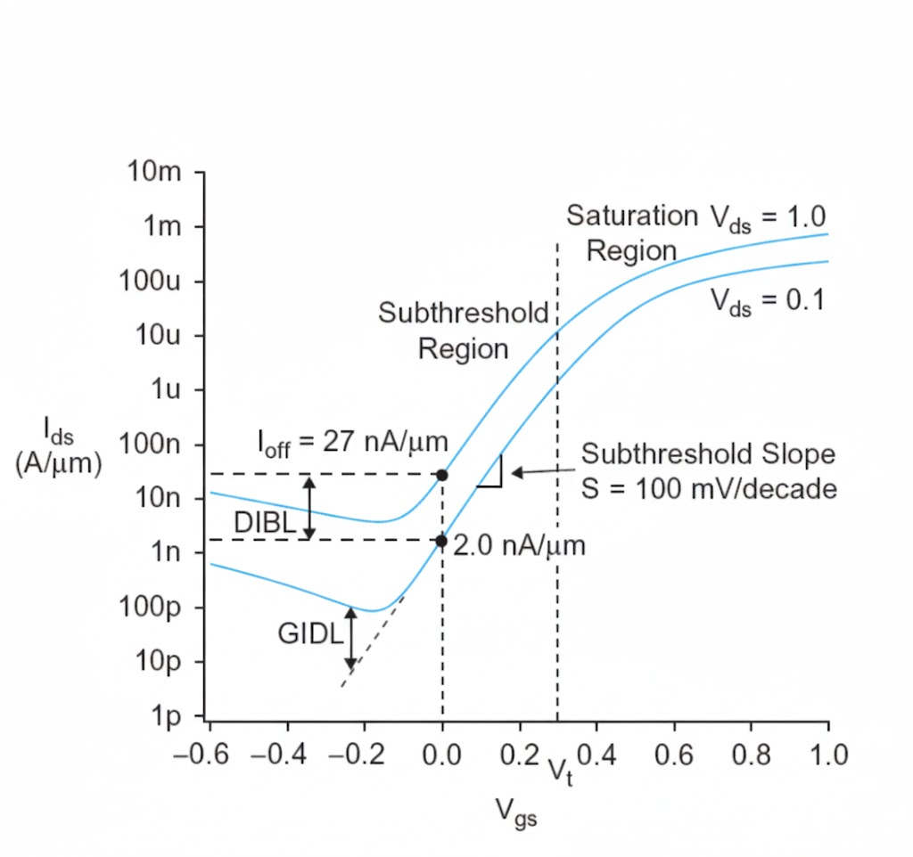
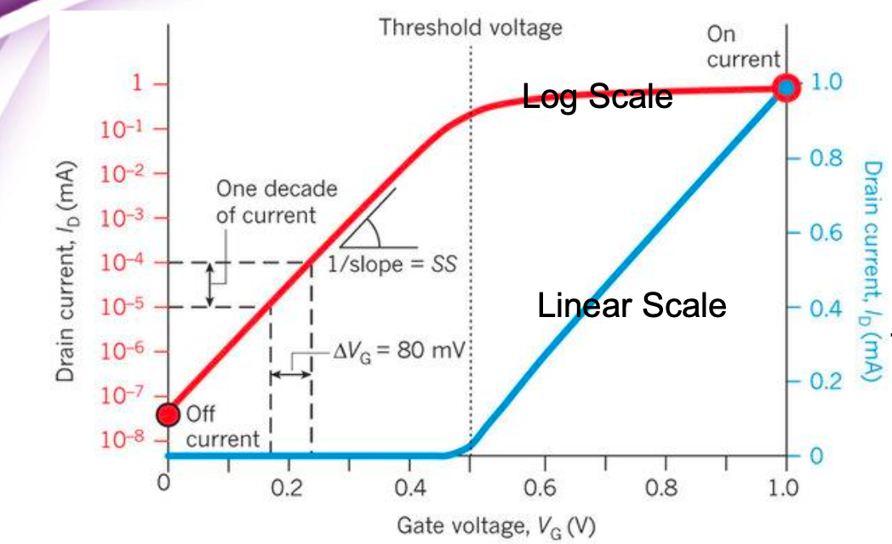

## 30. Leakage（漏電流）

本章整理 **MOS 電晶體在 cutoff（關閉）狀態下，為何電流不為 0**，並系統性分類現代 CMOS 中的主要 leakage 來源。本章重點在於**物理直覺與現象辨識**；相關數學模型與公式推導將於後續補充，但仍統一歸納於本章。

---

### 30.1 為什麼 cutoff 狀態下仍有電流？

在理想 MOS 模型中：

- 當 $V_{gs} < V_t$
- 電晶體處於 cutoff
- 預期 $I_{ds} = 0$

然而實際模擬與量測結果顯示：

> **MOS 電晶體在 cutoff 狀態下，電流不會趨近於 0。**

這代表「cutoff」僅是邏輯上的關閉，而非物理上的完全阻斷。

---

### 30.2 Subthreshold Region 的物理意義

當 $V_{gs} < V_t$ 時：

- 通道尚未形成強反轉（strong inversion）
- 但矽表面已進入 **弱反轉（weak inversion）**
- 表面仍存在少量載子

在 drain 電場的驅動下：

- 這些載子仍可由 source 漂移至 drain
- 形成 **subthreshold current**

重要觀念：

> **電晶體無法在某一個電壓點「突然」從 ON 變成 OFF。**  
> 能帶與載子濃度必然是連續變化的。

---

### 30.3 Drain 電壓對 OFF-state 電流的影響（DIBL 回顧）

在 subthreshold 區域中：

- 增加 $V_{ds}$
- 會因 DIBL（Drain-Induced Barrier Lowering）
- 拉低 source–channel 間的能障

結果是：

> **在相同 $V_{gs}$ 下，較高的 $V_{ds}$ 會導致更大的 OFF-state 電流。**

因此，leakage 不僅與 gate 有關，也與 drain 偏壓密切相關。

---

### 30.4 Ioff 的工程定義

實務上常以 **Ioff** 量化 leakage：

- 定義為：
  - $V_{gs} = 0$
  - $V_{ds} = V_{DD}$
- 所量得的 drain current

Ioff 是：

- 靜態功耗（static power）的直接來源
- 製程節點與低功耗設計的重要指標

---

### 30.5 Leakage Sources 的分類總覽

現代 CMOS 中的 leakage 主要可分為三大類：

1. **Subthreshold Leakage**
2. **Gate Leakage**
3. **Junction Leakage**

以下分別說明其物理來源。

---

### 30.6 Subthreshold Leakage

**定義**

- 當 $V_{gs} < V_t$ 時
- 由 source → drain 的漏電流

**物理來源**

- 弱反轉區仍存在載子
- 載子在 drain 電場作用下漂移
- 電流隨 $V_{gs}$ 呈指數變化

**重要性**

- 在先進製程中為 **最主要的 leakage 來源**
- 與：
  - $V_t$ 降低（SCE / DIBL）
  - 溫度上升
高度相關

---

### 30.7 Gate Leakage

**定義**

- 由 gate 穿越 gate dielectric 的漏電流

**物理來源**

- 為維持高 $C_{ox}$，gate oxide 需極薄
- 當氧化層厚度進入數奈米尺度
- 載子可發生 **量子穿隧（tunneling）**

**特性**

- 電流路徑為：
  - gate → channel / source / drain / body
- 與 $V_{gs}$ 關係較強
- 與 drain 電壓關係較弱

---

### 30.8 Junction Leakage

**定義**

- Source / Drain 與 body 之間的漏電流

**物理來源**

- 反向偏壓 PN junction 的二極體漏電
- 包含：
  - generation current
  - 表面態與缺陷相關電流

**特性**

- 在高溫、高反向偏壓下增加
- 在先進製程中非最大宗，但不可忽略

---

### 30.9 Leakage 的整體觀點

綜合而言：

- Leakage 並非單一機制
- 而是多條電流路徑的總和：
  - subthreshold（source → drain）
  - gate tunneling（gate → silicon）
  - junction leakage（S/D → body）

在先進 CMOS 設計中：

> **Leakage 已成為靜態功耗的主導因素，  
> 必須從製程、結構與電路層級共同控制。**

---

### 30.10 Subthreshold leakage 模型中的 $I_{ds0}$ 與適用範圍（cutoff / subthreshold）

本節針對投影片「Subthreshold Leakage」頁面中的模型：

$$
I_{ds} = I_{ds0} \; \exp \! \left( \frac{V_{gs} - V_{t0} + \eta V_{ds} - k_{\gamma} V_{sb}}{n v_T} \right) \left( 1 - e^{-V_{ds}/v_T} \right)
$$

說明兩個常見疑問：

1. $I_{ds0}$ 到底代表什麼？
2. 這個模型是否只適用於 cutoff（$V_{gs} < V_t$）的討論？

---

#### (1) $I_{ds0}$ 是什麼？

在 subthreshold（弱反轉）區的電流模型裡，$I_{ds0}$ 是 **指數式前面的尺度因子（prefactor / 前因子）** ，可視為：

> **在特定製程與器件結構下，subthreshold 電流的「基準電流尺度」。**  
> 後續電流如何放大或縮小，主要由指數項決定。

把模型寫成投影片藍框的形式更好理解：

$$
I_{ds} \approx I_{ds0} \; \exp \! \left( \frac{V_{gs} - V_t}{n v_T} \right)
$$

其中：

- $\exp \! \left( \frac{V_{gs} - V_t}{n v_T} \right)$ 決定 **電流對 $V_{gs}$ 的指數敏感度**。
- $I_{ds0}$ 決定 **整條 subthreshold 曲線的垂直位置（整體有多高）**。

投影片同時標註：

$$
I_{ds0} \propto \frac{W}{L}
$$

其物理意義是：

- $W$ 越大 → 通道「等效寬度」越大 → 漏電通路更多 → $I_{ds0}$ 越大  
- $L$ 越大 → 通道「等效長度」越長 → 漏電通路越受抑制 → $I_{ds0}$ 越小

---

#### (2) 這個模型適用於哪個區域？是否只談 cutoff？

是的。此一模型是用來描述 **cutoff / subthreshold（弱反轉）區** 的漏電流，也就是：

$$
V_{gs} < V_t
$$

可從三個角度判斷其適用範圍：

1. **投影片標題即為 Subthreshold Leakage**：直接限定討論主題在 $V_{gs} < V_t$ 的漏電。
2. **模型的核心結構是「指數型」對 $V_{gs}$ 變化**：強反轉區電流不再用這種單純的指數式描述。
3. **括號項 $1 - e^{-V_{ds}/v_T}$ 的存在是 subthreshold 常見寫法**：用來刻畫弱反轉電流的典型形式。

---

### 30.10.1 從完整模型推導至投影片藍框形式（逐步不跳步）

本小節補齊 **投影片藍框公式的來由**，並將 **$V_t$ 的定義、DIBL、Body Effect、以及 $V_{ds} > 78 \text{ mV}$** 的簡化條件全部明確寫出。

---

#### (1) 起點：完整的 subthreshold 漏電模型

投影片給出的完整形式為：

$$
I_{ds} = I_{ds0} \; \exp \! \left( \frac{V_{gs} - V_{t0} + \eta V_{ds} - k_{\gamma} V_{sb}}{n v_T} \right) \left( 1 - e^{-V_{ds}/v_T} \right)
$$

其中：
- $v_T = \frac{kT}{q} \approx 26 \text{ mV}$（室溫）
- $n$：subthreshold swing coefficient

---

#### (2) 明確寫出「有效 threshold voltage」的定義

包含 DIBL 與 body effect 的 threshold voltage 定義：

$$
\boxed{V_t = V_{t0} - \eta V_{ds} + k_{\gamma} V_{sb}}
$$

- $-\eta V_{ds}$：**DIBL**（drain 電壓拉低位能障 → $V_t$ 下降）
- $+k_{\gamma} V_{sb}$：**Body Effect**（source–body 反向偏壓 → $V_t$ 上升）

---

#### (3) 將 $V_t$ 定義代回指數分子

原本指數分子為：

$$
V_{gs} - V_{t0} + \eta V_{ds} - k_{\gamma} V_{sb}
$$

將第 (2) 步的 $V_t$ 展開後可得：

$$
\begin{aligned}
V_{gs} - V_t &= V_{gs} - (V_{t0} - \eta V_{ds} + k_{\gamma} V_{sb}) \\
&= V_{gs} - V_{t0} + \eta V_{ds} - k_{\gamma} V_{sb}
\end{aligned}
$$

也就是說：

$$
\boxed{V_{gs} - V_{t0} + \eta V_{ds} - k_{\gamma} V_{sb} \equiv V_{gs} - V_t}
$$

---

#### (4) 代換後的電流表達式

$$
I_{ds} = I_{ds0} \; \exp \! \left( \frac{V_{gs} - V_t}{n v_T} \right) \left( 1 - e^{-V_{ds}/v_T} \right)
$$

---

#### (5) 為什麼可以假設 $V_{ds} > 78 \text{ mV}$？

投影片右側直接標註：當 $V_{ds} > 78 \text{ mV}$ 時， $1 - e^{-V_{ds}/v_T} \approx 1$ 。
因為 $78 \text{ mV} = 3 v_T$ ，則 $e^{-3} \approx 0.05$ ，所以 $1 - 0.05 = 0.95 \approx 1$ 。

---

#### (6) 得到投影片藍框的近似形式

在 $V_{ds} > 78 \text{ mV}$ 的常見操作條件下：

$$
\boxed{I_{ds} \approx I_{ds0} \; \exp \! \left( \frac{V_{gs} - V_t}{n v_T} \right)}
$$

---

### 30.11 Subthreshold Swing（逐步推導，不跳步）

本小節目標：從弱反轉漏電的指數模型，推到 subthreshold swing（記為 $S$），並把模型改寫成以 10 為底的表示法。

---

#### (1) 起點：subthreshold 區的指數電流模型

$$
I_{ds} \approx I_{ds0} \exp \left( \frac{V_{gs} - V_t}{n kT/q} \right)
$$

---

#### (2) 對電流取自然對數

$$
\ln I_{ds} = \ln I_{ds0} + \frac{V_{gs} - V_t}{n kT/q}
$$

展開分子：

$$
\ln I_{ds} = \ln I_{ds0} + \frac{q}{n kT} V_{gs} - \frac{q}{n kT} V_t
$$

---

#### (3) 定義常數項，得到線性關係

把不隨 gate 電壓變化的項合併為常數 $A$：

$$
A \equiv \ln I_{ds0} - \frac{q}{n kT} V_t
$$

則：

$$
\ln I_{ds} = A + \frac{q}{n kT} V_{gs}
$$

---

#### (4) 問題定義：電流增加 10 倍，需要多少 gate 電壓變化？

假設 $I_{ds} = 10 I_{ds}$ 且 $V_{gs} = V_{gs} + \Delta V_{gs}$ 。

---

#### (5) 代回線性方程

定義斜率 $m = \frac{q}{n kT}$，則新狀態必須滿足：

$$
\ln(10 I_{ds}) = A + m (V_{gs} + \Delta V_{gs})
$$

---

#### (6) 展開並相減

利用 $\ln(10 I_{ds}) = \ln 10 + \ln I_{ds}$：

$$
\ln 10 + (A + m V_{gs}) = A + m V_{gs} + m \Delta V_{gs}
$$

左右消去後得到：

$$
\ln 10 = m \Delta V_{gs}
$$

---

#### (7) 解出 subthreshold swing ($S$ 的定義)

$$
S \equiv \Delta V_{gs} = \frac{\ln 10}{m} = n \frac{kT}{q} \ln 10
$$

---

#### (8) 改寫成以 10 為底的形式

利用 $e^{x \ln 10} = 10^x$ 性質，代回原始模型：

$$
\boxed{I_{ds} \approx I_{ds0} \cdot 10^{\frac{V_{gs} - V_t}{S}}}
$$

---

#### (9) 物理意義

$S$ 越小，表示只要更小的 gate 電壓變化，就能讓漏電流下降一個量級，電晶體關得越乾淨。

### 30.12 Subthreshold Swing（對照投影片的直覺解讀）

本節不再做數學推導，而是對照老師投影片的圖與逐字稿，整理每一個標示在圖上的物理意義。

---

#### (1) 為什麼要用 Log Scale 來看 Drain Current？
在次臨界區（ $V_{gs} < V_t$ ）時，漏電流非常小，且隨 $V_{gs}$ 呈指數變化。

因此投影片左側使用 log scale 來呈現 $I_{ds}$ ，目的是：
- 清楚觀察「電流增加一個 decade（10 倍）」所需的 gate 電壓變化
- 衡量電晶體在 OFF 區被 gate 控制的效率

這正是 subthreshold swing 的定義基礎。

---

#### (2) 圖中「One decade of current」的意義
投影片標示的：
- One decade of current
- 對應的 gate 電壓變化 $\Delta V_{gs}$

表示：當漏電流增加 10 倍時，gate 電壓必須增加多少？

這個 $\Delta V_{gs}$ 就是 Subthreshold Swing，記為 $S$ 。

---

#### (3) Subthreshold Swing 的定義（以圖來說）
根據圖上的標示：
- 紅色曲線：log scale 下的 $I_{ds}$
- 斜率的倒數： $\frac{1}{\text{slope}} = S$

也就是：

$$
S = \frac{\Delta V_{gs}}{\text{one decade change of } I_{ds}}
$$

單位為：

$$
\text{mV/decade}
$$

---

#### (4) 圖中標示的數值（室溫下的實際 CMOS）
投影片中給出的典型數值為：

$$
S \approx 80 \sim 100 \text{ mV/decade}
$$

這代表：Gate 電壓每下降約 80–100 mV，漏電流才能下降一個數量級（10 倍）。

---

#### (5) 右側公式與數值對照（老師要你知道的層級）
投影片右側給出：

$$
S = n \frac{kT}{q} \ln 10
$$

在室溫（約 300 K）下：
- $\frac{kT}{q} \approx 26 \text{ mV}$
- $\ln 10 \approx 2.3$
- 實際 CMOS 的 $n \approx 1.3$

代入後得到：

$$
S \approx 1.3 \times 26 \times 2.3 \approx 78 \text{ mV/decade}
$$

這正好對應圖中標示的數值。

---

#### (6) 為什麼 CMOS 有 60 mV/dec 的極限？
投影片最後一句指出：CMOS has a limit of 60 mV/dec @ room temperature (due to $n \ge 1$ )

其物理意義是：
- 當 $n = 1$ 時，subthreshold swing 達到理想下限
- 此時：

$$
S_{min} = \frac{kT}{q} \ln 10 \approx 60 \text{ mV/decade}
$$

實際 CMOS 中因為 $n > 1$ ，因此永遠無法低於 60 mV/dec。

---

#### (7) 本頁投影片的核心結論（老師版）
- Subthreshold swing 衡量的是：電晶體在 OFF 區，gate 關閉通道的效率
- $S$ 越小：
    - 關得越乾淨
    - 靜態漏電越低
- 室溫 CMOS 的物理極限約為：

$$
60 \text{ mV/decade}
$$