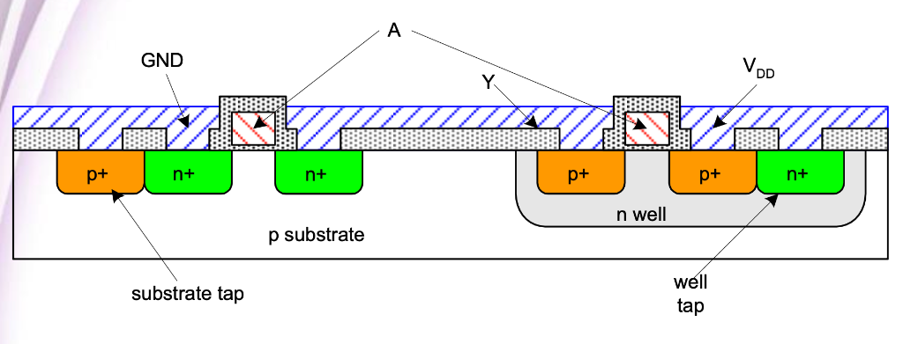
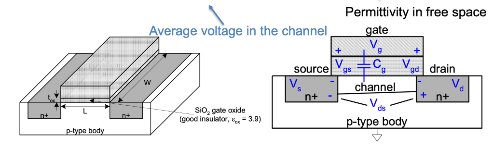
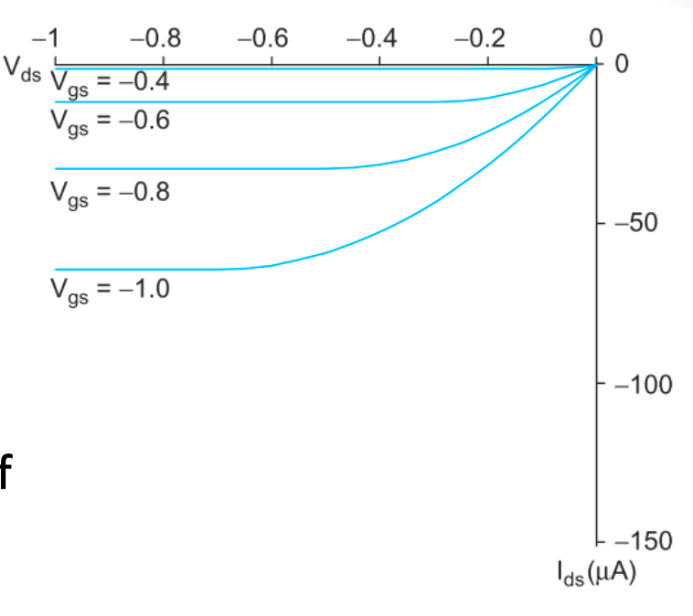
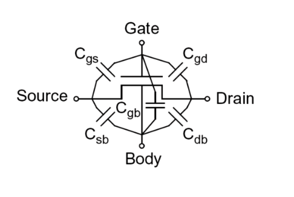
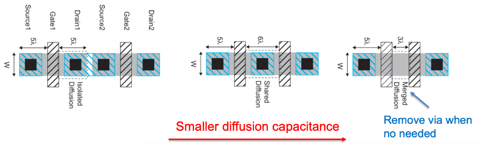

# Lecture 3 — CMOS Transistors（階段性筆記）

> 本筆記整理自 Lecture 3 目前為止的內容，並融合課堂逐字稿導讀、物理直覺、以及常見迷思澄清。
> 目標是：**不用背公式，也能清楚判斷 MOS 的狀態與行為**。

---

## 1. Intrinsic Silicon（本質矽）

- 矽（Si）為 **第四族元素**，最外層有 **4 個價電子**。
- 在晶體中，每個 Si 會與 **4 個鄰居形成共價鍵**。
- 這些共價鍵讓「最外層看起來有 8 個電子」，但：
  - 電子都被**鍵結綁住**
  - **沒有自由載子**（free carriers）

**結論：**
> 純矽（intrinsic silicon）幾乎不導電。

---

## 2. Doping（摻雜）與載子

### 2.1 P-type（受體摻雜）

- 用 **第三族元素**（例如 Boron, B）取代 Si
- 少一個電子 → 形成 **電洞（hole）**
- Boron 稱為 **acceptor**
- 多數載子：**hole**

### 2.2 N-type（施體摻雜）

- 用 **第五族元素**（例如 Phosphorus, Arsenic）取代 Si
- 多一個電子 → 形成 **自由電子**
- 這些原子稱為 **donor**
- 多數載子：**electron**

---

## 3. MOS 結構的物理直覺（以 NMOS 為例）

- 基板（body）是 **p-type substrate**，透過 **p+ tap 接地（GND）**
- Source / Drain 為 **n+ diffusion**
- n+ 與 p-substrate 之間形成 **PN junction（反向偏壓）**，產生耗盡區

### Gate 加正電時（Vg > 0）：

1. 吸引電子到 Si–SiO₂ 表面
2. 先推走 hole → **depletion（耗盡）**
3. 再吸引電子 → **inversion（反轉）**
4. 形成 **n-channel**，連接 source 與 drain

**關鍵觀念：**
> 輸出電壓是由「哪一顆 MOS 的通道導通」決定，
> 耗盡區的角色是隔離與防止接面導通，而不是直接設定電壓。



---

## 4. Accumulation / Depletion / Inversion

### Accumulation（累積）
- **NMOS**：$V_{G}$ < 0 ｜ **PMOS**：$V_{G}$ > 0
- Gate 電壓讓多數載子聚集在表面
- 但 **沒有形成導通通道**

### Depletion（耗盡）
- **NMOS**：0 < $V_{G}$ < $V_{th}$ ｜ **PMOS**：$V_{th}$ < $V_{G}$ < 0
- Gate 電壓推走多數載子
- 表面留下固定離子 → 耗盡區

### Inversion（反轉）
- **NMOS**：$V_{G}$ > $V_{th}$ ｜ **PMOS**：$V_{G}$ < $V_{th}$
- Gate 電壓夠大，吸引少數載子形成反轉層
- **形成可導通的 channel**

---

## 5. Threshold Voltage（Vth）

- **Vth = 剛好在表面形成穩定反轉層的 Gate 電壓**
- 物理上可定義、理論上可推導
- 工程上：
  - 由 **量測 Id–Vg 曲線** 萃取

**重要直覺：**
> Gate 並不是一加電就能控制通道，
> 必須先「付掉 Vth 這個入場費」。

---

## 6. Terminal Voltages（端點電壓定義）

- $V_{GS}$ = $V_{G}$ - $V_{S}$
- $V_{GD}$ = $V_{G}$ - $V_{D}$
- $V_{DS}$ = $V_{D}$ - $V_{S}$ = $V_{GS}$ - $V_{GD}$

### Source / Drain 的定義

- 結構上對稱
- **由電壓決定角色**：
  - NMOS：電壓較低者 = Source
  - PMOS：電壓較高者 = Source

---

## 7. 操作區域（Operating Regions, NMOS）

### 7.1 Cutoff
- $V_{GS}$ < $V_{th}$
- 無反轉層，MOS 關閉

### 7.2 Linear（Triode）
$$
\begin{cases}
V_{GS} > V_{th} \\
V_{DS} < V_{GS} - V_{th}
\end{cases}
$$

**物理意義：**
- 通道「整條都存在」
- Gate 在 Source 與 Drain 端都壓得住
- MOS 行為近似為 **受控電阻**

### 7.3 Saturation
$$
\begin{cases}
V_{GS} > V_{th} \\
V_{DS} \ge V_{GS} - V_{th}
\end{cases}
$$

**物理意義：**
- Drain 端通道被拉斷（pinch-off）
- 再增加 Vds，電流不再明顯增加

---

## 8. Vds 的關鍵直覺（重要）

> **Vgs 決定「有沒有路」**  
> **Vds 決定「通道會不會在 Drain 端被 pinch-off（夾斷）」**

- Vds 是加在 **整條通道上的電位差**
- 分界條件中的 -$V_{th}$ 代表：
  - Gate 必須先超過 Vth
  - 剩下的 $V_{GS}$ - $V_{th}$ 才是真正能對抗 Drain 端電位的有效控制力

**常見誤解澄清：**

| 誤解 | 實際情況 |
|------|----------|
| 通道真的斷成兩截？ | ❌ 不是。通道只是在 Drain 端「收縮到消失」，電流還是在流 |
| 電流停止？ | ❌ 不是。電子靠電場漂移穿越那一小段耗盡區 |

---

## 9. 電子流 vs. 傳統電流（符號觀念）

- **物理載子角度**：
  - NMOS：電子由 Source → Drain
  - PMOS：電洞由 Source → Drain

- **電路定義角度（Id, Ids）**：
  - 一律定義為 **Drain → Source 為正**

**結論：**
> 談物理機制 → 用電子 / 電洞想  
> 寫公式、算電流 → 用傳統正電流定義

---

## 10. Vds 與 Ids 正負號的實際對齊（CMOS Inverter 實例）

> 本節以**實際電壓數字**，將 Vds 與 Ids 的正負號一次對齊說清楚。

### 10.0 三個不能動的定義（錨點）

在開始之前，先鎖死這三個定義：

1. **Ids 定義**：傳統正電流，Drain → Source 為正
2. **Vds 定義**：$V_{DS}$ = $V_{D}$ - $V_{S}$
3. **Source 定義**：
   - NMOS：電壓較低的一端是 Source
   - PMOS：電壓較高的一端是 Source

---

### 10.1 PMOS 充電階段（0 → 1）

#### 設定條件
- $V_{DD}$ = 1.1 V
- PMOS source 接 VDD
- PMOS n-well 接 VDD
- Gate = 0（PMOS 打開）

#### 切換瞬間（真正有電流的時候）

假設某一個切換瞬間：
- Source：$V_{S}$ = 1.1 V
- Drain（輸出端，還在被充電中）：$V_{D}$ = 0.6 V

#### Vds 的正負號

$$V_{DS} = V_D - V_S = 0.6 - 1.1 = -0.5 \text{ V}$$

✅ **Vds 是負的**

這個負號的物理意義：
> Drain 的電位比 Source 低
> → 這正是 PMOS 正在「由 Source 往 Drain 充電」的狀態

#### Ids 的正負號

真實物理行為：
- 正電流（電洞）方向：Source → Drain

但 Ids 的定義方向是：
- Drain → Source 為正

所以此時：$I_{DS}$ < 0

✅ **Ids 是負的**

> **關鍵觀察：** Vds 與 Ids 在 PMOS 導通時，符號會「同時為負」。
> 這不是巧合，是因為電壓與電流的參考方向一致，符合被動符號慣例（passive sign convention）。

#### 充電完成（穩態）

充完電後：
- $V_{D}$ → 1.1 V，$V_{S}$ = 1.1 V
- $V_{DS}$ = 1.1 - 1.1 = 0（沒有壓差）
- $I_{DS}$ → 0（電流停止）

---

### 10.2 NMOS 放電階段（1 → 0）

#### 設定條件
- $V_{DD}$ = 1.1 V
- NMOS source 接 GND（0 V）
- NMOS body（p-substrate）接 GND
- Gate = 1.1 V（NMOS 打開）
- 輸出端原本被 PMOS 拉到高電位，準備放電

#### 切換瞬間（真正有電流的時候）

假設某一個放電瞬間：
- Source（接地）：$V_{S}$ = 0 V
- Drain（輸出端，還沒放完電）：$V_{D}$ = 0.6 V

#### Vds 的正負號

$$V_{DS} = V_D - V_S = 0.6 - 0 = +0.6 \text{ V}$$

✅ **Vds 是正的**

這個正號的物理意義：
> Drain 的電位比 Source 高
> → 電場方向會把電子往 Drain 拉
> → 但電子是負電，實際移動方向是 Source → Drain 的反方向
> → 這正是 NMOS 正在把電容往地放電

#### Ids 的正負號

真實物理行為：
- 電子方向：Source → Drain
- 傳統正電流方向：Drain → Source

對照 Ids 定義（正方向 = Drain → Source）：

$I_{DS}$ > 0

✅ **Ids 是正的**

> **關鍵觀察：** NMOS 導通時，Vds 與 Ids 會同時是正的。

#### 放電完成（穩態）

放電完成後：
- $V_{D}$ → 0 V，$V_{S}$ = 0 V
- $V_{DS}$ = 0 - 0 = 0（沒有壓差）
- $I_{DS}$ → 0（電流停止）

---

### 10.3 總結對照表

| 元件 | 切換方向 | $V_{DS}$ | $I_{DS}$ | 有電流的時機 |
|------|----------|----------|----------|---------------|
| NMOS | 1 → 0（放電） | 正 | 正 | Vout 尚未到 0 |
| PMOS | 0 → 1（充電） | 負 | 負 | Vout 尚未到 VDD |

---

### 10.4 總結段落

**PMOS 版本：**
> 以 PMOS 為例，在輸出由 0 充電至 $V_{DD}$ 的切換期間，Source 端維持在 $V_{DD}$，而 Drain 端電腳尚未上升完成，因此 $V_{D}$ < $V_{S}$，使得 $V_{DS}$ = $V_{D}$ - $V_{S}$ < 0。
>
> 此時實際正電流由 Source 流向 Drain，但由於 Ids 的正方向定義為 Drain → Source，因此量測到的 $I_{DS}$ 為負值。
> 當輸出電壓上升至與 Source 對齊後，$V_{DS}$ → 0，電流隨即消失，系統進入穩態。

**NMOS 版本：**
> 以 NMOS 為例，在輸出由 $V_{DD}$ 放電至 0 的切換期間，Source 端維持在 0 V，而 Drain 端電壓尚未下降完成，因此 $V_{D}$ > $V_{S}$，使得 $V_{DS}$ = $V_{D}$ - $V_{S}$ > 0。
>
> 此時電子實際由 Source 流向 Drain，而傳統正電流方向為 Drain → Source；由於 Ids 的正方向亦定義為 Drain → Source，因此量測到的 $I_{DS}$ 為正值。
> 當輸出電壓下降至與 Source 對齊後，$V_{DS}$ → 0，電流隨即消失，系統進入穩態。

---

### 10.5 一句話封印整個觀念

> **只要輸出還沒和 Source 對齊，就一定有電流；**
> **Source 是低端（NMOS）→ Vds、Ids 為正；**
> **Source 是高端（PMOS）→ Vds、Ids 為負。**

---

## 11. CMOS Inverter 的穩態理解（總結）

### Vin = High
- NMOS on, PMOS off
- n-channel 將輸出拉到 GND
- Vout ≈ 0

### Vin = Low
- PMOS on, NMOS off
- p-channel 將輸出拉到 VDD
- Vout ≈ VDD

**關鍵句：**
> 輸出電位由「哪一顆 MOS 的通道導通」決定，
> body / well 與 PN 接面負責隔離與正確偏壓。

---

## 13. Bulk Charge Model（Page 12）— 用電容近似通道電荷的第一步

> **開宗明義（先說這個模型在幹嘛）**  
> Bulk charge model 的目的，不是在判斷 MOS「有沒有打開」，  
> 而是在 **MOS 已經打開（strong inversion）之後**，  
> 用一個 *好算但不失直覺* 的方式，估算：
>
> 👉 **整條 channel 裡「大約有多少反轉電荷」**  
>
> 因此它回答的是「多少（how much）」的問題，  
> 而不是你前面已經熟悉的「有沒有（on/off）」問題。  
> 這也是它和 $V_{gs}$ $\ge$ $V_{t}$ 那套開關判斷**層級不同**的地方。

---

### 13.1 模型骨架：先把 Q = C · V 立起來

本頁從

$$Q_{\text{channel}} = C \cdot V$$

出發，其中把 gate–oxide–channel 視為**平行板電容**。

這裡的想像非常具體：

- 上方：gate（金屬）
- 中間：oxide（SiO₂，絕緣）
- 下方：channel（反轉層，導電）

只要你接受這個幾何結構，Q = C · V 就是最自然的第一步。

---

### 13.1.1 為什麼會有 $C_{ox}$？——「材料與距離」的係數

單位面積的氧化層電容定義為：

$$C_{ox} = \frac{\varepsilon_{ox}}{t_{ox}}$$

這一項只跟兩件事有關：

- $\varepsilon_{ox}$：  
  氧化層材料的介電常數  
  → **材料本身有多容易被極化**
- $t_{ox}$：  
  氧化層厚度  
  → **gate 跟 channel 隔多遠**

因此 $C_{ox}$ 的物理意義可以直接讀成：

> **「每一單位面積，gate 對 channel 的電容有多強」**

這是一個**純材料 + 製程**決定的係數，  
與 MOS 有沒有打開、電壓多大 **完全無關**。

---

### 13.1.2 為什麼要乘上 W × L？——「面積真的會線性放大電容」

gate 在上方覆蓋整條 channel，而 channel 的幾何尺寸為：

- 寬度：W（橫向，決定一次能排幾條電荷）
- 長度：L（縱向，從 source 到 drain）



因此 gate 覆蓋的有效面積約為：

$$A \approx W \cdot L$$

對平行板電容而言：

> **面積放大幾倍，能儲存的電荷就放大幾倍**

所以整體 gate 電容自然寫成：

$$
C = C_g = C_{ox} \cdot W L = \frac{\varepsilon_{ox}WL}{t_{ox}}
$$

你可以這樣記這一行：

- $C_{ox}$：**每單位面積的能力（強度）**
- WL：**你實際用掉多少面積**
- $C_{g}$：**這顆 MOS gate 對 channel 的總耦合能力**

---

### 13.1.3 小總結：$C_{g}$ 在這一頁「只負責一件事」

在 Page 12，$C_{g}$ **沒有任何動態、沒有任何非線性角色**，  
它只做一件事：

> 👉 把「gate 的有效控制電壓」  
> 轉成「channel 裡能被拉出來的電荷量」

也就是：

$$Q_{\text{channel}} = C_g \cdot V$$

---

### 13.2 你一開始最卡的點：V 到底是哪個電壓？為什麼是 $V_{gs}$ - $V_{ds}$/2？

#### (a) 先抓住事實：channel 電位沿著 x 方向會變
當 $V_{ds}$ ≠ 0 時，通道由 source 到 drain 的電位：

- 左端（source 端）約為 $V_{s}$
- 右端（drain 端）約為 $V_{d}$

因此 channel **不是等電位**，  
gate-to-channel 電壓 $V_{gc}$ 也就不是單一數值。

---

#### (b) 中點近似的真正幾何意義（幫你之後快速回想）

定義：

$$V_{\text{ch,mid}} \approx \frac{V_s + V_d}{2}$$

這個 $V_{ch,mid}$ 指的是：

> **channel 在「幾何正中央」那一點的電位**

它的位置是：

- 左右方向：source 與 drain 的正中間  
- 上下方向：在 gate 正下方、channel 內部

而 $V_{g}$ 則是：

- gate 那整片金屬的電位
- 對整片 gate 來說是同一個數值

所以在「同一個橫向位置（中點）」上：

$$V_{gc,\text{mid}} = V_g - V_{\text{ch,mid}}$$

這是一個**純上下方向**的電壓差，  
不是 gate 去「碰」source 或 drain 的左右概念。

---

(c) 改寫成端點電壓後的結果（完整推導，不省略）
從中點定義開始：

$$V_{\text{ch,mid}} \approx \frac{V_s + V_d}{2}$$

以及中點的 gate-to-channel 電壓定義：

$$V_{gc,\text{mid}} = V_g - V_{\text{ch,mid}}$$

將第一式代入第二式：

$$
\begin{aligned}
V_{gc,\text{mid}}
&= V_g - \frac{V_s + V_d}{2}
\end{aligned}
$$

接著把平均項改寫成「以 V_s 為基準」的形式（這一步是關鍵）：

$$
\begin{aligned}
\frac{V_s + V_d}{2}
&= \frac{V_s + \big(V_s + (V_d - V_s)\big)}{2} \
&= \frac{2V_s + (V_d - V_s)}{2} \
&= V_s + \frac{V_d - V_s}{2}
\end{aligned}
$$

將上式再代回 V_{gc,\text{mid}}：

$$
\begin{aligned}
V_{gc,\text{mid}}
&= V_g - \left( V_s + \frac{V_d - V_s}{2} \right) \
&= (V_g - V_s) - \frac{V_d - V_s}{2}
\end{aligned}
$$

最後用端點電壓定義：
- $V_{gs}$ = $V_{g}$ - $V_{s}$
- $V_{ds}$ = $V_{d}$ - $V_{s}$

代入得：

$$
\begin{aligned}
V_{gc,\text{mid}}
&= V_{gs} - \frac{V_{ds}}{2}
\end{aligned}
$$

這一項的直覺可以讀成：


> **「在平均意義下，gate 對 channel 還剩多少控制力」**

---

### 13.3 為什麼還要扣 $V_{t}$？以及最常見的誤會怎麼解

這裡一定要分清楚兩個層級（也是你一開始混在一起的地方）：

- **開關層級（有沒有通道）**  
  $$V_{gs} \ge V_t$$  
  → 判斷 MOS 是否打開（yes / no）

- **電荷層級（通道裡有多少反轉電荷）**  
  $V_{t}$ 那一段 gate 電壓，只是「剛好把反轉層建立起來的成本」，  
  **不會增加反轉層的厚度或電荷量**。

因此在算電荷時，有效電壓要寫成：

$$
V = V_{gc} - V_t
\approx \left( V_{gs} - \frac{V_{ds}}{2} \right) - V_t
$$

**關鍵澄清（避免之後再卡一次）：**

> 這不是在說  
> $V_{gs}$ = $V_{gs}$ - $V_{ds}$/2  
> 而是在說：
>
> - $V_{gs}$：用來判斷「MOS 有沒有開」
> - $V_{gs}$ - $V_{ds}$/2：用來估算「平均 gate 控制力」
> - 再扣掉 $V_{t}$：得到「真正能增加反轉電荷的部分」

---

### 13.4 邊界條件：Bulk charge model 什麼時候才「站得住腳」？

本頁的中點平均近似隱含一個很重要的前提：

> **$V_{gs}$ - $V_{t}$ 要夠大**，  
> 使得 channel 大部分區域都能維持 strong inversion。

因此：

- 當 $V_{gs}$ 只比 $V_{t}$ 大一點點時  
  V = ($V_{gs}$ - $V_{ds}$/2) - $V_{t}$ 很容易被算成負值
- 這不代表「實際完全沒有電流」
- 更合理的解讀是：  
  **這個「整條 channel 平均」的模型在該操作點開始失效**

---

### 13.5 Bulk Charge Model 核心概念總結

> **核心思路：**  
> 在 strong inversion 前提下，用平行板電容模型  
> 把 gate 的「平均有效控制電壓」  
> 轉成「channel 裡的總反轉電荷量」。

## 14. Carrier velocity（載子速度）— 電子在通道裡是怎麼被拉著走的？

> **本節在做什麼（先對齊角色）**  
> 在前一節（Bulk charge model）中，我們已經用電容近似，
> 估算出「通道裡大約有多少反轉電荷 $Q_{channel}$」。
>
> 接下來要回答的問題是：
>
> 👉 **這些電荷是怎麼移動的？移動得快還是慢？**
>
> 因此，本節只討論「載子的運動行為」，  
> 尚未引入電流公式。

---

### 14.1 橫向電場 E：推電子往前的來源

當 NMOS 的 drain 與 source 之間存在電壓差 $V_{ds}$ 時，
在通道內沿著 **source → drain** 方向會形成一個**橫向電場**。

在這裡採用的是平均近似：

$$
E \approx \frac{V_{ds}}{L}
$$

其中各符號的中文意義為：

- E：橫向電場（electric field）  
  → **每單位通道長度上，電子所感受到的平均推力大小**
- $V_{ds}$：汲極對源極電壓  
  → **沿著通道施加的總電壓差**
- L：通道長度（channel length）  
  → **source 到 drain 的距離**

**直覺理解：**

> 把整個 $V_{ds}$ 平均分攤在長度 L 上，  
> 得到「每單位通道長度，電位下降多少」，  
> 也就是「每單位長度，對電子施加多大的推力」。

這裡的 E 是**平均電場**，  
並不表示通道中每一點的電場都完全相同。

---

### 14.2 載子速度 v：電子實際跑多快？

電子在電場作用下會產生漂移運動，其平均漂移速度定義為：

$$
v = \mu \cdot E
$$

各符號的物理意義為：

- v：載子速度（carrier velocity）  
  → **電子在通道裡沿著 source → drain 移動的平均速度**
- μ：遷移率（mobility）  
  → **材料允許電子移動快慢的能力係數**
- E：橫向電場  
  → **推動電子前進的驅動來源**

**物理直覺：**

> 電場越強，電子被拉得越用力；  
> 但電子實際能跑多快，取決於材料本身（μ）。

---

### 14.3 隱含假設：低電場（low-field）載子運動模型

在本節中直接使用

$$
v = \mu \cdot E
$$

且將 μ 視為常數，隱含了一個重要前提：

> **低電場假設（low-field regime）**

其意義為：

- 尚未考慮速度飽和（velocity saturation）
- 載子速度與電場呈線性關係
- μ 不隨電場改變

只要看到 v = μE 且 μ 為常數，
就代表模型站在 **low-field transport** 的假設下。

---

### 14.4 載子穿越通道所需的時間 t

若電子以平均速度 v 通過長度為 L 的通道，
則其通過整條通道所需的時間定義為：

$$
t = \frac{L}{v}
$$

其中：

- t：載子穿越通道的時間  
  → **電子從 source 走到 drain 需要多久**
- L：通道長度
- v：載子速度

這是最基本的運動學關係：

> **時間 = 距離 / 速度**

---

### 14.5 本節重點整理（一眼回想用）

- E = $V_{ds}$/L：  
  → 通道中的**平均橫向推力（電場）**
- v = μE：  
  → 電子在材料中實際移動的速度（低電場假設）
- t = L/v：  
  → 電子穿越整條通道所需的時間

本節僅建立「載子如何移動」的物理模型，  
尚未引入電流的定義。

## 15. NMOS Linear I–V（線性區）— 從通道電荷到汲極電流

> **本節在做什麼（先講目的）**  
> 在第 13 節中，我們已經知道：
> - 通道裡大約有多少反轉電荷 $Q_{channel}$
>
> 在第 14 節中，我們也已經知道：
> - 載子在通道裡移動的速度 v
> - 以及穿越整條通道所需的時間 t
>
> 👉 本節要做的事只有一件：  
> **把「電荷有多少」與「移動要多久」接起來，推導出線性區的電流 $I_{ds}$。**

---

### 15.1 電流的基本定義：電荷流率

電流的物理定義為「單位時間內通過的電荷量」：

$$I_{ds} = \frac{Q}{t}$$

在 NMOS 中，我們關心的是：
- 通道內的總反轉電荷 $Q_{channel}$
- 載子穿越通道所需的時間 t

因此可直接寫成：

$$I_{ds} = \frac{Q_{\text{channel}}}{t}$$

---

### 15.2 通道電荷 $Q_{channel}$（來自 Bulk charge model）

根據第 13 節的 bulk charge model，在 strong inversion 且採用中點近似時：

$$Q_{\text{channel}} = C_{ox} W L \left( V_{gs} - V_t - \frac{V_{ds}}{2} \right)$$

這個式子的物理意義是：

- 通道電荷 **正比於**
  - gate 對 channel 的平均有效控制電壓  
    $V_{gs} - \frac{V_{ds}}{2}$
  - 再扣掉剛好形成反轉層所需的門檻電壓 $V_{t}$

其中：
- $-\frac{V_{ds}}{2}$ 代表  
  **因為 drain 電壓拉高，使得通道電位平均被抬高，  
  gate 對通道的平均控制力變弱，能維持的反轉電荷因此變少。**

---

### 15.3 載子穿越通道所需的時間 t

根據第 14 節，載子穿越整條通道所需的時間為：

$$t = \frac{L}{v}$$

而在低電場假設（low-field regime）下：

$$v = \mu \cdot E$$

通道內的平均橫向電場近似為：

$$E \approx \frac{V_{ds}}{L}$$

將電場代入速度：

$$v = \mu \cdot \frac{V_{ds}}{L}$$

再代回時間定義式：

$$
\begin{aligned}
t
&= \frac{L}{v} \\
&= \frac{L}{\mu \cdot \frac{V_{ds}}{L}} \\
&= \frac{L^2}{\mu V_{ds}}
\end{aligned}
$$

---

### 15.4 將 $Q_{channel}$ 與 t 代入電流定義式

回到電流定義：

$$I_{ds} = \frac{Q_{\text{channel}}}{t}$$

代入前兩節得到的結果：

$$I_{ds} = \frac{ C_{ox} W L \left( V_{gs} - V_t - \frac{V_{ds}}{2} \right) }{ \frac{L^2}{\mu V_{ds}} }$$

除以分數等於乘以倒數：

$$I_{ds} = C_{ox} W L \left( V_{gs} - V_t - \frac{V_{ds}}{2} \right) \cdot \frac{\mu V_{ds}}{L^2}$$

將幾何因子整理：

$$
\frac{W L}{L^2} = \frac{W}{L}
$$

得到線性區的 I–V 關係式：

$$I_{ds} = \mu C_{ox} \frac{W}{L} \left( V_{gs} - V_t - \frac{V_{ds}}{2} \right) V_{ds}$$

---

### 15.5 定義 $\beta$ 以簡化表示

為了讓式子更簡潔，定義一個常數：

$$\beta = \mu C_{ox} \frac{W}{L}$$

則線性區的 NMOS 汲極電流可寫成：

$$I_{ds} = \beta \left( V_{gs} - V_t - \frac{V_{ds}}{2} \right) V_{ds}$$

---

### 15.6 關於 $-V_{ds}/2$ 的關鍵物理意義（常見困惑釐清）

- $-\frac{V_{ds}}{2}$ **不是直接在減電流**
- 它代表的是：
  - drain 電壓升高
  - 使通道電位平均被抬高
  - gate 對 channel 的平均有效電壓下降
  - 因此通道內的反轉電荷變少

由於電流本質上來自「有多少電荷在流動」，
平均通道電荷下降，會抑制電流的成長速度。

---

### 15.7 本節重點整理（一眼回想用）

- 電流的本質：
  $$I_{ds} = \frac{Q_{\text{channel}}}{t}$$
- 線性區電流同時受到兩個 $V_{ds}$ 效應影響：
  - 括號外的 $V_{ds}$：  
    → 推動載子移動（速度變快）
  - 括號內的 $-V_{ds}/2$：  
    → 平均通道電荷變少
- 在線性區中，電流仍隨 $V_{ds}$ 增加，
  但增加速度逐漸變慢，為後續進入飽和區鋪路

## 16. NMOS Saturation I–V：通道被夾斷後，電流為什麼不再增加？

> **本節核心目的**  
> 承接前一節的線性區模型，說明：  
> 當 $V_{ds}$ 持續增加時，為什麼 $I_{ds}$ 會「停止隨 $V_{ds}$ 增加」，  
> 並推導出 NMOS 在飽和區的 I–V 關係式。

---

### 16.1 從線性區模型出發（所有推導的起點）

在前一節（Linear I–V），我們已經建立：

$$I_{ds} = \beta \left( V_{gs} - V_t - \frac{V_{ds}}{2} \right) V_{ds}$$

其中：

- $\beta = \mu C_{ox}\frac{W}{L}$
- 括號內代表 **通道平均反轉電荷的強度**
- 括號外的 $V_{ds}$ 代表 **橫向電場造成的載子推進效果**

⚠️ **此公式的隱含前提：**

> 整條 channel 從 source 到 drain 都仍然存在  
>（gate 對整條通道都還有控制力）

---

### 16.2 什麼時候這個前提會失效？——Pinch-off 的出現

回到 gate-to-channel 的觀點：

在通道某一位置 $x$，有：

$$V_{gc}(x) = V_g - V_{ch}(x)$$

當 $V_{ds}$ 增加時：

- drain 端的 channel 電位 $V_{ch}$ 被拉高
- 導致 drain 端的 $V_{gc}$ 持續下降

在 **drain 端那一點**：

$$V_{gc,\text{drain}} = V_{gs} - V_{ds}$$

當這個值剛好等於門檻電壓：

$$V_{gs} - V_{ds} = V_t$$

即可得到臨界條件：

$$V_{dsat} = V_{gs} - V_t$$

**物理意義：**

> drain 端的反轉層剛好消失，  
> channel 在 drain 附近被「夾斷（pinch off）」。

---

### 16.3 為什麼進入飽和後，$V_{ds}$ 不再增加電流？

這是本頁最重要的觀念，不是數學，而是「控制權」。

在 pinch-off 發生之後：

- drain 附近 **已經沒有 channel**
- gate 無法再對那一段施加控制
- 通道中可被 gate 控制、可被注入的反轉電荷數量  
  **完全由 source 端決定**

因此：

> 即使再增加 $V_{ds}$，  
> gate 能提供的反轉電荷數量已經不再增加，  
> $I_{ds}$ 也就不再隨 $V_{ds}$ 上升。

這就是投影片所說的：

> **Now drain voltage no longer increases current**

⚠️ 關鍵澄清：

- 飽和 **不是** 電子停止移動  
- 飽和 **不是** 速度飽和  
- 飽和是：**gate 對 channel 的控制已經達到極限**

---

### 16.4 飽和區電流的完整推導（不省略步驟）

從線性區公式出發：

$$I_{ds} = \beta \left( V_{gs} - V_t - \frac{V_{ds}}{2} \right) V_{ds}$$

在進入飽和的臨界點：

$$V_{ds} = V_{dsat} = V_{gs} - V_t$$

直接代入：

$$\begin{aligned} I_{ds} &= \beta \left( V_{gs} - V_t - \frac{V_{gs} - V_t}{2} \right) (V_{gs} - V_t) \\ &= \beta \left( \frac{V_{gs} - V_t}{2} \right) (V_{gs} - V_t) \\ &= \frac{\beta}{2} (V_{gs} - V_t)^2 \end{aligned}$$

再將 $\beta$ 展開：

$$I_{ds} = \frac{1}{2} \mu C_{ox} \frac{W}{L} (V_{gs} - V_t)^2$$

這就是 **NMOS 飽和區 I–V 方程式**。

---

### 16.5 一句話封印本頁（回想用）

> **NMOS 進入飽和區，  
> 不是因為電子跑不動，  
> 而是因為 drain 端的 channel 被 gate 夾斷，  
> 電流只剩下由 $V_{gs}$ 能提供多少反轉電荷來決定。**

## 17. NMOS I–V 行為總整理（Cutoff / Linear / Saturation）

本章將前面第 13–16 章推導出的結果，
整理成一張「操作區域 × 電流模型」的對照表，
作為之後分析電路時的快速查閱基準。

---

### 17.1 三個操作區域與對應條件

NMOS 的汲極電流 $I_{ds}$ 可依操作條件分為三個區域：

---

#### (1) Cutoff（截止區）

條件：
$$V_{gs} < V_t$$

電流：
$$I_{ds} = 0$$

物理意義：
- 尚未形成反轉層
- channel 不存在
- MOS 關閉（off）

---

#### (2) Linear / Triode（線性區）

條件：
$$V_{gs} \ge V_t \quad \text{且} \quad V_{ds} < V_{dsat}$$

其中：
$$V_{dsat} = V_{gs} - V_t$$

電流模型：
$$I_{ds} = \beta \left( V_{gs} - V_t - \frac{V_{ds}}{2} \right) V_{ds}$$

物理意義：
- 整條 channel 從 source 到 drain 都存在
- gate 可控制整條通道的反轉電荷
- 電流同時受：
  - 通道電荷量（由 $V_{gs}$ 決定）
  - 橫向電場（由 $V_{ds}$ 決定）

---

#### (3) Saturation（飽和區）

條件：
$$V_{gs} \ge V_t \quad \text{且} \quad V_{ds} \ge V_{dsat}$$

電流模型：
$$I_{ds} = \frac{\beta}{2} \left( V_{gs} - V_t \right)^2$$

物理意義：
- drain 端的 channel 發生 pinch-off
- gate 對通道的控制已達上限
- 電流只由 source 端可提供的反轉電荷決定
- 再增加 $V_{ds}$，理想模型下不再增加 $I_{ds}$

---

### 17.2 參數定義（統一記法）

$$\beta = \mu C_{ox} \frac{W}{L}$$

其中：

- $\mu$：載子遷移率（mobility）
- $C_{ox}$：單位面積氧化層電容
- $W$：通道寬度
- $L$：通道長度

---

### 17.3 一句話快速回想整個 Chapter

- $V_{gs}$：  
  → 決定 **通道能不能存在、以及有多少反轉電荷**
- $V_{ds}$（小）：  
  → 提供橫向電場，推動載子（Linear）
- $V_{ds}$（大）：  
  → 夾斷 drain 端 channel，電流進入飽和（Saturation）

> **NMOS 的 I–V 行為，本質上就是  
> gate 能拉多少 charge、以及 drain 能推多快。**

---

> 本節為 Lecture 3  
> **NMOS I–V 模型（long-channel、low-field）** 的完整總結頁。

### 17.4 模型適用條件註解：為什麼需要 $V_{gs}-V_t$ 夠大？

本章整理的 NMOS I–V 模型（Linear 與 Saturation）  
**隱含一個重要前提**，但在公式中通常不會被特別寫出來：

> **$V_{gs} - V_t$ 必須夠大，使通道處於 strong inversion。**

---

#### 這句話的真正意思是什麼？

這裡的「夠大」不是只要求：

$$V_{gs} \ge V_t$$

而是指：

> **通道中「大部分區域」都能維持明顯的反轉層厚度，  
> 不會因為一點 $V_{ds}$ 就被快速削弱或消失。**

---

#### 為什麼線性區模型需要這個條件？

線性區電流模型：

$$I_{ds} = \beta \left( V_{gs} - V_t - \frac{V_{ds}}{2} \right) V_{ds}$$

是建立在以下假設之上：

- 整條 channel 從 source 到 drain 都存在
- 通道反轉電荷可以用「平均值」近似
- $V_{gs} - V_t$ 明顯大於 $\frac{V_{ds}}{2}$

若 $V_{gs}-V_t$ 很小：
- 中點近似會過早算出「負的有效電壓」
- 模型會低估實際存在的電流
- 代表 **模型開始失效，而非物理上真的沒電流**

---

#### 那飽和區模型呢？

飽和區模型：

$$I_{ds} = \frac{\beta}{2} \left( V_{gs} - V_t \right)^2$$

同樣假設：

- source 端能提供穩定、足量的反轉電荷
- pinch-off 發生前，通道已經完整建立

因此：

> 飽和區模型 **不是** 用來描述  
> $V_{gs}$ 剛超過 $V_t$ 的臨界狀態，  
> 而是用在 **strong inversion + channel 已充分形成** 的情況。

---

#### 一句話版本

> **Linear 與 Saturation 的長通道 I–V 模型，  
> 都假設 $V_{gs}-V_t$ 夠大，  
> 才能把通道視為「可被 gate 穩定控制的反轉層」。**

---

> 若 $V_{gs}-V_t$ 很小，  
> 應進入的是 weak / moderate inversion 的分析框架，  
> 不再適合直接套用本章公式。

## 18. PMOS I–V 重點整理：與 NMOS 的對稱與差異

本節不重新推導 PMOS 的 I–V 方程式，  
而是說清楚 **如何從 NMOS 的模型「對稱地理解」PMOS**，  
以及在電路設計上最重要的幾個直覺差異。

---

### 18.1 一個核心原則：PMOS 是「符號與極性反轉」的 NMOS

對於 long-channel、low-field 的模型而言：

> **PMOS 的 I–V 形式與 NMOS 完全相同，  
> 只是「載子、摻雜與電壓極性」全部反轉。**

因此在分析時，最重要的不是重背新公式，  
而是搞清楚「誰是 source、誰是 drain、電壓怎麼定義」。

---

### 18.2 Source / Drain 的定義（這點一定要牢記）

在 PMOS 中：

- **Source 是「電位較高」的端點**
- Drain 是電位較低的端點

這與 NMOS 相反（NMOS 的 source 是電位較低者）。

因此在 PMOS I–V 圖中你會看到：

- $V_{gs} < 0$
- $V_{ds} < 0$
- $I_{ds} < 0$（慣例上電流方向與 NMOS 相反）

⚠️ 這不是物理行為變奇怪，  
而只是 **符號定義遵守同一套電路慣例**。

---

### 18.3 載子不同 → 遷移率不同（設計上的關鍵差異）

- NMOS：  
  - 載子為電子（electrons）
  - 遷移率： $\mu_{n}$
- PMOS：  
  - 載子為電洞（holes）
  - 遷移率： $\mu_{p}$

重要事實：

> $\mu_{p}$ **通常約為** $\mu_{n}$ **的 1/2 ～ 1/3**

這是材料物理造成的，  
不是製程或偏壓可以輕易改變的。

---

### 18.4 為什麼 PMOS 通常要做得比較寬？

回到你已經熟悉的參數：


$$ \beta = \mu C_{ox} \frac{W}{L} $$


由於：


$$ \mu_{p} < \mu_{n} $$


若希望在 CMOS 中：

- PMOS 與 NMOS 提供**相近的驅動電流**
- 上拉（PMOS）與下拉（NMOS）速度接近

那就必須：

> **用較大的** $W_p$ **來補償較小的** $\mu_p$

也就是設計上常見的結論：

> **PMOS 必須比 NMOS 做得寬，  
> 才能提供相同等級的電流能力。**

這正是你之後在 inverter、NAND、NOR sizing 時  
會反覆看到的比例來源。

---

### 18.5 如何「正確閱讀」PMOS I–V 曲線？



在 PMOS I–V 圖中（如上圖）：

- 橫軸： $V_{ds}$ （負方向）
- 縱軸： $I_{ds}$ （負方向）
- 不同曲線：不同 $V_{gs}$ （越負 → 驅動越強）

閱讀時請記住：

> **不要被負號嚇到，  
> 只看「絕對值大小」與「趨勢是否與 NMOS 對稱」。**

在物理行為上：

- Cutoff / Linear / Saturation 的區分完全類比 NMOS
- Pinch-off、strong inversion 的概念也完全相同

---

### 18.6 一句話總結（CMOS 設計用）

> **PMOS = 極性反轉的 NMOS，  
> 但因為電洞比較慢，  
> 所以要做得比較寬。**

---

> 本節為 Lecture 3  
> **NMOS → PMOS 對稱延伸** 的總結頁，  
> 直接銜接後續 CMOS inverter 與 sizing 分析。

## 19. Capacitance：MOS 為什麼一定有電容？以及它為什麼決定速度與功耗

> **本章定位**  
> 本章從 I–V（電流）模型正式轉向 C（電容）模型。  
> 電容不是附加細節，而是之後決定 **切換速度（delay）與動態功耗（power）** 的核心因素。

---

### 19.1 一個最基本但關鍵的原則

> **Any two conductors separated by an insulator have capacitance**

只要滿足：
- 兩個導體（metal / heavily doped region）
- 中間隔著絕緣體（oxide、depletion region）

就一定存在電容。

在 MOS 中，這個條件幾乎無所不在。

---

### 19.2 Gate–Channel 電容：MOS 能運作的根本原因

Gate 與 channel：
- 都是導體
- 中間隔著 gate oxide（SiO₂）

因此它們本質上形成一個平行板電容，其單位面積電容為：

$$C_{ox} = \frac{\varepsilon_{ox}}{t_{ox}}$$

**物理意義：**

> Gate–channel 電容的存在，  
> 才能讓 gate 透過電場「拉出反轉電荷」，  
> 形成 channel，MOS 才能導通。

沒有這個電容：
- 就沒有 channel
- MOS 不可能運作

---

### 19.3 Source / Drain 對 Body 的電容（Diffusion Capacitance）

Source 與 Drain 和 Body 之間形成的是 **反向偏壓的 PN 接面**。

- 反向偏壓 PN 接面
- 會產生 depletion region
- depletion region 沒有自由載子 → 等效為絕緣層

因此：
- Source–Body → $C_{sb}$
- Drain–Body → $C_{db}$

這類電容因為來自 source / drain 的擴散區，
故稱為 **diffusion capacitance**。

> **補充提醒（從製程與材料角度理解 diffusion capacitance）**  
>
> 以 **NMOS** 為例：
>
> - Body（Bulk / Base）為 **p-type 半導體**
> - Source 與 Drain 為 **n⁺ 重摻雜區**
> - 這些 n⁺ 區域是透過 **擴散（diffusion）或離子佈植製程** 形成的
>
> 因此：
>
> - Source–Body 與 Drain–Body 之間  
>   **天然形成 n–p 接面（PN junction）**
> - 在正常操作下，這些 PN 接面多半處於 **反向偏壓**
>
> 對反向偏壓的 PN 接面而言：
>
> - 接面附近會形成 **耗盡區（depletion region）**
> - 耗盡區內幾乎沒有自由載子
> - 在電氣行為上等效為 **絕緣層**
>
> 於是：
>
> - n⁺ diffusion（Source / Drain）與 p-type Body  
>   就構成了：
>
>   > **導體 – 絕緣層 – 導體**
>
> 這正是「電容」的定義。
>
> 因為這個電容來自 **source / drain 的擴散區（diffusion region）**，
> 所以稱為 **diffusion capacitance**，
> 並以 $C_{sb}$ 、 $C_{db}$ 表示。




---

### 19.4 核心釐清：電容到底是「越大越好」還是「越小越好」？

這正是你卡住的地方，我們直接用你心中正在打架的兩個式子來解。

---

#### (1) 你目前的直覺來源

你腦中同時存在這兩件事：

- 電流定義：
$$I_{ds} = \frac{Q}{t}$$

- 電荷與電容關係：
$$Q = C V$$

於是你自然會想：

> C 變大 → Q 變大 → I 變大  
> → 充放電更快？  
> → 電容好像越大越好？

這個推理 **在「單一瞬間」是對的**，但它漏掉了一個關鍵角色。

---

#### (2) 被忽略的關鍵：Q 是「要被充進去的東西」

在數位電路中，真正的問題不是：

> 「瞬間能不能拉很大的電流？」

而是：

> **「要花多久，才能把『該充的電荷』充完？」**

當電容變大時：
- 你要充的電荷量 Q = C·V **也跟著變大**
- 不是免費的

即使 $I_{ds}$ 很大：
- 你還是必須把「更多的電荷」搬進去
- 所需時間 **不一定變短，反而可能變長**

---

#### (3) 換一個更貼近電路的問法（關鍵轉換）

真正的速度問題其實是：

> **「輸出電壓要從 0 變成 $V_{DD}$，需要多久？」**

而不是：
> 「瞬間電流能不能很大？」

而這個時間尺度，之後你會看到它長成：

$$t_{\text{delay}} \sim \frac{C \cdot V}{I}$$

現在先不用背，只抓直覺：

- C ↑ → 要搬的電荷 ↑
- I ↑ → 搬電荷的能力 ↑
- **速度取決於兩者的平衡**

---

#### (4) 所以結論是什麼？（一句話版本）

> **電容不是越大越好，也不是越小越好。**

更精準地說：

- **對導通能力（drive strength）來說**：  
  大 $C_{ox}$ 有助於形成更多通道電荷 → $I_{ds}$ 大
- **對切換速度與功耗來說**：  
  大電容意味著：
  - 需要更多能量充放電
  - 需要更長時間完成電壓切換

因此在 CMOS 設計中，核心永遠是：

> **用「夠大的電流」，  
> 去驅動「盡可能小的電容」。**

---

### 19.5 本章一句話總結（之後回頭看用）

> **電流決定你「推得多用力」，  
> 電容決定你「要推多少東西」。**  
>  
> 速度與功耗，都是這兩者之間的取捨結果。

---

> 本章為 Lecture 3  
> **從 I–V 過渡到 Delay / Power 模型的關鍵轉折點**。

## 20. Gate–Channel Capacitance：Gate 電容如何建模成電路元件

> **本章定位**  
> 本章建立「Gate–Channel 電容」的基本模型，  
> 將 MOS 的幾何結構轉換為之後可用於 delay 與 power 分析的電路電容。

---

### 20.1 建模近似：將 channel 視為與 source 相連

在電容模型中，採用一個常見的工程近似：

> **Approximate channel as connected to source**

也就是在分析 gate 電容時，
暫時將 channel 視為電氣上與 source 相連的導體節點。

⚠️ 這是一種 **電路模型近似**，
並非指物理上 channel 與 source 短路。

---

### 20.2 Gate–Channel 電容的總量 $C_g$

Gate 與 channel：
- 皆為導體
- 中間隔著 SiO₂ gate oxide（絕緣層）

因此可直接用平行板電容模型描述。

單位面積氧化層電容為：

$$C_{ox} = \frac{\varepsilon_{ox}}{t_{ox}}$$

Gate 覆蓋的 channel 面積約為 $W \cdot L$，
因此整體 gate–channel 電容為：

$$C_g = \frac{\varepsilon_{ox}WL}{t_{ox}} = C_{ox}WL$$

---

### 20.3 Gate 電容在電路中的分解方式

在電路等效模型中，
Gate 不會直接連接到「channel」這個抽象節點，
而是透過 source 與 drain 兩個實際端點產生作用。

因此：

$$C_g = C_{gs} + C_{gd}$$

其中：

- $C_{gs}$：Gate–Source 電容
- $C_{gd}$：Gate–Drain 電容

這兩個電容的總和，
等於整個 gate–channel 電容 $C_g$。

---

### 20.4 以設計觀點重寫 Gate 電容

由於在同一製程中：

- $C_{ox}$ 為固定參數
- $L$ 通常由製程或設計目標決定

可將其合併為一個常數：

$$C_{per\_micron} \equiv C_{ox}L$$

因此 Gate 電容可寫成：

$$C_g = C_{per\_micron} \cdot W$$

**重要設計意義：**

> Gate 電容與晶體管寬度 $W$ 成正比。

---

### 20.5 本章重點整理

- Gate–Channel 本質上是一個由 oxide 隔開的電容
- Gate–Channel 總電容為：
  $$C_g = C_{ox}WL$$
- 在電路模型中，Gate 電容需拆分為：
  $$C_g = C_{gs} + C_{gd}$$
- Gate 電容大小與晶體管寬度 $W$ 線性相關

---

> 本章僅建立 **Gate 電容的靜態等效模型**，  
> 尚未討論不同操作區域下 $C_{gs}$ 與 $C_{gd}$ 的分配方式。

## 21. Diffusion Capacitance 與 NMOS 串接 Layout 的真正用途

本章的重點不是再背一種電容名稱，  
而是理解 **為什麼在實際電路與 layout 中，工程師會刻意把 NMOS 的 source / drain 合併**，  
以及這個動作同時在做兩件事：

1. **實現邏輯功能（例如 NAND 的 AND 條件）**
2. **降低不必要的 diffusion capacitance（提升速度、降低功耗）**

---

### 21.1 Diffusion Capacitance 的物理來源（從製程角度看）

以 **NMOS** 為例：

- Body（Bulk / Base）：**p-type 半導體**
- Source / Drain：**n⁺ 重摻雜擴散區**
- 這些 n⁺ 區域是透過 **擴散（diffusion）或離子佈植製程**形成

因此：

- Source–Body 與 Drain–Body 之間
  **天然形成 PN 接面**
- 在正常操作下，這些 PN 接面多半處於 **反向偏壓**

對反向偏壓的 PN 接面而言：

- 接面附近形成 **耗盡區（depletion region）**
- 耗盡區內幾乎沒有自由載子
- 在電氣行為上等效為 **絕緣層**

於是：

> n⁺ diffusion（Source / Drain）  
> + depletion region（絕緣）  
> + p-type body  
>  
> ⇨ 等效為一個電容

這些電容分別記為：

- $C_{sb}$：Source–Body diffusion capacitance  
- $C_{db}$：Drain–Body diffusion capacitance  

因為它們來自 **source / drain 的擴散區（diffusion region）**，  
所以稱為 **diffusion capacitance**。

---

### 21.2 為什麼 diffusion capacitance 是「不想要的」？

Diffusion capacitance 的特性是：

- 與 **邏輯功能無關**
- 只會：
  - 增加節點負載
  - 降低切換速度
  - 增加動態功耗（charging / discharging）

因此在電路設計中，它被歸類為：

> **Parasitic capacitance（寄生電容）**

工程上的目標永遠是：

> **在不影響邏輯功能的前提下，讓 diffusion capacitance 越小越好**

---

### 21.3 Diffusion Capacitance 為什麼與「面積 + 周長」有關？

Diffusion capacitance 主要來自兩個地方：

1. **接面面積（area component）**
2. **接面邊緣（sidewall / perimeter component）**

因此：

- 擴散區面積越大 → C 越大
- 擴散區周長越長 → C 越大

這就是為什麼老師在投影片與逐字稿中強調：

> Capacitance depends on **area and perimeter**

---

### 21.4 為什麼「共享 diffusion」可以減少電容？

對比三種 layout 情況：

#### (1) Isolated diffusion（完全分開）
- 每個 NMOS 都有獨立的 source / drain 擴散區
- 面積與周長最大
- diffusion capacitance 最大

#### (2) Shared diffusion（共享擴散區）
- 相鄰 NMOS 共用一塊 diffusion
- 總面積與總周長減少
- diffusion capacitance 下降

#### (3) Merged diffusion（合併擴散區）
- 中間節點完全合併
- 甚至可移除不必要的 via
- diffusion capacitance 最小

這就是投影片底下那條紅字：



> **Smaller diffusion capacitance**

真正想傳達的意思。

> **補充理解（為什麼已經共用 diffusion，還需要 shared 而不是直接 merged？）**
>
> Shared diffusion 與 merged diffusion 的差別，
> **不在於是否共用矽中的擴散區**，
> 而在於：
>
> 👉 **「中間節點是否需要被當成一個『電氣節點』拉出來使用」**
>
> - 若中間節點：
>   - 需要接到其他電路
>   - 需要被觀察、回授或控制
>   - 在電路功能上仍然有意義
>
>   那麼即使擴散區可以共用，
>   **仍必須保留 via 將該節點拉到金屬層**，
>   這種情況就稱為 **shared diffusion**。
>
> - 若中間節點：
>   - 只是一段導通路徑的一部分
>   - 不輸出、不回授、不被使用
>
>   則可以直接將 diffusion 完全合併，
>   **不拉出金屬節點、不放 via**，
>   此時使用 **merged diffusion**，
>   可進一步減少面積、周長與寄生電容。
>
> 因此：
>
> > **Shared diffusion 是「在保留中間節點功能的前提下，降低 diffusion capacitance 的折衷方案」；  
> > Merged diffusion 則是「在中間節點完全不需要存在時的最佳化選擇」。**
---

### 21.5 關鍵觀念釐清：中間那塊「不是 source 也不是 drain」

你之前會卡住，是因為腦中一直想問：

>「中間那塊到底是 source 還是 drain？」

**正確觀念是：**

> Source 與 Drain **不是由擴散區本身決定的**，  
> 而是由「當下操作時的電壓高低」決定。

對 NMOS 而言：

- 電壓較低的一端 → source
- 電壓較高的一端 → drain

因此在 **兩顆 NMOS 串接**時：

Vout
|
NMOS2
|
（共享 diffusion 節點）
|
NMOS1
|
GND

- 中間那塊 diffusion：
  - **沒有固定身分**
  - 它只是「兩顆 NMOS 共用的內部節點」
- 當 NMOS1 導通時：
  - 它是 NMOS1 的 drain
- 當 NMOS2 導通時：
  - 它是 NMOS2 的 source

👉 **source / drain 是動態角色，不是靜態標籤**

---

### 21.6 為什麼要把兩顆 NMOS 串接在一起？

這件事其實同時滿足兩個目的：

#### (1) 邏輯功能（Pull-Down Network）

兩顆 NMOS 串接代表：

- 只有 **A = 1 且 B = 1**
- 才能形成一條完整導通路徑到 GND

這正是 **AND 條件的實體實現**  
（在 CMOS 中，對應到 NAND 的 pull-down network）。

#### (2) Layout 與效能最佳化

- 串接 → 可以 **共享 diffusion**
- 共享 diffusion → **減少 area 與 perimeter**
- area / perimeter 減少 → **diffusion capacitance 下降**
- diffusion capacitance 下降 → **切換更快、功耗更低**

---

### 21.7 本章一眼回想重點

- Diffusion capacitance 來自 **n⁺ diffusion 與 p-type body 的 PN 接面**
- 它是 **寄生電容**，對效能不利
- 電容大小與 **擴散區的面積與周長** 有關
- **共享 / 合併 diffusion** 是為了：
  - 實現邏輯功能
  - 同時減少 diffusion capacitance
- 串接 NMOS 中間節點：
  - **不是固定的 source 或 drain**
  - 而是依電壓動態決定角色的內部節點

  ## 22. High Field Effects（高電場效應）— 理想模型開始失效的第一步

在前面的章節中，我們建立的 MOS 行為模型，隱含了幾個重要假設：

- 載子遷移率 μ 為常數
- 載子速度 v 與電場 E 呈線性關係（v = μE）
- 電場不會影響材料本身的傳輸特性

這些假設在 **低電場（low-field）** 情況下成立，  
但在實際電晶體中，當電場變得很大時，這些關係會開始失效。

這一章的目的，是指出 **「哪些地方開始不理想」**，  
而不是立刻修正所有公式。

---

### 22.1 什麼叫 High Field？

所謂的 **High Field**，並不只指一種電場，而是包含兩個方向：

- **垂直電場（vertical field）**
  - 由 gate 電壓 $V_{gs}$ 造成
  - 影響電子被壓到 Si–SiO₂ 界面的程度
- **橫向電場（lateral field）**
  - 由 $V_{ds}/L$ 造成
  - 直接推動電子沿著通道移動

High field effects 指的是：  
> 當這些電場變得很大時，  
> 載子不再照「理想、線性」模型行為移動。

---

### 22.2 Mobility Degradation（遷移率退化）

#### 22.2.1 為什麼這個效應會出現？

以 NMOS 為例：

- 增加 $V_{gs}$
  - 會吸引 **更多電子** 到通道（反轉層）
  - 這件事本身是「好事」，因為通道電荷 $Q$ 變多

但同時也會發生另一件事：

- 強垂直電場會把電子 **壓得非常靠近 Si–SiO₂ 界面**
- 而這個界面：
  - 並非完美平滑
  - 有粗糙度與缺陷

結果是：

> 電子在移動過程中更容易被散射，  
> 每次加速更容易被打斷。

---

#### 22.2.2 Mobility Degradation 的本質意義

遷移率 μ 的物理意義是：

> **在給定電場下，電子能否有效被加速的能力**

當散射變多時：

- 電子平均下來「比較跑不動」
- 在模型中等效為：
  
$$\mu \downarrow$$

因此 mobility degradation 並不是：

- 電子變少  
而是：
- **電子還很多，但每一顆電子都跑得比較不順**

---

#### 22.2.3 對電流的影響（直覺版）

可以用你前面已經熟悉的觀念來理解：

$$I \sim Q \times (\text{電子移動效率})$$

> ⚠️ 補充說明：這一行不是新公式，而是從你前面已經用過的定義整理出來的直覺寫法。

我們從最基本、你已經學過的定義開始：

### 電流的最原始定義
電流的物理意義是：

> **單位時間內，有多少電荷通過通道**

因此定義為：

$$I = \frac{Q}{t}$$

其中：
- $Q$：通道中可參與導通的總電荷量
- $t$：載子穿越整條通道所需的時間

---

### 載子穿越通道的時間從哪來？
在前面的 carrier velocity 模型中，我們已經推過：

$$t = \frac{L}{v}$$

其中：
- $L$：通道長度
- $v$：載子在通道中的平均漂移速度

---

### 代回電流定義
將 $t = L / v$ 代回 $I = Q / t$：

$$I = \frac{Q}{L/v} = Q \cdot \frac{v}{L}$$

因此可以看出：

> **電流大小與兩件事成正比：**
> - 通道中有多少電荷 ($Q$)
> - 這些電荷移動得有多有效率 ($v$)

---

### 為什麼可以寫成 $I \sim Q \times (\text{電子移動效率})$？
因為在 low-field 假設下：

$$v = \mu E$$

而在討論「趨勢與直覺」時，  
我們可以把 $v$ 的角色理解為：

> **電子在通道中被推動、實際移動的效率**

因此：

$$I \sim Q \times (\text{電子移動效率})$$

這只是把
$$I \propto Q \cdot v \quad (\text{或 } Q \cdot \mu)$$
用直覺語言重新表達，而非引入新的物理模型。

- $V_{gs} \uparrow$  
  $\rightarrow Q \uparrow$ （通道電子變多）
- 但同時  
  $\rightarrow \mu \downarrow$ （電子移動變慢）

結果是：

> 電流仍然會增加，但**增加得比理想模型預期慢**

---

### 22.3 Velocity Saturation（速度飽和）

Velocity saturation 來自 **橫向電場過大**，  
與 mobility degradation 是不同來源的效應。

當：

$$E \approx \frac{V_{ds}}{L}$$

變得非常大（例如短通道或高 V<sub>ds</sub>）時：

- 電子速度不再隨電場線性增加
- 而是趨近一個最大值 $v_{sat}$

這代表：

> 就算再增加 $V_{ds}$，  
> 電子也無法跑得更快。

---

### 22.4 Mobility Degradation 與 Velocity Saturation 的差異整理

兩者都屬於 High Field Effects，但重點不同：

- **Mobility Degradation**
  - 關鍵量：μ
  - 成因：強垂直電場、界面散射
  - 效果：v = μE 中的「μ 變小」
- **Velocity Saturation**
  - 關鍵量：v
  - 成因：強橫向電場
  - 效果：v 本身有上限，不再線性成長

可以這樣記：

> mobility degradation 改變「斜率」，  
> velocity saturation 限制「上限」。

---

### 22.5 本章定位（給未來自己的提醒）

本章的 High Field Effects 仍屬於：

> **「修正載子運動模型」的層級**

尚未討論：

- 通道長度調變（CLM）
- 臨界電壓漂移
- 各種 leakage 機制

這些將在後續章節中分別引入。

## 23. Electric Field Effects（電場在 MOS 中各自扮演的角色）

> 本章目標：  
> **把 MOS 中的「電場」清楚分成兩種，並釐清它們各自負責的事情。**  
> 後續所有 high-field effects，都是在破壞這一章建立的「理想分工」。

---

### 23.1 垂直電場（Vertical Electric Field）

在 MOS 結構中，gate 與 channel 之間隔著一層氧化層（oxide），  
其厚度為 $t_{ox}$。

當 gate-to-source 電壓 $V_{gs}$ 存在時，  
在 **垂直方向（由 gate 指向 channel）** 會形成電場：

$$
E_{\text{vert}} = \frac{V_{gs}}{t_{ox}}
$$

#### 垂直電場的物理角色

- 方向：**由 gate 向下，穿過 oxide 指向 channel**
- 功能：**吸引載子進入 channel**
- 對 NMOS 而言：吸引電子至 Si–SiO₂ 界面，形成反轉層

---

### 23.2 垂直電場與通道電荷的關係（長通道假設）

在 **long-channel、低電場** 的理想條件下：

$$
Q_{\text{channel}} \propto E_{\text{vert}}
$$

其直覺意義為：

- $V_{gs}$ 越大  
- 垂直電場越強  
- 被拉進 channel 的電子越多  
- 通道中的總電荷量 $Q_{\text{channel}}$ 越大  

> 此處尚未考慮 mobility degradation 等非理想效應。

---

### 23.3 橫向電場（Lateral Electric Field）

當 drain 與 source 之間存在電壓差 $V_{ds}$ 時，  
在通道內沿著 **source → drain** 方向會形成橫向電場：

$$
E_{\text{lat}} = \frac{V_{ds}}{L}
$$

其中 $L$ 為通道長度。

#### 橫向電場的物理角色

- 方向：**沿著通道方向**
- 功能：**推動已存在於 channel 中的載子移動**
- 對 NMOS 而言：推動電子由 source 流向 drain

---

### 23.4 橫向電場與載子速度（長通道、低電場假設）

在理想 long-channel、low-field 條件下，  
載子的平均漂移速度可寫為：

$$
v = \mu E_{\text{lat}}
$$

其中：

- $v$：載子在通道中的平均移動速度  
- $\mu$：遷移率（mobility），描述材料允許載子移動的能力  

此關係隱含假設：

- 電場尚未高到導致速度飽和
- mobility 可視為常數

---

### 23.5 本章的核心分工（非常重要）

在理想 MOS 模型中，兩種電場「各司其職」：

- **垂直電場 $E_{\text{vert}}$**
  - 決定：通道中有多少電荷 $Q$
  - 功能：把電子拉進 channel

- **橫向電場 $E_{\text{lat}}$**
  - 決定：電子移動得多快 $v$
  - 功能：把電子推著沿通道前進

而電流的本質仍可回到你熟悉的直覺：

> **電流大小取決於：  
> 通道中有多少電荷 × 這些電荷移動得有多快**

---

### 23.6 鋪墊：為什麼接下來要談 High-Field Effects？

後續章節將逐步打破本章的理想假設：

- 垂直電場太強 → mobility 下降  
- 橫向電場太強 → 速度飽和  
- 兩種效應都會讓實際電流  
  **小於理想 long-channel 模型的預測**

因此，本章是理解所有非理想效應的「參考基準點」。

## 24. Linear I–V 的再理解：真正被優化的是 μ（遷移率）

在前一節（Linear I–V），我們已經建立 NMOS 在線性區（V_ds 小）的電流模型：

```
I_ds = μ C_ox (W/L) (V_gs - V_t - V_ds/2) V_ds
```

其中：

- C_ox：氧化層單位面積電容  
- W/L：幾何比例（寬越大、長越短，電流越大）
- (V_gs - V_t - V_ds/2)：**平均通道反轉電荷的有效 gate overdrive**
- V_ds：沿通道的橫向推力
- **μ**：電子在通道中移動的「效率係數」（遷移率）

---

### 24.1 這個式子真正的假設是什麼？

這條 Linear I–V 式子，其實隱含了一個很關鍵、但前面不太被強調的假設：

> **遷移率 μ 是常數**

也就是假設：

- 電場不高  
- 電子移動速度 v 與橫向電場 E_lat 呈線性關係  
- v = μ E_lat

這正是 **low-field（低電場）模型**。

---

### 24.2 為什麼老師後面要花那麼多力氣「修正 μ」？

在實際電晶體中，當：

- V_ds 變大（橫向電場變強）
- 或 V_gs 很大（垂直電場很強）

電子在矽晶格中會發生更多散射，導致：

- **電子還是很多（Q 很大）**
- 但 **每顆電子移動得比較慢**

也就是：

> **μ 不再是常數，而是會隨電場下降**

因此，老師後面做的事情**不是推翻 Linear I–V 架構**，而是：

> **保留原本的電流形式，但把 μ 換成「有效遷移率 μ_eff」**

---

### 24.3 用一句話看懂後面所有修正模型在幹嘛

你現在可以用這個「工程師版本」來理解：

```
I_ds = μ_eff × C_ox (W/L) (V_gs - V_t - V_ds/2) V_ds
       ↑
    （會被高電場壓縮）
```

- **幾何項 W/L**：設計者能控制  
- **電荷項 (V_gs - V_t - V_ds/2)**：bulk charge model 已經給你  
- **真正不理想的來源：μ**  
  → 這也是後面「mobility degradation」與「velocity saturation」的切入點

---

### 24.4 這一章你應該帶走的核心結論

- Linear I–V 的數學結構本身沒有錯  
- 問題不在「電流怎麼算」，而在：
  - **電子在高電場下跑不動**
- 所以後續所有 non-ideal model：
  - mobility degradation  
  - velocity saturation  
  - α-power law  
  
  本質上都是在回答同一件事：

> **「μ 在真實電晶體裡，到底該怎麼算？」**

---

> 本章為「階段性理解筆記」：  
> 已足以支撐後續速度飽和模型的閱讀，  
> 飽和區與完整 V_dsat、I_dsat 推導將於後續章節再深入。