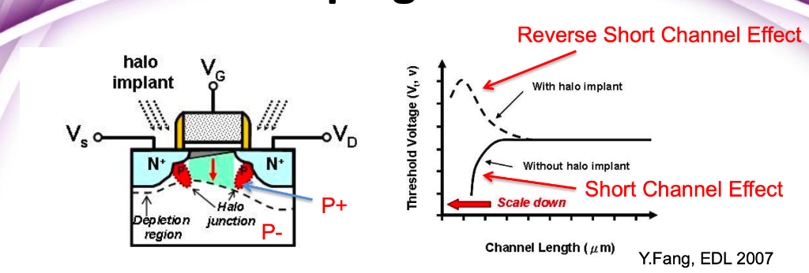

# Lecture 3 — CMOS Transistors（階段性筆記）

> 本筆記整理自 Lecture 3 目前為止的內容，並融合課堂逐字稿導讀、物理直覺、以及常見迷思澄清。
> 目標是：**不用背公式，也能清楚判斷 MOS 的狀態與行為**。

---

## 1. Intrinsic Silicon（本質矽）

- 矽（Si）為 **第四族元素**，最外層有 **4 個價電子**。
- 在晶體中，每個 Si 會與 **4 個鄰居形成共價鍵**。
- 這些共價鍵讓「最外層看起來有 8 個電子」，但：
  - 電子都被**鍵結綁住**
  - **沒有自由載子**（free carriers）

**結論：**
> 純矽（intrinsic silicon）幾乎不導電。

---

## 2. Doping（摻雜）與載子

### 2.1 P-type（受體摻雜）

- 用 **第三族元素**（例如 Boron, B）取代 Si
- 少一個電子 → 形成 **電洞（hole）**
- Boron 稱為 **acceptor**
- 多數載子：**hole**

### 2.2 N-type（施體摻雜）

- 用 **第五族元素**（例如 Phosphorus, Arsenic）取代 Si
- 多一個電子 → 形成 **自由電子**
- 這些原子稱為 **donor**
- 多數載子：**electron**

---

## 3. MOS 結構的物理直覺（以 NMOS 為例）

- 基板（body）是 **p-type substrate**，透過 **p+ tap 接地（GND）**
- Source / Drain 為 **n+ diffusion**
- n+ 與 p-substrate 之間形成 **PN junction（反向偏壓）**，產生耗盡區

### Gate 加正電時（ $V_g > 0$ ）：

1. 吸引電子到 Si–SiO₂ 表面
2. 先推走 hole → **depletion（耗盡）**
3. 再吸引電子 → **inversion（反轉）**
4. 形成 **n-channel**，連接 source 與 drain

**關鍵觀念：**
> 輸出電壓是由「哪一顆 MOS 的通道導通」決定，
> 耗盡區的角色是隔離與防止接面導通，而不是直接設定電壓。


---

## 4. Accumulation / Depletion / Inversion

### Accumulation（累積）
- **NMOS**： $V_g < 0$ ｜ **PMOS**： $V_g > 0$ 
- Gate 電壓讓多數載子聚集在表面
- 但 **沒有形成導通通道**

### Depletion（耗盡）
- **NMOS**： $0 < V_g < V_{th}$ ｜ **PMOS**： $V_{th} < V_g < 0$ 
- Gate 電壓推走多數載子
- 表面留下固定離子 → 耗盡區

### Inversion（反轉）
- **NMOS**： $V_g > V_{th}$ ｜ **PMOS**： $V_g < V_{th}$ 
- Gate 電壓夠大，吸引少數載子形成反轉層
- **形成可導通的 channel**

---

## 5. Threshold Voltage（ $V_{th}$ ）

- ** $V_{th}$ = 剛好在表面形成穩定反轉層的 Gate 電壓**
- 物理上可定義、理論上可推導
- 工程上：
  - 由 **量測 $I_d – V_g$ 曲線** 萃取

**重要直覺：**
> Gate 並不是一加電就能控制通道，
> 必須先「付掉 $V_{th}$ 這個入場費」。

---

## 6. Terminal Voltages（端點電壓定義）

- $V_{gs} = V_g - V_s$ 
- $V_{gd} = V_g - V_d$ 
- $V_{ds} = V_d - V_s = V_{gs} - V_{gd}$ 

### Source / Drain 的定義

- 結構上對稱
- **由電壓決定角色**：
  - NMOS：電壓較低者 = Source
  - PMOS：電壓較高者 = Source

---

## 7. 操作區域（Operating Regions, NMOS）

### 7.1 Cutoff
- $V_{gs} < V_{th}$ 
- 無反轉層，MOS 關閉

### 7.2 Linear（Triode）
$$
\begin{cases}
V_{gs} > V_{th} \\
V_{ds} < V_{gs} - V_{th}
\end{cases}
$$

**物理意義：**
- 通道「整條都存在」
- Gate 在 Source 與 Drain 端都壓得住
- MOS 行為近似為 **受控電阻**

### 7.3 Saturation
$$
\begin{cases}
V_{gs} > V_{th} \\
V_{ds} \ge V_{gs} - V_{th}
\end{cases}
$$

**物理意義：**
- Drain 端通道被拉斷（pinch-off）
- 再增加 $V_{ds}$ ，電流不再明顯增加

---

## 8. $V_{ds}$ 的關鍵直覺（重要）

> ** $V_{gs}$ 決定「有沒有路」**  
> ** $V_{ds}$ 決定「通道會不會在 Drain 端被 pinch-off（夾斷）」**

- $V_{ds}$ 是加在 **整條通道上的電位差**
- 分界條件中的 $- V_{th}$ 代表：
  - Gate 必須先超過 $V_{th}$ 
  - 剩下的 $V_{gs} - V_{th}$ 才是真正能對抗 Drain 端電位的有效控制力

**常見誤解澄清：**

| 誤解 | 實際情況 |
|------|----------|
| 通道真的斷成兩截？ | ❌ 不是。通道只是在 Drain 端「收縮到消失」，電流還是在流 |
| 電流停止？ | ❌ 不是。電子靠電場漂移穿越那一小段耗盡區 |

---

## 9. 電子流 vs. 傳統電流（符號觀念）

- **物理載子角度**：
  - NMOS：電子由 Source → Drain
  - PMOS：電洞由 Source → Drain

- **電路定義角度（ $I_d$ , $I_{ds}$ ）**：
  - 一律定義為 **Drain → Source 為正**

**結論：**
> 談物理機制 → 用電子 / 電洞想  
> 寫公式、算電流 → 用傳統正電流定義

---

## 10. $V_{ds}$ 與 $I_{ds}$ 正負號的實際對齊（CMOS Inverter 實例）

> 本節以 **實際電壓數字** ，將 $V_{ds}$ 與 $I_{ds}$ 的正負號一次對齊說清楚。

### 10.0 三個不能動的定義（錨點）

在開始之前，先鎖死這三個定義：

1. ** $I_{ds}$ 定義** ：傳統正電流，Drain → Source 為正
2. ** $V_{ds}$ 定義** ： $V_{ds} = V_d - V_s$ 
3. **Source 定義** ：
   - NMOS：電壓較低的一端是 Source
   - PMOS：電壓較高的一端是 Source

---

### 10.1 PMOS 充電階段（0 → 1）

#### 設定條件
- $V_{DD} = 1.1 \text{ V}$ 
- PMOS source 接 $V_{DD}$ 
- PMOS n-well 接 $V_{DD}$ 
- Gate = 0 （PMOS 打開）

#### 切換瞬間（真正有電流的時候）

假設某一個切換瞬間：
- Source： $V_s = 1.1 \text{ V}$ 
- Drain（輸出端，還在被充電中）： $V_d = 0.6 \text{ V}$ 

#### $V_{ds}$ 的正負號

$$V_{ds} = V_d - V_s = 0.6 - 1.1 = -0.5 \text{ V}$$

✅ ** $V_{ds}$ 是負的**

這個負號的物理意義：
> Drain 的電位比 Source 低
> → 這正是 PMOS 正在「由 Source 往 Drain 充電」的狀態

#### $I_{ds}$ 的正負號

真實物理行為：
- 正電流（電洞）方向：Source → Drain

但 $I_{ds}$ 的定義方向是：
- Drain → Source 為正

所以此時： $I_{ds} < 0$ 

✅ ** $I_{ds}$ 是負的**

> **關鍵觀察：** $V_{ds}$ 與 $I_{ds}$ 在 PMOS 導通時，符號會「同時為負」。
> 這不是巧合，是因為電壓與電流的參考方向一致，符合被動符號慣例（passive sign convention）。

#### 充電完成（穩態）

充完電後：
- $V_d \rightarrow 1.1 \text{ V}$ ， $V_s = 1.1 \text{ V}$ 
- $V_{ds} = 1.1 - 1.1 = 0$ （沒有壓差）
- $I_{ds} \rightarrow 0$ （電流停止）

---

### 10.2 NMOS 放電階段（1 → 0）

#### 設定條件
- $V_{DD} = 1.1 \text{ V}$ 
- NMOS source 接 GND（0 V）
- NMOS body（p-substrate）接 GND
- Gate = $1.1 \text{ V}$ （NMOS 打開）
- 輸出端原本被 PMOS 拉到高電位，準備放電

#### 切換瞬間（真正有電流的時候）

假設某一個放電瞬間：
- Source（接地）： $V_s = 0 \text{ V}$ 
- Drain（輸出端，還沒放完電）： $V_d = 0.6 \text{ V}$ 

#### $V_{ds}$ 的正負號

$$V_{ds} = V_d - V_s = 0.6 - 0 = +0.6 \text{ V}$$

✅ ** $V_{ds}$ 是正的**

這個正號的物理意義：
> Drain 的電位比 Source 高
> → 電場方向會把電子往 Drain 拉
> → 但電子是負電，實際移動方向是 Source → Drain 的反方向
> → 這正是 NMOS 正在把電容往地放電

#### $I_{ds}$ 的正負號

真實物理行為：
- 電子方向：Source → Drain
- 傳統正電流方向：Drain → Source

對照 $I_{ds}$ 定義（正方向 = Drain → Source）：

$I_{ds} > 0$ 

✅ ** $I_{ds}$ 是正的**

> **關鍵觀察：** NMOS 導通時， $V_{ds}$ 與 $I_{ds}$ 會同時是正的。

#### 放電完成（穩態）

放電完成後：
- $V_d \rightarrow 0 \text{ V}$ ， $V_s = 0 \text{ V}$ 
- $V_{ds} = 0 - 0 = 0$ （沒有壓差）
- $I_{ds} \rightarrow 0$ （電流停止）

---

### 10.3 總結對照表

| 元件 | 切換方向 | $V_{ds}$ | $I_{ds}$ | 有電流的時機 |
|------|----------|----------|----------|---------------|
| NMOS | 1 → 0（放電） | 正 | 正 | $V_{out}$ 尚未到 0 |
| PMOS | 0 → 1（充電） | 負 | 負 | $V_{out}$ 尚未到 $V_{DD}$ |

---

### 10.4 總結段落

**PMOS 版本：**
> 以 PMOS 為例，在輸出由 0 充電至 $V_{DD}$ 的切換期間，Source 端維持在 $V_{DD}$ ，而 Drain 端電腳尚未上升完成，因此 $V_d < V_s$ ，使得 $V_{ds} = V_d - V_s < 0$ 。
>
> 此時實際正電流由 Source 流向 Drain，但由於 $I_{ds}$ 的正方向定義為 Drain → Source，因此量測到的 $I_{ds}$ 為負值。
> 當輸出電壓上升至與 Source 對齊後， $V_{ds} \rightarrow 0$ ，電流隨即消失，系統進入穩態。

**NMOS 版本：**
> 以 NMOS 為例，在輸出由 $V_{DD}$ 放電至 0 的切換期間，Source 端維持在 0 V，而 Drain 端電壓尚未下降完成，因此 $V_d > V_s$ ，使得 $V_{ds} = V_d - V_s > 0$ 。
>
> 此時電子實際由 Source 流向 Drain，而傳統正電流方向為 Drain → Source；由於 $I_{ds}$ 的正方向亦定義為 Drain → Source，因此量測到的 $I_{ds}$ 為正值。
> 當輸出電壓下降至與 Source 對齊後， $V_{ds} \rightarrow 0$ ，電流隨即消失，系統進入穩態。

---

### 10.5 一句話封印整個觀念

> **只要輸出還沒和 Source 對齊，就一定有電流；**
> **Source 是低端（NMOS）→ $V_{ds}$ 、 $I_{ds}$ 為正；**
> **Source 是高端（PMOS）→ $V_{ds}$ 、 $I_{ds}$ 為負。**

---

## 11. CMOS Inverter 的穩態理解（總結）

### Vin = High
- NMOS on, PMOS off
- n-channel 將輸出拉到 GND
- Vout ≈ 0

### Vin = Low
- PMOS on, NMOS off
- p-channel 將輸出拉到 VDD
- Vout ≈ VDD

**關鍵句：**
> 輸出電位由「哪一顆 MOS 的通道導通」決定，
> body / well 與 PN 接面負責隔離與正確偏壓。

---

## 13. Bulk Charge Model（Page 12）— 用電容近似通道電荷的第一步

> **開宗明義（先說這個模型在幹嘛）**  
> Bulk charge model 的目的，不是在判斷 MOS「有沒有打開」，  
> 而是在 **MOS 已經打開（strong inversion）之後**，  
> 用一個 *好算但不失直覺* 的方式，估算：
>
> 👉 **整條 channel 裡「大約有多少反轉電荷」**  
>
> 因此它回答的是「多少（how much）」的問題，  
> 而不是你前面已經熟悉的「有沒有（on/off）」問題。  
> 這也是它和 $V_{gs}$ $\ge$ $V_{t}$ 那套開關判斷**層級不同**的地方。

---

### 13.1 模型骨架：先把 Q = C · V 立起來

本頁從

$$Q_{\text{channel}} = C \cdot V$$

出發，其中把 gate–oxide–channel 視為**平行板電容**。

這裡的想像非常具體：

- 上方：gate（金屬）
- 中間：oxide（SiO₂，絕緣）
- 下方：channel（反轉層，導電）

只要你接受這個幾何結構，Q = C · V 就是最自然的第一步。

---

### 13.1.1 為什麼會有 $C_{ox}$？——「材料與距離」的係數

單位面積的氧化層電容定義為：

$$C_{ox} = \frac{\varepsilon_{ox}}{t_{ox}}$$

這一項只跟兩件事有關：

- $\varepsilon_{ox}$：  
  氧化層材料的介電常數  
  → **材料本身有多容易被極化**
- $t_{ox}$：  
  氧化層厚度  
  → **gate 跟 channel 隔多遠**

因此 $C_{ox}$ 的物理意義可以直接讀成：

> **「每一單位面積，gate 對 channel 的電容有多強」**

這是一個**純材料 + 製程**決定的係數，  
與 MOS 有沒有打開、電壓多大 **完全無關**。

---

### 13.1.2 為什麼要乘上 W × L？——「面積真的會線性放大電容」

gate 在上方覆蓋整條 channel，而 channel 的幾何尺寸為：

- 寬度：W（橫向，決定一次能排幾條電荷）
- 長度：L（縱向，從 source 到 drain）


因此 gate 覆蓋的有效面積約為：

$$A \approx W \cdot L$$

對平行板電容而言：

> **面積放大幾倍，能儲存的電荷就放大幾倍**

所以整體 gate 電容自然寫成：

$$
C = C_g = C_{ox} \cdot W L = \frac{\varepsilon_{ox}WL}{t_{ox}}
$$

你可以這樣記這一行：

- $C_{ox}$：**每單位面積的能力（強度）**
- WL：**你實際用掉多少面積**
- $C_{g}$：**這顆 MOS gate 對 channel 的總耦合能力**

---

### 13.1.3 小總結： $C_{g}$ 在這一頁「只負責一件事」

在 Page 12， $C_{g}$ **沒有任何動態、沒有任何非線性角色**，  
它只做一件事：

> 👉 把「gate 的有效控制電壓」  
> 轉成「channel 裡能被拉出來的電荷量」

也就是：

$$Q_{\text{channel}} = C_{g} \cdot V$$

---

### 13.2 你一開始最卡的點：V 到底是哪個電壓？為什麼是 $V_{gs}$ - $V_{ds}$/2？

#### (a) 先抓住事實：channel 電位沿著 x 方向會變
當 $V_{ds}$ ≠ 0 時，通道由 source 到 drain 的電位：

- 左端（source 端）約為 $V_{s}$
- 右端（drain 端）約為 $V_{d}$

因此 channel **不是等電位**，  
gate-to-channel 電壓 $V_{gc}$ 也就不是單一數值。

---

#### (b) 中點近似的真正幾何意義（幫你之後快速回想）

定義：

$$V_{\text{ch,mid}} \approx \frac{V_s + V_d}{2}$$

這個 $V_{ch,mid}$ 指的是：

> **channel 在「幾何正中央」那一點的電位**

它的位置是：

- 左右方向：source 與 drain 的正中間  
- 上下方向：在 gate 正下方、channel 內部

而 $V_{g}$ 則是：

- gate 那整片金屬的電位
- 對整片 gate 來說是同一個數值

所以在「同一個橫向位置（中點）」上：

$$V_{gc,\text{mid}} = V_g - V_{\text{ch,mid}}$$

這是一個**純上下方向**的電壓差，  
不是 gate 去「碰」source 或 drain 的左右概念。

---

(c) 改寫成端點電壓後的結果（完整推導，不省略）
從中點定義開始：

$$V_{\text{ch,mid}} \approx \frac{V_s + V_d}{2}$$

以及中點的 gate-to-channel 電壓定義：

$$V_{gc,\text{mid}} = V_g - V_{\text{ch,mid}}$$

將第一式代入第二式：

$$
\begin{aligned}
V_{gc,\text{mid}}
&= V_g - \frac{V_s + V_d}{2}
\end{aligned}
$$

接著把平均項改寫成「以 V_s 為基準」的形式（這一步是關鍵）：

$$
\begin{aligned}
\frac{V_s + V_d}{2}
&= \frac{V_s + \big(V_s + (V_d - V_s)\big)}{2} \
&= \frac{2V_s + (V_d - V_s)}{2} \
&= V_s + \frac{V_d - V_s}{2}
\end{aligned}
$$

將上式再代回 $V_{gc,\text{mid}}$ ：

$$
\begin{aligned}
V_{gc,\text{mid}}
&= V_g - \left( V_s + \frac{V_d - V_s}{2} \right) \\
&= (V_g - V_s) - \frac{V_d - V_s}{2}
\end{aligned}
$$

最後用端點電壓定義：
- $V_{gs} = V_g - V_s$ 
- $V_{ds} = V_d - V_s$ 

代入得：

$$
\begin{aligned}
V_{gc,\text{mid}}
&= V_{gs} - \frac{V_{ds}}{2}
\end{aligned}
$$

這一項的直覺可以讀成：


> **「在平均意義下，gate 對 channel 還剩多少控制力」**

---

### 13.3 為什麼還要扣 $V_{t}$？以及最常見的誤會怎麼解

這裡一定要分清楚兩個層級（也是你一開始混在一起的地方）：

- **開關層級（有沒有通道）**  
  $$V_{gs} \ge V_t$$  
  → 判斷 MOS 是否打開（yes / no）

- **電荷層級（通道裡有多少反轉電荷）**  
  $V_{t}$ 那一段 gate 電壓，只是「剛好把反轉層建立起來的成本」，  
  **不會增加反轉層的厚度或電荷量**。

因此在算電荷時，有效電壓要寫成：

$$
V = V_{gc} - V_t
\approx \left( V_{gs} - \frac{V_{ds}}{2} \right) - V_t
$$

**關鍵澄清（避免之後再卡一次）：**

> 這不是在說  
> $V_{gs}$ = $V_{gs}$ - $V_{ds}$/2  
> 而是在說：
>
> - $V_{gs}$：用來判斷「MOS 有沒有開」
> - $V_{gs}$ - $V_{ds}$/2：用來估算「平均 gate 控制力」
> - 再扣掉 $V_{t}$：得到「真正能增加反轉電荷的部分」

---

### 13.4 邊界條件：Bulk charge model 什麼時候才「站得住腳」？

本頁的中點平均近似隱含一個很重要的前提：

> **$V_{gs}$ - $V_{t}$ 要夠大**，  
> 使得 channel 大部分區域都能維持 strong inversion。

因此：

- 當 $V_{gs}$ 只比 $V_{t}$ 大一點點時  
  V = ($V_{gs}$ - $V_{ds}$/2) - $V_{t}$ 很容易被算成負值
- 這不代表「實際完全沒有電流」
- 更合理的解讀是：  
  **這個「整條 channel 平均」的模型在該操作點開始失效**

---

### 13.5 Bulk Charge Model 核心概念總結

> **核心思路：**  
> 在 strong inversion 前提下，用平行板電容模型  
> 把 gate 的「平均有效控制電壓」  
> 轉成「channel 裡的總反轉電荷量」。

## 14. Carrier velocity（載子速度）— 電子在通道裡是怎麼被拉著走的？

> **本節在做什麼（先對齊角色）**  
> 在前一節（Bulk charge model）中，我們已經用電容近似，
> 估算出「通道裡大約有多少反轉電荷 $Q_{channel}$」。
>
> 接下來要回答的問題是：
>
> 👉 **這些電荷是怎麼移動的？移動得快還是慢？**
>
> 因此，本節只討論「載子的運動行為」，  
> 尚未引入電流公式。

---

### 14.1 橫向電場 E：推電子往前的來源

當 NMOS 的 drain 與 source 之間存在電壓差 $V_{ds}$ 時，
在通道內沿著 **source → drain** 方向會形成一個**橫向電場**。

在這裡採用的是平均近似：

$$
E \approx \frac{V_{ds}}{L}
$$

其中各符號的中文意義為：

- E：橫向電場（electric field）  
  → **每單位通道長度上，電子所感受到的平均推力大小**
- $V_{ds}$：汲極對源極電壓  
  → **沿著通道施加的總電壓差**
- L：通道長度（channel length）  
  → **source 到 drain 的距離**

**直覺理解：**

> 把整個 $V_{ds}$ 平均分攤在長度 L 上，  
> 得到「每單位通道長度，電位下降多少」，  
> 也就是「每單位長度，對電子施加多大的推力」。

這裡的 E 是**平均電場**，  
並不表示通道中每一點的電場都完全相同。

---

### 14.2 載子速度 v：電子實際跑多快？

電子在電場作用下會產生漂移運動，其平均漂移速度定義為：

$$
v = \mu \cdot E
$$

各符號的物理意義為：

- v：載子速度（carrier velocity）  
  → **電子在通道裡沿著 source → drain 移動的平均速度**
- μ：遷移率（mobility）  
  → **材料允許電子移動快慢的能力係數**
- E：橫向電場  
  → **推動電子前進的驅動來源**

**物理直覺：**

> 電場越強，電子被拉得越用力；  
> 但電子實際能跑多快，取決於材料本身（μ）。

---

### 14.3 隱含假設：低電場（low-field）載子運動模型

在本節中直接使用

$$
v = \mu \cdot E
$$

且將 μ 視為常數，隱含了一個重要前提：

> **低電場假設（low-field regime）**

其意義為：

- 尚未考慮速度飽和（velocity saturation）
- 載子速度與電場呈線性關係
- μ 不隨電場改變

只要看到 v = μE 且 μ 為常數，
就代表模型站在 **low-field transport** 的假設下。

---

### 14.4 載子穿越通道所需的時間 t

若電子以平均速度 v 通過長度為 L 的通道，
則其通過整條通道所需的時間定義為：

$$
t = \frac{L}{v}
$$

其中：

- t：載子穿越通道的時間  
  → **電子從 source 走到 drain 需要多久**
- L：通道長度
- v：載子速度

這是最基本的運動學關係：

> **時間 = 距離 / 速度**

---

### 14.5 本節重點整理（一眼回想用）

- E = $V_{ds}$/L：  
  → 通道中的**平均橫向推力（電場）**
- v = μE：  
  → 電子在材料中實際移動的速度（低電場假設）
- t = L/v：  
  → 電子穿越整條通道所需的時間

本節僅建立「載子如何移動」的物理模型，  
尚未引入電流的定義。

## 15. NMOS Linear I–V（線性區）— 從通道電荷到汲極電流

> **本節在做什麼（先講目的）**  
> 在第 13 節中，我們已經知道：
> - 通道裡大約有多少反轉電荷 $Q_{channel}$
>
> 在第 14 節中，我們也已經知道：
> - 載子在通道裡移動的速度 v
> - 以及穿越整條通道所需的時間 t
>
> 👉 本節要做的事只有一件：  
> **把「電荷有多少」與「移動要多久」接起來，推導出線性區的電流 $I_{ds}$。**

---

### 15.1 電流的基本定義：電荷流率

電流的物理定義為「單位時間內通過的電荷量」：

$$I_{ds} = \frac{Q}{t}$$

在 NMOS 中，我們關心的是：
- 通道內的總反轉電荷 $Q_{channel}$
- 載子穿越通道所需的時間 t

因此可直接寫成：

$$I_{ds} = \frac{Q_{\text{channel}}}{t}$$

---

### 15.2 通道電荷 $Q_{channel}$（來自 Bulk charge model）

根據第 13 節的 bulk charge model，在 strong inversion 且採用中點近似時：

$$Q_{\text{channel}} = C_{ox} W L \left( V_{gs} - V_t - \frac{V_{ds}}{2} \right)$$

這個式子的物理意義是：

- 通道電荷 **正比於**
  - gate 對 channel 的平均有效控制電壓  
    $V_{gs} - \frac{V_{ds}}{2}$
  - 再扣掉剛好形成反轉層所需的門檻電壓 $V_{t}$

其中：
- $-\frac{V_{ds}}{2}$ 代表  
  **因為 drain 電壓拉高，使得通道電位平均被抬高，  
  gate 對通道的平均控制力變弱，能維持的反轉電荷因此變少。**

---

### 15.3 載子穿越通道所需的時間 t

根據第 14 節，載子穿越整條通道所需的時間為：

$$t = \frac{L}{v}$$

而在低電場假設（low-field regime）下：

$$v = \mu \cdot E$$

通道內的平均橫向電場近似為：

$$E \approx \frac{V_{ds}}{L}$$

將電場代入速度：

$$v = \mu \cdot \frac{V_{ds}}{L}$$

再代回時間定義式：

$$
\begin{aligned}
t
&= \frac{L}{v} \\
&= \frac{L}{\mu \cdot \frac{V_{ds}}{L}} \\
&= \frac{L^2}{\mu V_{ds}}
\end{aligned}
$$

---

### 15.4 將 $Q_{channel}$ 與 t 代入電流定義式

回到電流定義：

$$I_{ds} = \frac{Q_{\text{channel}}}{t}$$

代入前兩節得到的結果：

$$I_{ds} = \frac{ C_{ox} W L \left( V_{gs} - V_t - \frac{V_{ds}}{2} \right) }{ \frac{L^2}{\mu V_{ds}} }$$

除以分數等於乘以倒數：

$$I_{ds} = C_{ox} W L \left( V_{gs} - V_t - \frac{V_{ds}}{2} \right) \cdot \frac{\mu V_{ds}}{L^2}$$

將幾何因子整理：

$$
\frac{W L}{L^2} = \frac{W}{L}
$$

得到線性區的 I–V 關係式：

$$I_{ds} = \mu C_{ox} \frac{W}{L} \left( V_{gs} - V_t - \frac{V_{ds}}{2} \right) V_{ds}$$

---

### 15.5 定義 $\beta$ 以簡化表示

為了讓式子更簡潔，定義一個常數：

$$\beta = \mu C_{ox} \frac{W}{L}$$

則線性區的 NMOS 汲極電流可寫成：

$$I_{ds} = \beta \left( V_{gs} - V_t - \frac{V_{ds}}{2} \right) V_{ds}$$

---

### 15.6 關於 $-V_{ds}/2$ 的關鍵物理意義（常見困惑釐清）

- $-\frac{V_{ds}}{2}$ **不是直接在減電流**
- 它代表的是：
  - drain 電壓升高
  - 使通道電位平均被抬高
  - gate 對 channel 的平均有效電壓下降
  - 因此通道內的反轉電荷變少

由於電流本質上來自「有多少電荷在流動」，
平均通道電荷下降，會抑制電流的成長速度。

---

### 15.7 本節重點整理（一眼回想用）

- 電流的本質：
  $$I_{ds} = \frac{Q_{\text{channel}}}{t}$$
- 線性區電流同時受到兩個 $V_{ds}$ 效應影響：
  - 括號外的 $V_{ds}$：  
    → 推動載子移動（速度變快）
  - 括號內的 $-V_{ds}/2$：  
    → 平均通道電荷變少
- 在線性區中，電流仍隨 $V_{ds}$ 增加，
  但增加速度逐漸變慢，為後續進入飽和區鋪路

## 16. NMOS Saturation I–V：通道被夾斷後，電流為什麼不再增加？

> **本節核心目的**  
> 承接前一節的線性區模型，說明：  
> 當 $V_{ds}$ 持續增加時，為什麼 $I_{ds}$ 會「停止隨 $V_{ds}$ 增加」，  
> 並推導出 NMOS 在飽和區的 I–V 關係式。

---

### 16.1 從線性區模型出發（所有推導的起點）

在前一節（Linear I–V），我們已經建立：

$$I_{ds} = \beta \left( V_{gs} - V_t - \frac{V_{ds}}{2} \right) V_{ds}$$

其中：

- $\beta = \mu C_{ox}\frac{W}{L}$
- 括號內代表 **通道平均反轉電荷的強度**
- 括號外的 $V_{ds}$ 代表 **橫向電場造成的載子推進效果**

⚠️ **此公式的隱含前提：**

> 整條 channel 從 source 到 drain 都仍然存在  
>（gate 對整條通道都還有控制力）

---

### 16.2 什麼時候這個前提會失效？——Pinch-off 的出現

回到 gate-to-channel 的觀點：

在通道某一位置 $x$，有：

$$V_{gc}(x) = V_g - V_{ch}(x)$$

當 $V_{ds}$ 增加時：

- drain 端的 channel 電位 $V_{ch}$ 被拉高
- 導致 drain 端的 $V_{gc}$ 持續下降

在 **drain 端那一點**：

$$V_{gc,\text{drain}} = V_{gs} - V_{ds}$$

當這個值剛好等於門檻電壓：

$$V_{gs} - V_{ds} = V_t$$

即可得到臨界條件：

$$V_{dsat} = V_{gs} - V_t$$

**物理意義：**

> drain 端的反轉層剛好消失，  
> channel 在 drain 附近被「夾斷（pinch off）」。

---

### 16.3 為什麼進入飽和後， $V_{ds}$ 不再增加電流？

這是本頁最重要的觀念，不是數學，而是「控制權」。

在 pinch-off 發生之後：

- drain 附近 **已經沒有 channel**
- gate 無法再對那一段施加控制
- 通道中可被 gate 控制、可被注入的反轉電荷數量  
  **完全由 source 端決定**

因此：

> 即使再增加 $V_{ds}$ ，  
> gate 能提供的反轉電荷數量已經不再增加，  
> $I_{ds}$ 也就不再隨 $V_{ds}$ 上升。

這就是投影片所說的：

> **Now drain voltage no longer increases current**

⚠️ 關鍵澄清：

- 飽和 **不是** 電子停止移動  
- 飽和 **不是** 速度飽和  
- 飽和是：**gate 對 channel 的控制已經達到極限**

---

### 16.4 飽和區電流的完整推導（不省略步驟）

從線性區公式出發：

$$I_{ds} = \beta \left( V_{gs} - V_t - \frac{V_{ds}}{2} \right) V_{ds}$$

在進入飽和的臨界點：

$$V_{ds} = V_{dsat} = V_{gs} - V_t$$

直接代入：

$$\begin{aligned} I_{ds} &= \beta \left( V_{gs} - V_t - \frac{V_{gs} - V_t}{2} \right) (V_{gs} - V_t) \\ &= \beta \left( \frac{V_{gs} - V_t}{2} \right) (V_{gs} - V_t) \\ &= \frac{\beta}{2} (V_{gs} - V_t)^2 \end{aligned}$$

再將 $\beta$ 展開：

$$I_{ds} = \frac{1}{2} \mu C_{ox} \frac{W}{L} (V_{gs} - V_t)^2$$

這就是 **NMOS 飽和區 I–V 方程式**。

---

### 16.5 一句話封印本頁（回想用）

> **NMOS 進入飽和區，  
> 不是因為電子跑不動，  
> 而是因為 drain 端的 channel 被 gate 夾斷，  
> 電流只剩下由 $V_{gs}$ 能提供多少反轉電荷來決定。**

## 17. NMOS I–V 行為總整理（Cutoff / Linear / Saturation）

本章將前面第 13–16 章推導出的結果，
整理成一張「操作區域 × 電流模型」的對照表，
作為之後分析電路時的快速查閱基準。

---

### 17.1 三個操作區域與對應條件

NMOS 的汲極電流 $I_{ds}$ 可依操作條件分為三個區域：

---

#### (1) Cutoff（截止區）

條件：
$$V_{gs} < V_t$$

電流：
$$I_{ds} = 0$$

物理意義：
- 尚未形成反轉層
- channel 不存在
- MOS 關閉（off）

---

#### (2) Linear / Triode（線性區）

條件：
$$V_{gs} \ge V_t \quad \text{且} \quad V_{ds} < V_{dsat}$$

其中：
$$V_{dsat} = V_{gs} - V_t$$

電流模型：
$$I_{ds} = \beta \left( V_{gs} - V_t - \frac{V_{ds}}{2} \right) V_{ds}$$

物理意義：
- 整條 channel 從 source 到 drain 都存在
- gate 可控制整條通道的反轉電荷
- 電流同時受：
  - 通道電荷量（由 $V_{gs}$ 決定）
  - 橫向電場（由 $V_{ds}$ 決定）

---

#### (3) Saturation（飽和區）

條件：
$$V_{gs} \ge V_t \quad \text{且} \quad V_{ds} \ge V_{dsat}$$

電流模型：
$$I_{ds} = \frac{\beta}{2} \left( V_{gs} - V_t \right)^2$$

物理意義：
- drain 端的 channel 發生 pinch-off
- gate 對通道的控制已達上限
- 電流只由 source 端可提供的反轉電荷決定
- 再增加 $V_{ds}$，理想模型下不再增加 $I_{ds}$

---

### 17.2 參數定義（統一記法）

$$\beta = \mu C_{ox} \frac{W}{L}$$

其中：

- $\mu$：載子遷移率（mobility）
- $C_{ox}$：單位面積氧化層電容
- $W$：通道寬度
- $L$：通道長度

---

### 17.3 一句話快速回想整個 Chapter

- $V_{gs}$：  
  → 決定 **通道能不能存在、以及有多少反轉電荷**
- $V_{ds}$（小）：  
  → 提供橫向電場，推動載子（Linear）
- $V_{ds}$（大）：  
  → 夾斷 drain 端 channel，電流進入飽和（Saturation）

> **NMOS 的 I–V 行為，本質上就是  
> gate 能拉多少 charge、以及 drain 能推多快。**

---

> 本節為 Lecture 3  
> **NMOS I–V 模型（long-channel、low-field）** 的完整總結頁。

### 17.4 模型適用條件註解：為什麼需要 $V_{gs}-V_t$ 夠大？

本章整理的 NMOS I–V 模型（Linear 與 Saturation）  
**隱含一個重要前提**，但在公式中通常不會被特別寫出來：

> **$V_{gs} - V_t$ 必須夠大，使通道處於 strong inversion。**

---

#### 這句話的真正意思是什麼？

這裡的「夠大」不是只要求：

$$V_{gs} \ge V_t$$

而是指：

> **通道中「大部分區域」都能維持明顯的反轉層厚度，  
> 不會因為一點 $V_{ds}$ 就被快速削弱或消失。**

---

#### 為什麼線性區模型需要這個條件？

線性區電流模型：

$$I_{ds} = \beta \left( V_{gs} - V_t - \frac{V_{ds}}{2} \right) V_{ds}$$

是建立在以下假設之上：

- 整條 channel 從 source 到 drain 都存在
- 通道反轉電荷可以用「平均值」近似
- $V_{gs} - V_t$ 明顯大於 $\frac{V_{ds}}{2}$

若 $V_{gs}-V_t$ 很小：
- 中點近似會過早算出「負的有效電壓」
- 模型會低估實際存在的電流
- 代表 **模型開始失效，而非物理上真的沒電流**

---

#### 那飽和區模型呢？

飽和區模型：

$$I_{ds} = \frac{\beta}{2} \left( V_{gs} - V_t \right)^2$$

同樣假設：

- source 端能提供穩定、足量的反轉電荷
- pinch-off 發生前，通道已經完整建立

因此：

> 飽和區模型 **不是** 用來描述  
> $V_{gs}$ 剛超過 $V_t$ 的臨界狀態，  
> 而是用在 **strong inversion + channel 已充分形成** 的情況。

---

#### 一句話版本

> **Linear 與 Saturation 的長通道 I–V 模型，  
> 都假設 $V_{gs}-V_t$ 夠大，  
> 才能把通道視為「可被 gate 穩定控制的反轉層」。**

---

> 若 $V_{gs}-V_t$ 很小，  
> 應進入的是 weak / moderate inversion 的分析框架，  
> 不再適合直接套用本章公式。

## 18. PMOS I–V 重點整理：與 NMOS 的對稱與差異

本節不重新推導 PMOS 的 I–V 方程式，  
而是說清楚 **如何從 NMOS 的模型「對稱地理解」PMOS**，  
以及在電路設計上最重要的幾個直覺差異。

---

### 18.1 一個核心原則：PMOS 是「符號與極性反轉」的 NMOS

對於 long-channel、low-field 的模型而言：

> **PMOS 的 I–V 形式與 NMOS 完全相同，  
> 只是「載子、摻雜與電壓極性」全部反轉。**

因此在分析時，最重要的不是重背新公式，  
而是搞清楚「誰是 source、誰是 drain、電壓怎麼定義」。

---

### 18.2 Source / Drain 的定義（這點一定要牢記）

在 PMOS 中：

- **Source 是「電位較高」的端點**
- Drain 是電位較低的端點

這與 NMOS 相反（NMOS 的 source 是電位較低者）。

因此在 PMOS I–V 圖中你會看到：

- $V_{gs} < 0$
- $V_{ds} < 0$
- $I_{ds} < 0$（慣例上電流方向與 NMOS 相反）

⚠️ 這不是物理行為變奇怪，  
而只是 **符號定義遵守同一套電路慣例**。

---

### 18.3 載子不同 → 遷移率不同（設計上的關鍵差異）

- NMOS：  
  - 載子為電子（electrons）
  - 遷移率： $\mu_{n}$
- PMOS：  
  - 載子為電洞（holes）
  - 遷移率： $\mu_{p}$

重要事實：

> $\mu_{p}$ **通常約為** $\mu_{n}$ **的 1/2 ～ 1/3**

這是材料物理造成的，  
不是製程或偏壓可以輕易改變的。

---

### 18.4 為什麼 PMOS 通常要做得比較寬？

回到你已經熟悉的參數：


$$ \beta = \mu C_{ox} \frac{W}{L} $$


由於：


$$ \mu_{p} < \mu_{n} $$


若希望在 CMOS 中：

- PMOS 與 NMOS 提供**相近的驅動電流**
- 上拉（PMOS）與下拉（NMOS）速度接近

那就必須：

> **用較大的** $W_p$ **來補償較小的** $\mu_p$

也就是設計上常見的結論：

> **PMOS 必須比 NMOS 做得寬，  
> 才能提供相同等級的電流能力。**

這正是你之後在 inverter、NAND、NOR sizing 時  
會反覆看到的比例來源。

---

### 18.5 如何「正確閱讀」PMOS I–V 曲線？


在 PMOS I–V 圖中（如上圖）：

- 橫軸： $V_{ds}$ （負方向）
- 縱軸： $I_{ds}$ （負方向）
- 不同曲線：不同 $V_{gs}$ （越負 → 驅動越強）

閱讀時請記住：

> **不要被負號嚇到，  
> 只看「絕對值大小」與「趨勢是否與 NMOS 對稱」。**

在物理行為上：

- Cutoff / Linear / Saturation 的區分完全類比 NMOS
- Pinch-off、strong inversion 的概念也完全相同

---

### 18.6 一句話總結（CMOS 設計用）

> **PMOS = 極性反轉的 NMOS，  
> 但因為電洞比較慢，  
> 所以要做得比較寬。**

---

> 本節為 Lecture 3  
> **NMOS → PMOS 對稱延伸** 的總結頁，  
> 直接銜接後續 CMOS inverter 與 sizing 分析。

## 19. Capacitance：MOS 為什麼一定有電容？以及它為什麼決定速度與功耗

> **本章定位**  
> 本章從 I–V（電流）模型正式轉向 C（電容）模型。  
> 電容不是附加細節，而是之後決定 **切換速度（delay）與動態功耗（power）** 的核心因素。

---

### 19.1 一個最基本但關鍵的原則

> **Any two conductors separated by an insulator have capacitance**

只要滿足：
- 兩個導體（metal / heavily doped region）
- 中間隔著絕緣體（oxide、depletion region）

就一定存在電容。

在 MOS 中，這個條件幾乎無所不在。

---

### 19.2 Gate–Channel 電容：MOS 能運作的根本原因

Gate 與 channel：
- 都是導體
- 中間隔著 gate oxide（SiO₂）

因此它們本質上形成一個平行板電容，其單位面積電容為：

$$C_{ox} = \frac{\varepsilon_{ox}}{t_{ox}}$$

**物理意義：**

> Gate–channel 電容的存在，  
> 才能讓 gate 透過電場「拉出反轉電荷」，  
> 形成 channel，MOS 才能導通。

沒有這個電容：
- 就沒有 channel
- MOS 不可能運作

---

### 19.3 Source / Drain 對 Body 的電容（Diffusion Capacitance）

Source 與 Drain 和 Body 之間形成的是 **反向偏壓的 PN 接面**。

- 反向偏壓 PN 接面
- 會產生 depletion region
- depletion region 沒有自由載子 → 等效為絕緣層

因此：
- Source–Body → $C_{sb}$
- Drain–Body → $C_{db}$

這類電容因為來自 source / drain 的擴散區，
故稱為 **diffusion capacitance**。

> **補充提醒（從製程與材料角度理解 diffusion capacitance）**  
>
> 以 **NMOS** 為例：
>
> - Body（Bulk / Base）為 **p-type 半導體**
> - Source 與 Drain 為 **n⁺ 重摻雜區**
> - 這些 n⁺ 區域是透過 **擴散（diffusion）或離子佈植製程** 形成的
>
> 因此：
>
> - Source–Body 與 Drain–Body 之間  
>   **天然形成 n–p 接面（PN junction）**
> - 在正常操作下，這些 PN 接面多半處於 **反向偏壓**
>
> 對反向偏壓的 PN 接面而言：
>
> - 接面附近會形成 **耗盡區（depletion region）**
> - 耗盡區內幾乎沒有自由載子
> - 在電氣行為上等效為 **絕緣層**
>
> 於是：
>
> - n⁺ diffusion（Source / Drain）與 p-type Body  
>   就構成了：
>
>   > **導體 – 絕緣層 – 導體**
>
> 這正是「電容」的定義。
>
> 因為這個電容來自 **source / drain 的擴散區（diffusion region）**，
> 所以稱為 **diffusion capacitance**，
> 並以 $C_{sb}$ 、 $C_{db}$ 表示。


---

### 19.4 核心釐清：電容到底是「越大越好」還是「越小越好」？

這正是你卡住的地方，我們直接用你心中正在打架的兩個式子來解。

---

#### (1) 你目前的直覺來源

你腦中同時存在這兩件事：

- 電流定義：
$$I_{ds} = \frac{Q}{t}$$

- 電荷與電容關係：
$$Q = C V$$

於是你自然會想：

> C 變大 → Q 變大 → I 變大  
> → 充放電更快？  
> → 電容好像越大越好？

這個推理 **在「單一瞬間」是對的**，但它漏掉了一個關鍵角色。

---

#### (2) 被忽略的關鍵：Q 是「要被充進去的東西」

在數位電路中，真正的問題不是：

> 「瞬間能不能拉很大的電流？」

而是：

> **「要花多久，才能把『該充的電荷』充完？」**

當電容變大時：
- 你要充的電荷量 Q = C·V **也跟著變大**
- 不是免費的

即使 $I_{ds}$ 很大：
- 你還是必須把「更多的電荷」搬進去
- 所需時間 **不一定變短，反而可能變長**

---

#### (3) 換一個更貼近電路的問法（關鍵轉換）

真正的速度問題其實是：

> **「輸出電壓要從 0 變成 $V_{DD}$，需要多久？」**

而不是：
> 「瞬間電流能不能很大？」

而這個時間尺度，之後你會看到它長成：

$$t_{\text{delay}} \sim \frac{C \cdot V}{I}$$

現在先不用背，只抓直覺：

- C ↑ → 要搬的電荷 ↑
- I ↑ → 搬電荷的能力 ↑
- **速度取決於兩者的平衡**

---

#### (4) 所以結論是什麼？（一句話版本）

> **電容不是越大越好，也不是越小越好。**

更精準地說：

- **對導通能力（drive strength）來說**：  
  大 $C_{ox}$ 有助於形成更多通道電荷 → $I_{ds}$ 大
- **對切換速度與功耗來說**：  
  大電容意味著：
  - 需要更多能量充放電
  - 需要更長時間完成電壓切換

因此在 CMOS 設計中，核心永遠是：

> **用「夠大的電流」，  
> 去驅動「盡可能小的電容」。**

---

### 19.5 本章一句話總結（之後回頭看用）

> **電流決定你「推得多用力」，  
> 電容決定你「要推多少東西」。**  
>  
> 速度與功耗，都是這兩者之間的取捨結果。

---

> 本章為 Lecture 3  
> **從 I–V 過渡到 Delay / Power 模型的關鍵轉折點**。

## 20. Gate–Channel Capacitance：Gate 電容如何建模成電路元件

> **本章定位**  
> 本章建立「Gate–Channel 電容」的基本模型，  
> 將 MOS 的幾何結構轉換為之後可用於 delay 與 power 分析的電路電容。

---

### 20.1 建模近似：將 channel 視為與 source 相連

在電容模型中，採用一個常見的工程近似：

> **Approximate channel as connected to source**

也就是在分析 gate 電容時，
暫時將 channel 視為電氣上與 source 相連的導體節點。

⚠️ 這是一種 **電路模型近似**，
並非指物理上 channel 與 source 短路。

---

### 20.2 Gate–Channel 電容的總量 $C_g$

Gate 與 channel：
- 皆為導體
- 中間隔著 SiO₂ gate oxide（絕緣層）

因此可直接用平行板電容模型描述。

單位面積氧化層電容為：

$$C_{ox} = \frac{\varepsilon_{ox}}{t_{ox}}$$

Gate 覆蓋的 channel 面積約為 $W \cdot L$，
因此整體 gate–channel 電容為：

$$C_g = \frac{\varepsilon_{ox}WL}{t_{ox}} = C_{ox}WL$$

---

### 20.3 Gate 電容在電路中的分解方式

在電路等效模型中，
Gate 不會直接連接到「channel」這個抽象節點，
而是透過 source 與 drain 兩個實際端點產生作用。

因此：

$$C_g = C_{gs} + C_{gd}$$

其中：

- $C_{gs}$：Gate–Source 電容
- $C_{gd}$：Gate–Drain 電容

這兩個電容的總和，
等於整個 gate–channel 電容 $C_g$。

---

### 20.4 以設計觀點重寫 Gate 電容

由於在同一製程中：

- $C_{ox}$ 為固定參數
- $L$ 通常由製程或設計目標決定

可將其合併為一個常數：

$$C_{per\_micron} \equiv C_{ox}L$$

因此 Gate 電容可寫成：

$$C_g = C_{per\_micron} \cdot W$$

**重要設計意義：**

> Gate 電容與晶體管寬度 $W$ 成正比。

---

### 20.5 本章重點整理

- Gate–Channel 本質上是一個由 oxide 隔開的電容
- Gate–Channel 總電容為：
  $$C_g = C_{ox}WL$$
- 在電路模型中，Gate 電容需拆分為：
  $$C_g = C_{gs} + C_{gd}$$
- Gate 電容大小與晶體管寬度 $W$ 線性相關

---

> 本章僅建立 **Gate 電容的靜態等效模型**，  
> 尚未討論不同操作區域下 $C_{gs}$ 與 $C_{gd}$ 的分配方式。

## 21. Diffusion Capacitance 與 NMOS 串接 Layout 的真正用途

本章的重點不是再背一種電容名稱，  
而是理解 **為什麼在實際電路與 layout 中，工程師會刻意把 NMOS 的 source / drain 合併**，  
以及這個動作同時在做兩件事：

1. **實現邏輯功能（例如 NAND 的 AND 條件）**
2. **降低不必要的 diffusion capacitance（提升速度、降低功耗）**

---

### 21.1 Diffusion Capacitance 的物理來源（從製程角度看）

以 **NMOS** 為例：

- Body（Bulk / Base）：**p-type 半導體**
- Source / Drain：**n⁺ 重摻雜擴散區**
- 這些 n⁺ 區域是透過 **擴散（diffusion）或離子佈植製程**形成

因此：

- Source–Body 與 Drain–Body 之間
  **天然形成 PN 接面**
- 在正常操作下，這些 PN 接面多半處於 **反向偏壓**

對反向偏壓的 PN 接面而言：

- 接面附近形成 **耗盡區（depletion region）**
- 耗盡區內幾乎沒有自由載子
- 在電氣行為上等效為 **絕緣層**

於是：

> n⁺ diffusion（Source / Drain）  
> + depletion region（絕緣）  
> + p-type body  
>  
> ⇨ 等效為一個電容

這些電容分別記為：

- $C_{sb}$：Source–Body diffusion capacitance  
- $C_{db}$：Drain–Body diffusion capacitance  

因為它們來自 **source / drain 的擴散區（diffusion region）**，  
所以稱為 **diffusion capacitance**。

---

### 21.2 為什麼 diffusion capacitance 是「不想要的」？

Diffusion capacitance 的特性是：

- 與 **邏輯功能無關**
- 只會：
  - 增加節點負載
  - 降低切換速度
  - 增加動態功耗（charging / discharging）

因此在電路設計中，它被歸類為：

> **Parasitic capacitance（寄生電容）**

工程上的目標永遠是：

> **在不影響邏輯功能的前提下，讓 diffusion capacitance 越小越好**

---

### 21.3 Diffusion Capacitance 為什麼與「面積 + 周長」有關？

Diffusion capacitance 主要來自兩個地方：

1. **接面面積（area component）**
2. **接面邊緣（sidewall / perimeter component）**

因此：

- 擴散區面積越大 → C 越大
- 擴散區周長越長 → C 越大

這就是為什麼老師在投影片與逐字稿中強調：

> Capacitance depends on **area and perimeter**

---

### 21.4 為什麼「共享 diffusion」可以減少電容？

對比三種 layout 情況：

#### (1) Isolated diffusion（完全分開）
- 每個 NMOS 都有獨立的 source / drain 擴散區
- 面積與周長最大
- diffusion capacitance 最大

#### (2) Shared diffusion（共享擴散區）
- 相鄰 NMOS 共用一塊 diffusion
- 總面積與總周長減少
- diffusion capacitance 下降

#### (3) Merged diffusion（合併擴散區）
- 中間節點完全合併
- 甚至可移除不必要的 via
- diffusion capacitance 最小

這就是投影片底下那條紅字：


> **Smaller diffusion capacitance**

真正想傳達的意思。

> **補充理解（為什麼已經共用 diffusion，還需要 shared 而不是直接 merged？）**
>
> Shared diffusion 與 merged diffusion 的差別，
> **不在於是否共用矽中的擴散區**，
> 而在於：
>
> 👉 **「中間節點是否需要被當成一個『電氣節點』拉出來使用」**
>
> - 若中間節點：
>   - 需要接到其他電路
>   - 需要被觀察、回授或控制
>   - 在電路功能上仍然有意義
>
>   那麼即使擴散區可以共用，
>   **仍必須保留 via 將該節點拉到金屬層**，
>   這種情況就稱為 **shared diffusion**。
>
> - 若中間節點：
>   - 只是一段導通路徑的一部分
>   - 不輸出、不回授、不被使用
>
>   則可以直接將 diffusion 完全合併，
>   **不拉出金屬節點、不放 via**，
>   此時使用 **merged diffusion**，
>   可進一步減少面積、周長與寄生電容。
>
> 因此：
>
> > **Shared diffusion 是「在保留中間節點功能的前提下，降低 diffusion capacitance 的折衷方案」；  
> > Merged diffusion 則是「在中間節點完全不需要存在時的最佳化選擇」。**
---

### 21.5 關鍵觀念釐清：中間那塊「不是 source 也不是 drain」

你之前會卡住，是因為腦中一直想問：

>「中間那塊到底是 source 還是 drain？」

**正確觀念是：**

> Source 與 Drain **不是由擴散區本身決定的**，  
> 而是由「當下操作時的電壓高低」決定。

對 NMOS 而言：

- 電壓較低的一端 → source
- 電壓較高的一端 → drain

因此在 **兩顆 NMOS 串接**時：

Vout
|
NMOS2
|
（共享 diffusion 節點）
|
NMOS1
|
GND

- 中間那塊 diffusion：
  - **沒有固定身分**
  - 它只是「兩顆 NMOS 共用的內部節點」
- 當 NMOS1 導通時：
  - 它是 NMOS1 的 drain
- 當 NMOS2 導通時：
  - 它是 NMOS2 的 source

👉 **source / drain 是動態角色，不是靜態標籤**

---

### 21.6 為什麼要把兩顆 NMOS 串接在一起？

這件事其實同時滿足兩個目的：

#### (1) 邏輯功能（Pull-Down Network）

兩顆 NMOS 串接代表：

- 只有 **A = 1 且 B = 1**
- 才能形成一條完整導通路徑到 GND

這正是 **AND 條件的實體實現**  
（在 CMOS 中，對應到 NAND 的 pull-down network）。

#### (2) Layout 與效能最佳化

- 串接 → 可以 **共享 diffusion**
- 共享 diffusion → **減少 area 與 perimeter**
- area / perimeter 減少 → **diffusion capacitance 下降**
- diffusion capacitance 下降 → **切換更快、功耗更低**

---

### 21.7 本章一眼回想重點

- Diffusion capacitance 來自 **n⁺ diffusion 與 p-type body 的 PN 接面**
- 它是 **寄生電容**，對效能不利
- 電容大小與 **擴散區的面積與周長** 有關
- **共享 / 合併 diffusion** 是為了：
  - 實現邏輯功能
  - 同時減少 diffusion capacitance
- 串接 NMOS 中間節點：
  - **不是固定的 source 或 drain**
  - 而是依電壓動態決定角色的內部節點

  ## 22. High Field Effects（高電場效應）— 理想模型開始失效的第一步

在前面的章節中，我們建立的 MOS 行為模型，隱含了幾個重要假設：

- 載子遷移率 μ 為常數
- 載子速度 v 與電場 E 呈線性關係（v = μE）
- 電場不會影響材料本身的傳輸特性

這些假設在 **低電場（low-field）** 情況下成立，  
但在實際電晶體中，當電場變得很大時，這些關係會開始失效。

這一章的目的，是指出 **「哪些地方開始不理想」**，  
而不是立刻修正所有公式。

---

### 22.1 什麼叫 High Field？

所謂的 **High Field**，並不只指一種電場，而是包含兩個方向：

- **垂直電場（vertical field）**
  - 由 gate 電壓 $V_{gs}$ 造成
  - 影響電子被壓到 Si–SiO₂ 界面的程度
- **橫向電場（lateral field）**
  - 由 $V_{ds}/L$ 造成
  - 直接推動電子沿著通道移動

High field effects 指的是：  
> 當這些電場變得很大時，  
> 載子不再照「理想、線性」模型行為移動。

---

### 22.2 Mobility Degradation（遷移率退化）

#### 22.2.1 為什麼這個效應會出現？

以 NMOS 為例：

- 增加 $V_{gs}$
  - 會吸引 **更多電子** 到通道（反轉層）
  - 這件事本身是「好事」，因為通道電荷 $Q$ 變多

但同時也會發生另一件事：

- 強垂直電場會把電子 **壓得非常靠近 Si–SiO₂ 界面**
- 而這個界面：
  - 並非完美平滑
  - 有粗糙度與缺陷

結果是：

> 電子在移動過程中更容易被散射，  
> 每次加速更容易被打斷。

---

#### 22.2.2 Mobility Degradation 的本質意義

遷移率 μ 的物理意義是：

> **在給定電場下，電子能否有效被加速的能力**

當散射變多時：

- 電子平均下來「比較跑不動」
- 在模型中等效為：
  
$$\mu \downarrow$$

因此 mobility degradation 並不是：

- 電子變少  
而是：
- **電子還很多，但每一顆電子都跑得比較不順**

---

#### 22.2.3 對電流的影響（直覺版）

可以用你前面已經熟悉的觀念來理解：

$$I \sim Q \times (\text{電子移動效率})$$

> ⚠️ 補充說明：這一行不是新公式，而是從你前面已經用過的定義整理出來的直覺寫法。

我們從最基本、你已經學過的定義開始：

### 電流的最原始定義
電流的物理意義是：

> **單位時間內，有多少電荷通過通道**

因此定義為：

$$I = \frac{Q}{t}$$

其中：
- $Q$：通道中可參與導通的總電荷量
- $t$：載子穿越整條通道所需的時間

---

### 載子穿越通道的時間從哪來？
在前面的 carrier velocity 模型中，我們已經推過：

$$t = \frac{L}{v}$$

其中：
- $L$：通道長度
- $v$：載子在通道中的平均漂移速度

---

### 代回電流定義
將 $t = L / v$ 代回 $I = Q / t$：

$$I = \frac{Q}{L/v} = Q \cdot \frac{v}{L}$$

因此可以看出：

> **電流大小與兩件事成正比：**
> - 通道中有多少電荷 ($Q$)
> - 這些電荷移動得有多有效率 ($v$)

---

### 為什麼可以寫成 $I \sim Q \times (\text{電子移動效率})$？
因為在 low-field 假設下：

$$v = \mu E$$

而在討論「趨勢與直覺」時，  
我們可以把 $v$ 的角色理解為：

> **電子在通道中被推動、實際移動的效率**

因此：

$$I \sim Q \times (\text{電子移動效率})$$

這只是把
$$I \propto Q \cdot v \quad (\text{或 } Q \cdot \mu)$$
用直覺語言重新表達，而非引入新的物理模型。

- $V_{gs} \uparrow$  
  $\rightarrow Q \uparrow$ （通道電子變多）
- 但同時  
  $\rightarrow \mu \downarrow$ （電子移動變慢）

結果是：

> 電流仍然會增加，但**增加得比理想模型預期慢**

---

### 22.3 Velocity Saturation（速度飽和）

Velocity saturation 來自 **橫向電場過大**，  
與 mobility degradation 是不同來源的效應。

當：

$$E \approx \frac{V_{ds}}{L}$$

變得非常大（例如短通道或高 V<sub>ds</sub>）時：

- 電子速度不再隨電場線性增加
- 而是趨近一個最大值 $v_{sat}$

這代表：

> 就算再增加 $V_{ds}$，  
> 電子也無法跑得更快。

---

### 22.4 Mobility Degradation 與 Velocity Saturation 的差異整理

兩者都屬於 High Field Effects，但重點不同：

- **Mobility Degradation**
  - 關鍵量：μ
  - 成因：強垂直電場、界面散射
  - 效果：v = μE 中的「μ 變小」
- **Velocity Saturation**
  - 關鍵量：v
  - 成因：強橫向電場
  - 效果：v 本身有上限，不再線性成長

可以這樣記：

> mobility degradation 改變「斜率」，  
> velocity saturation 限制「上限」。

---

### 22.5 本章定位（給未來自己的提醒）

本章的 High Field Effects 仍屬於：

> **「修正載子運動模型」的層級**

尚未討論：

- 通道長度調變（CLM）
- 臨界電壓漂移
- 各種 leakage 機制

這些將在後續章節中分別引入。

## 23. Electric Field Effects（電場在 MOS 中各自扮演的角色）

> 本章目標：  
> **把 MOS 中的「電場」清楚分成兩種，並釐清它們各自負責的事情。**  
> 後續所有 high-field effects，都是在破壞這一章建立的「理想分工」。

---

### 23.1 垂直電場（Vertical Electric Field）

在 MOS 結構中，gate 與 channel 之間隔著一層氧化層（oxide），  
其厚度為 $t_{ox}$。

當 gate-to-source 電壓 $V_{gs}$ 存在時，  
在 **垂直方向（由 gate 指向 channel）** 會形成電場：

$$
E_{\text{vert}} = \frac{V_{gs}}{t_{ox}}
$$

#### 垂直電場的物理角色

- 方向：**由 gate 向下，穿過 oxide 指向 channel**
- 功能：**吸引載子進入 channel**
- 對 NMOS 而言：吸引電子至 Si–SiO₂ 界面，形成反轉層

---

### 23.2 垂直電場與通道電荷的關係（長通道假設）

在 **long-channel、低電場** 的理想條件下：

$$
Q_{\text{channel}} \propto E_{\text{vert}}
$$

其直覺意義為：

- $V_{gs}$ 越大  
- 垂直電場越強  
- 被拉進 channel 的電子越多  
- 通道中的總電荷量 $Q_{\text{channel}}$ 越大  

> 此處尚未考慮 mobility degradation 等非理想效應。

---

### 23.3 橫向電場（Lateral Electric Field）

當 drain 與 source 之間存在電壓差 $V_{ds}$ 時，  
在通道內沿著 **source → drain** 方向會形成橫向電場：

$$
E_{\text{lat}} = \frac{V_{ds}}{L}
$$

其中 $L$ 為通道長度。

#### 橫向電場的物理角色

- 方向：**沿著通道方向**
- 功能：**推動已存在於 channel 中的載子移動**
- 對 NMOS 而言：推動電子由 source 流向 drain

---

### 23.4 橫向電場與載子速度（長通道、低電場假設）

在理想 long-channel、low-field 條件下，  
載子的平均漂移速度可寫為：

$$
v = \mu E_{\text{lat}}
$$

其中：

- $v$：載子在通道中的平均移動速度  
- $\mu$：遷移率（mobility），描述材料允許載子移動的能力  

此關係隱含假設：

- 電場尚未高到導致速度飽和
- mobility 可視為常數

---

### 23.5 本章的核心分工（非常重要）

在理想 MOS 模型中，兩種電場「各司其職」：

- **垂直電場 $E_{\text{vert}}$**
  - 決定：通道中有多少電荷 $Q$
  - 功能：把電子拉進 channel

- **橫向電場 $E_{\text{lat}}$**
  - 決定：電子移動得多快 $v$
  - 功能：把電子推著沿通道前進

而電流的本質仍可回到你熟悉的直覺：

> **電流大小取決於：  
> 通道中有多少電荷 × 這些電荷移動得有多快**

---

### 23.6 鋪墊：為什麼接下來要談 High-Field Effects？

後續章節將逐步打破本章的理想假設：

- 垂直電場太強 → mobility 下降  
- 橫向電場太強 → 速度飽和  
- 兩種效應都會讓實際電流  
  **小於理想 long-channel 模型的預測**

因此，本章是理解所有非理想效應的「參考基準點」。

## 24. Linear I–V 的再理解：真正被優化的是 μ（遷移率）

在前一節（Linear I–V），我們已經建立 NMOS 在線性區（ $V_{ds}$ 小）的電流模型：

$$
I_{ds} = \mu C_{ox} \frac{W}{L} \left( V_{gs} - V_t - \frac{V_{ds}}{2} \right) V_{ds}
$$

其中：

- $C_{ox}$ ：氧化層單位面積電容  
- $W/L$ ：幾何比例（寬越大、長越短，電流越大）
- $\left( V_{gs} - V_t - \frac{V_{ds}}{2} \right)$ ：**平均通道反轉電荷的有效 gate overdrive**
- $V_{ds}$ ：沿通道的橫向推力
- ** $\mu$ ** ：電子在通道中移動的「效率係數」（遷移率）

---

### 24.1 這個式子真正的假設是什麼？

這條 Linear I–V 式子，其實隱含了一個很關鍵、但前面不太被強調的假設：

> **遷移率 $\mu$ 是常數**

也就是假設：

- 電場不高  
- 電子移動速度 $v$ 與橫向電場 $E_{\text{lat}}$ 呈線性關係  
- $v = \mu E_{\text{lat}}$

這正是 **low-field（低電場）模型**。

---

### 24.2 為什麼老師後面要花那麼多力氣「修正 μ」？

在實際電晶體中，當：

- $V_{ds}$ 變大（橫向電場變強）
- 或 $V_{gs}$ 很大（垂直電場很強）

電子在矽晶格中會發生更多散射，導致：

- **電子還是很多（ $Q$ 很大）**
- 但 **每顆電子移動得比較慢**

也就是：

$$
\mu \text{ 不再是常數，而是會隨電場下降}
$$

因此，老師後面做的事情**不是推翻 Linear I–V 架構**，而是：

> **保留原本的電流形式，但把 $\mu$ 換成「有效遷移率 $\mu_{\text{eff}}$ 」**

---

### 24.3 用一句話看懂後面所有修正模型在幹嘛

你現在可以用這個「工程師版本」來理解：

$$
I_{ds} = \underbrace{\mu_{\text{eff}}}_{\text{會被高電場壓縮}} C_{ox} \frac{W}{L} \left( V_{gs} - V_t - \frac{V_{ds}}{2} \right) V_{ds}
$$

- **幾何項 $W/L$ **：設計者能控制  
- **電荷項 $\left( V_{gs} - V_t - \frac{V_{ds}}{2} \right)$ **：bulk charge model 已經給你  
- **真正不理想的來源： $\mu$ **  
  → 這也是後面「mobility degradation」與「velocity saturation」的切入點

---

### 24.4 這一章你應該帶走的核心結論

- Linear I–V 的數學結構本身沒有錯  
- 問題不在「電流怎麼算」，而在：
  - **電子在高電場下跑不動**
- 所以後續所有 non-ideal model：
  - mobility degradation  
  - velocity saturation  
  - α-power law  
  
  本質上都是在回答同一件事：

> **「 $\mu$ 在真實電晶體裡，到底該怎麼算？」**

---
### 24.5 線性區電流式的修正版：把速度飽和過渡塞進 Linear I–V（完整推導）

本節目的：  
在維持原本 Linear I–V 架構下，將「高橫向電場時速度不再線性增加」的效應，  
等效成 ** $\mu$ ** 不再是常數，而是變成一個會隨 $V_{ds}$ 被壓縮的有效遷移率。

---

#### Step 1：從「橫向電場」開始（沿通道方向）

通道內橫向電場（平均近似）為：

$$
E_{lat} \approx \frac{V_{ds}}{L}
$$

---

#### Step 2：低電場模型回顧（你已經用過）

低電場時，載子漂移速度：

$$
v = \mu E_{lat}
$$

但在高電場下，這個線性關係會失效（速度開始 roll-off）。

---

#### Step 3：引入速度飽和的「過渡模型」（投影片的 better model）

投影片用一個可平滑過渡到飽和速度的模型（在 $E < E_c$ 時）：

$$
v(E) = \frac{\mu_{\text{eff}} E}{1 + \frac{E}{E_c}}
$$

其中：

- $\mu_{\text{eff}}$ ：有效遷移率（在高場下會比理想值小）
- $E_c$ ：臨界電場（critical electric field）

---

#### Step 4：把 $E$ 換成 $V_{ds}$ （用 $E_{lat} = \frac{V_{ds}}{L}$ ）

代入 $E = \frac{V_{ds}}{L}$ ：

$$
v = \frac{\mu_{\text{eff}} \left( \frac{V_{ds}}{L} \right)}{1 + \frac{\frac{V_{ds}}{L}}{E_c}}
$$

先把分母整理：

$$
\frac{\frac{V_{ds}}{L}}{E_c} = \frac{V_{ds}}{E_c L}
$$

定義「臨界電壓」：

$$
V_c \triangleq E_c L
$$

> **註解（這一步怎麼來的？）**  
> 這裡的想法其實完全來自你前面已經熟到不行的關係：
>
> $$
> E_{lat} \approx \frac{V_{ds}}{L}
> $$
>
> 當橫向電場達到「臨界電場」 $E_c$ 時，代表載子速度即將進入飽和，
> 因此對應的 drain-to-source 電壓自然就是：
>
> $$
> V_{ds} = E_c \cdot L
> $$
>
> 這個「讓橫向電場剛好等於 $E_c$ 的電壓」，  
> 我們就定義為 **臨界電壓 $V_c$ **。
>
> 換句話說：
>
> - $E_c$ ：材料／物理層面的「臨界電場」  
> - $V_c$ ：對應到實際電路端點的「臨界電壓」

因此：

$$
\frac{V_{ds}}{E_c L} = \frac{V_{ds}}{V_c}
$$

代回得到：

$$
v = \frac{\mu_{\text{eff}} \left( \frac{V_{ds}}{L} \right)}{1 + \frac{V_{ds}}{V_c}} = \left( \frac{\mu_{\text{eff}}}{1 + \frac{V_{ds}}{V_c}} \right) \frac{V_{ds}}{L}
$$

到這一步，你可以把它讀成：

> 原本的 $v = \mu \frac{V_{ds}}{L}$ ，  
> 現在變成 $v = \mu_{\text{eff,eq}} \frac{V_{ds}}{L}$ ，其中  
> $\mu_{\text{eff,eq}} = \frac{\mu_{\text{eff}}}{1 + \frac{V_{ds}}{V_c}}$

---

#### Step 5：把「速度模型」塞回 Linear I–V 的架構（保留原本電荷項）

在 bulk charge model 的線性區近似中，通道平均有效 overdrive 仍採：

$$
V_{\text{eff}} \approx V_{gs} - V_t - \frac{V_{ds}}{2}
$$

而 Linear I–V 的結構本質是：

$$
I_{ds} \propto (\text{charge term}) \times (\text{drift term})
$$

在低場模型下，電流可寫成：

$$
I_{ds} = \mu C_{ox} \frac{W}{L} \left( V_{gs} - V_t - \frac{V_{ds}}{2} \right) V_{ds}
$$

現在只要把原本的 $\mu$ 換成「被高場壓縮後的等效遷移率」：

$$
\mu \Rightarrow \frac{\mu_{\text{eff}}}{1 + \frac{V_{ds}}{V_c}}
$$

即可得到修正版線性區電流：

$$
I_{ds} = \left( \frac{\mu_{\text{eff}}}{1 + \frac{V_{ds}}{V_c}} \right) C_{ox} \frac{W}{L} \left( V_{gs} - V_t - \frac{V_{ds}}{2} \right) V_{ds}
$$

這就是投影片在 Linear Region（ $V_{ds} < V_{dsat}$ ）所寫的那條式子。

---

#### 本節重點（和你第 24 章的結論完全對齊）

- 你原本的 Linear I–V 架構不變：  
  $C_{ox} \frac{W}{L} ( \cdots ) V_{ds}$
- 真正「被修正」的是 $\mu$ 的表達式：  
  低電場： $\mu$ 當常數  
  高電場： $\mu \rightarrow \frac{\mu_{\text{eff}}}{1 + \frac{V_{ds}}{V_c}}$

也就是：  
> **高 $V_{ds}$ 會讓速度（或等效 $\mu$ ）roll-off，  
> 因此電流不再像理想模型那樣隨 $V_{ds}$ 成比例增長。**


### 24.6 速度飽和模型（Velocity Saturation）：從 Square-Law 自然延伸而來的完整推導

> 本節目標：  
> 在不推翻 bulk charge 與 square-law 推導骨架的前提下，  
> 只修正「載子速度如何隨電場變化」，  
> 從而自然導出提早飽和的 $V_{dsat}$ 與非平方律的 $I_{dsat}$ 。
>
> 關鍵觀念：  
> 通道電荷怎麼來（ $Q = CV$ ）沒有變，  
> 電流定義（ $I = Q/t$ ）沒有變，  
> 變的只有「電子實際跑多快」。

---


#### 24.6.1 回顧：Long-Channel Square-Law 的完整邏輯鏈

在長通道、低電場假設下，我們已經建立：

- 通道在位置 $x$ 的反轉電荷（線電荷密度）：

$$
Q'(x) = C_{ox} W \bigl( V_{gs} - V_t - V(x) \bigr)
$$

- 電流的最原始定義：

$$
I = \frac{Q}{t}
$$

- 載子穿越通道時間：

$$
t = \frac{L}{v}
$$

- 因此得到漂移電流形式：

$$
I = Q'(x) \, v(x)
$$

- 低電場速度模型：

$$
v(x) = \mu E(x) = -\mu \frac{dV}{dx}
$$

接下來把它 **完整積分一次** （這一步就是 square-law 的核心，過程不省略）。

從

$$
I = Q'(x) v(x)
$$

代入

$$
Q'(x) = C_{ox} W ( V_{gs} - V_t - V(x) ), \quad v(x) = -\mu \frac{dV}{dx}
$$

得到：

$$
I = C_{ox} W ( V_{gs} - V_t - V(x) ) ( -\mu \frac{dV}{dx} )
$$

把常數整理出來：

$$
I = -\mu C_{ox} W ( V_{gs} - V_t - V(x) ) \frac{dV}{dx}
$$

接著把微分項移項（把 $dx$ 與 $dV$ 分開）：

$$
I \, dx = -\mu C_{ox} W ( V_{gs} - V_t - V ) \, dV
$$

現在對整條通道積分。  
邊界條件是：

- $x : 0 \rightarrow L$
- $V : V(0) = 0 \rightarrow V(L) = V_{ds}$

因此：

$$
\int_{0}^{L} I \, dx = -\mu C_{ox} W \int_{0}^{V_{ds}} ( V_{gs} - V_t - V ) \, dV
$$

左邊因為 $I$ 在穩態下沿通道為常數：

$$
\int_{0}^{L} I \, dx = I L
$$

右邊把積分展開（先拆成兩項）：

$$
\int_{0}^{V_{ds}} ( V_{gs} - V_t - V ) \, dV = \int_{0}^{V_{ds}} ( V_{gs} - V_t ) \, dV - \int_{0}^{V_{ds}} V \, dV
$$

逐項算：

第一項：

$$
\int_{0}^{V_{ds}} ( V_{gs} - V_t ) \, dV = ( V_{gs} - V_t ) V_{ds}
$$

第二項：

$$
\int_{0}^{V_{ds}} V \, dV = \left. \frac{V^2}{2} \right|_{0}^{V_{ds}} = \frac{V_{ds}^2}{2}
$$

因此右邊整體為：

$$
\int_{0}^{V_{ds}} ( V_{gs} - V_t - V ) \, dV = ( V_{gs} - V_t ) V_{ds} - \frac{V_{ds}^2}{2}
$$

代回主式：

$$
I L = \mu C_{ox} W \left[ ( V_{gs} - V_t ) V_{ds} - \frac{V_{ds}^2}{2} \right]
$$

兩邊除以 $L$ ：

$$
I_{ds} = \mu C_{ox} \frac{W}{L} \left[ ( V_{gs} - V_t ) V_{ds} - \frac{V_{ds}^2}{2} \right]
$$

最後把 $V_{ds}$ 提出來（整理成你熟悉的形式）：

$$
I_{ds} = \mu C_{ox} \frac{W}{L} \left( V_{gs} - V_t - \frac{V_{ds}}{2} \right) V_{ds}
$$

---

接著補上「飽和條件」與「飽和電流」的完整收尾，避免筆記讀起來沒頭沒尾。

#### (a) 為什麼飽和點是 $V_{dsat} = V_{gs} - V_t$ ？

在 bulk charge / 漸變通道假設下，通道在位置 $x$ 的線電荷密度為：

$$
Q'(x) = C_{ox} W ( V_{gs} - V_t - V(x) )
$$

飽和（ pinch-off ）邊界的定義是： **drain 端的反轉電荷剛好降為 0** ，也就是在 $x = L$ ：

$$
Q'(L) = 0
$$

而 drain 端通道電位 $V(L) = V_{ds}$ ，代入：

$$
0 = C_{ox} W ( V_{gs} - V_t - V_{ds} )
$$

因此得到飽和邊界電壓：

$$
V_{dsat} = V_{gs} - V_t
$$

---

#### (b) 把 $V_{ds} = V_{dsat}$ 代回線性區電流式，得到飽和電流 $I_{dsat}$

從線性區電流式出發：

$$
I_{ds} = \mu C_{ox} \frac{W}{L} \left( V_{gs} - V_t - \frac{V_{ds}}{2} \right) V_{ds}
$$

在飽和邊界令 $V_{ds} = V_{dsat} = V_{gs} - V_t$ ，則括號內變成：

$$
V_{gs} - V_t - \frac{V_{dsat}}{2} = V_{gs} - V_t - \frac{V_{gs} - V_t}{2} = \frac{V_{gs} - V_t}{2}
$$

同時外面的 $V_{ds}$ 也變成：

$$
V_{ds} = V_{dsat} = V_{gs} - V_t
$$

所以飽和電流為：

$$
I_{dsat} = \mu C_{ox} \frac{W}{L} \left( \frac{V_{gs} - V_t}{2} \right) ( V_{gs} - V_t )
$$

整理得到你熟悉的 square-law 飽和電流：

$$
I_{dsat} = \frac{1}{2} \mu C_{ox} \frac{W}{L} ( V_{gs} - V_t )^2
$$

---

#### 24.6.2 為什麼需要速度飽和模型？

上述 square-law 推導隱含一個關鍵假設：

> 電子速度可以隨橫向電場 $E_{lat}$ 無限線性增加

然而在實際 MOS 中，當：

- 通道很短
- $V_{ds}$ 很大
- 橫向電場過強

電子會頻繁與晶格散射，導致：

- 電子數量（通道電荷）仍可增加
- 但電子速度不再線性成長，最終趨近一個上限 $v_{sat}$ 

因此，square-law 失效的根本原因在於：速度模型 $v = \mu E$ 失效，而不是通道電荷模型錯誤。

---

#### 24.6.3 修正的核心：只換掉「速度–電場關係」

在速度飽和模型中：

- 低電場：

$$
v \approx \mu_{\text{eff}} E
$$

- 高電場：

$$
v \rightarrow v_{sat}
$$

常用的一個連續模型寫成：

$$
v(E) = \frac{\mu_{\text{eff}} E}{1 + \dfrac{E}{E_c}}
$$

其中：

- $E_c$ ：臨界電場（critical field）
- $\mu_{\text{eff}}$ ：有效遷移率
- $v_{sat}$ ：速度上限

兩者關係為：

$$
E_c = \frac{2v_{sat}}{\mu_{\text{eff}}}
$$

---

#### 24.6.4 由臨界電場引入「臨界電壓」 $V_c$ 

通道平均橫向電場近似為： $E_{lat} \approx \frac{V_{ds}}{L}$ 

因此，對應臨界電場 $E_c$ 的端點電壓定義為：

$$
V_c \triangleq E_c \, L
$$

此 $V_c$ 代表：

> 使整條通道平均橫向電場剛好達到速度飽和門檻的 drain 電壓。

---

#### 24.6.5 修正後的線性區電流（速度被壓縮）

將速度模型改寫為端點電壓形式：

$$
v \approx \frac{\mu_{\text{eff}} (V_{ds}/L)}{1 + \dfrac{V_{ds}}{V_c}}
$$

等效上，就是把 square-law 線性區中的 $\mu$ 改為：

$$
\mu \longrightarrow \frac{\mu_{\text{eff}}}{1 + \dfrac{V_{ds}}{V_c}}
$$

因此得到修正後的線性區電流：

$$
I_{ds,\text{lin}} = \frac{\mu_{\text{eff}}}{1 + \dfrac{V_{ds}}{V_c}} C_{ox} \frac{W}{L} \left( V_{gs} - V_t - \frac{V_{ds}}{2} \right) V_{ds}
$$

---

#### 24.6.6 飽和區電流：速度到頂後的物理意義

一旦進入速度飽和區： $v \approx v_{sat}$ 

電流仍由最基本的關係決定：

$$
I = Q'(x) \, v
$$

在飽和邊界，採用 bulk charge 模型於該關鍵位置：

$$
Q' \approx C_{ox} W \bigl( V_{gs} - V_t - V_{dsat} \bigr)
$$

因此飽和區電流為：

$$
I_{ds,\text{sat}} = C_{ox} W \bigl( V_{gs} - V_t - V_{dsat} \bigr) v_{sat}
$$

---

#### 24.6.7 由「線性區 = 飽和區」聯立解出新的 $V_{dsat}$ 

在剛進入飽和的交界點： $I_{ds,lin} (V_{ds} = V_{dsat}) = I_{ds,sat}$ 

聯立前述兩式並整理後（這裡把代數過程完整寫出來，不省略）。

---

#### (1) 先把兩條電流式子完整寫出來

線性區（含速度飽和修正項）在 $V_{ds} = V_{dsat}$ 時：

$$
I_{ds,lin}(V_{dsat}) = \frac{\mu_{\text{eff}}}{1 + \dfrac{V_{dsat}}{V_c}} C_{ox} \frac{W}{L} \left( V_{gs} - V_t - \frac{V_{dsat}}{2} \right) V_{dsat}
$$

飽和區（速度到頂 $v \approx v_{sat}$ ）：

$$
I_{ds,sat} = C_{ox} W ( V_{gs} - V_t - V_{dsat} ) v_{sat}
$$

---

#### (2) 在交界點令兩者相等

$$
\frac{\mu_{\text{eff}}}{1 + \dfrac{V_{dsat}}{V_c}} C_{ox} \frac{W}{L} \left( V_{gs} - V_t - \frac{V_{dsat}}{2} \right) V_{dsat} = C_{ox} W ( V_{gs} - V_t - V_{dsat} ) v_{sat}
$$

兩邊同除以 $C_{ox} W$ （約掉共同因子）：

$$
\frac{\mu_{\text{eff}}}{1 + \dfrac{V_{dsat}}{V_c}} \frac{1}{L} \left( V_{gs} - V_t - \frac{V_{dsat}}{2} \right) V_{dsat} = ( V_{gs} - V_t - V_{dsat} ) v_{sat}
$$

---

#### (3) 用 $V_c$ 把 $v_{sat}$ 與 $\mu_{\text{eff}} / L$ 連起來

由投影片的定義：

$$
E_c = \frac{2 v_{sat}}{\mu_{\text{eff}}}
$$

且

$$
V_c \triangleq E_c L
$$

所以：

$$
V_{c} = \frac{2 v_{sat}}{\mu_{\text{eff}}} L
$$

移項解出 $v_{sat}$ ：

$$
v_{sat} = \frac{\mu_{\text{eff}} V_c}{2 L}
$$

把這個 $v_{sat}$ 代回剛剛的等式右邊：

$$
\frac{\mu_{\text{eff}}}{1 + \dfrac{V_{dsat}}{V_c}} \frac{1}{L} \left( V_{gs} - V_t - \frac{V_{dsat}}{2} \right) V_{dsat} = ( V_{gs} - V_t - V_{dsat} ) \frac{\mu_{\text{eff}} V_c}{2 L}
$$

兩邊同除以 $\mu_{\text{eff}} / L$ （再次約掉共同因子）：

$$
\frac{1}{1 + \dfrac{V_{dsat}}{V_c}} \left( V_{gs} - V_t - \frac{V_{dsat}}{2} \right) V_{dsat} = ( V_{gs} - V_t - V_{dsat} ) \frac{V_c}{2}
$$

---

#### (4) 消掉分母並整理成只含 $V_{dsat}$ 的代數式

先把左邊的分母消掉。注意：

$$
\frac{1}{1 + \dfrac{V_{dsat}}{V_c}} = \frac{V_c}{V_c + V_{dsat}}
$$

因此等式變成：

$$
\frac{V_c}{V_c + V_{dsat}} \left( V_{gs} - V_t - \frac{V_{dsat}}{2} \right) V_{dsat} = ( V_{gs} - V_t - V_{dsat} ) \frac{V_c}{2}
$$

兩邊同除以 $V_c$ ：

$$
\frac{1}{V_c + V_{dsat}} \left( V_{gs} - V_t - \frac{V_{dsat}}{2} \right) V_{dsat} = \frac{1}{2} ( V_{gs} - V_t - V_{dsat} )
$$

兩邊同乘 $( V_c + V_{dsat} )$ ：

$$
\left( V_{gs} - V_t - \frac{V_{dsat}}{2} \right) V_{dsat} = \frac{1}{2} ( V_{gs} - V_t - V_{dsat} ) ( V_c + V_{dsat} )
$$

兩邊同乘 2 ：

$$
2 \left( V_{gs} - V_t - \frac{V_{dsat}}{2} \right) V_{dsat} = ( V_{gs} - V_t - V_{dsat} ) ( V_c + V_{dsat} )
$$

把左邊展開（注意 $2 (\cdot)$ 會消掉 $\frac{1}{2}$ ）：

$$
\left( 2 ( V_{gs} - V_t ) - V_{dsat} \right) V_{dsat} = ( V_{gs} - V_t - V_{dsat} ) ( V_c + V_{dsat} )
$$

---

#### (5) 令 $V_{ov} = V_{gs} - V_t$ 使代數更乾淨，解出 $V_{dsat}$

定義：

$$
V_{ov} \triangleq V_{gs} - V_t
$$

則上式變成：

$$
( 2 V_{ov} - V_{dsat} ) V_{dsat} = ( V_{ov} - V_{dsat} ) ( V_c + V_{dsat} )
$$

展開左邊：

$$
2 V_{ov} V_{dsat} - V_{dsat}^2
$$

展開右邊：

$$
( V_{ov} - V_{dsat} ) V_c + ( V_{ov} - V_{dsat} ) V_{dsat} = V_{ov} V_c - V_{dsat} V_c + V_{ov} V_{dsat} - V_{dsat}^2
$$

令左右相等並把相同項約掉（注意兩邊都有 $- V_{dsat}^2$ 可消掉）：

$$
2 V_{ov} V_{dsat} = V_{ov} V_c - V_{dsat} V_c + V_{ov} V_{dsat}
$$

把右邊的 $V_{ov} V_{dsat}$ 移到左邊：

$$
V_{ov} V_{dsat} = V_{ov} V_c - V_{dsat} V_c
$$

把含 $V_{dsat}$ 的項收斂在一起：

$$
V_{ov} V_{dsat} + V_{c} V_{dsat} = V_{ov} V_c
$$

提出 $V_{dsat}$ ：

$$
V_{dsat} ( V_{ov} + V_c ) = V_{ov} V_c
$$

所以：

$$
V_{dsat} = \frac{V_{ov} V_c}{V_{ov} + V_c}
$$

最後代回 $V_{ov} = V_{gs} - V_t$ ：

$$
V_{dsat} = \frac{( V_{gs} - V_t ) V_c}{V_{gs} - V_t + V_c}
$$

---
此結果顯示：在速度飽和存在時，MOS 會比 square-law 預測更早進入飽和。

---

#### 24.6.8 對應的飽和電流 $I_{dsat}$ 

將 $V_{dsat}$ 代回飽和區電流式，可得：

$$
\boxed{
I_{dsat} = W C_{ox} v_{sat} \frac{(V_{gs} - V_t)^2}{V_{gs} - V_t + V_c}
}
$$

---

#### 24.6.9 與 Square-Law 的連續性檢查（重要直覺）

速度飽和模型的關鍵要求是：

> 在低電場、長通道極限下，  
> 必須自然退化回我們熟悉的 square-law （ bulk charge ）模型。

我們從速度飽和下的完整飽和電流式出發：

$$
I_{dsat} = W C_{ox} v_{sat} \frac{( V_{gs} - V_t )^2}{V_{gs} - V_t + V_c}
$$

---

##### （一）長通道 / 低電場極限

當通道很長、臨界電壓很大時：

$$
V_c \gg V_{gs} - V_t
$$

分母可近似為：

$$
V_{gs} - V_t + V_c \approx V_c
$$

因此：

$$
I_{dsat} \approx W C_{ox} v_{sat} \frac{( V_{gs} - V_t )^2}{V_c}
$$

再代入臨界電壓定義：

$$
V_c = \frac{2 v_{sat}}{\mu} L
$$

得到：

$$
I_{dsat} \approx \frac{1}{2} \mu C_{ox} \frac{W}{L} ( V_{gs} - V_t )^2
$$

這正是 **long-channel bulk charge model 的 square-law 飽和電流式** 。

---

##### （二）短通道 / 高電場極限

當通道很短、電場很強時：

$$
V_{gs} - V_t \gg V_c
$$

此時分母由 $( V_{gs} - V_t )$ 主導：

$$
V_{gs} - V_t + V_c \approx V_{gs} - V_t
$$

因此速度飽和模型退化為：

$$
I_{dsat} \approx W C_{ox} v_{sat} ( V_{gs} - V_t )
$$

電流不再呈平方成長，
而是 **線性依賴 overdrive voltage** 。

---

##### （三）核心物理意義（這一頁真正想傳達的）

- Square-law 模型不是錯
- 它是 **低電場、長通道下的極限情況**
- Velocity saturation 模型是其在高電場下的自然延伸
- 真實短通道 MOS 的行為介於兩者之間

這也是為什麼後續會使用：

$$
I_{ds} \propto V_{DD}^{\alpha}, \quad 1 < \alpha < 2
$$

來描述實際電晶體的 ON 電流行為。

---

#### 24.6.10 本節一句話總結

> **速度飽和模型保留了 bulk charge 與電流定義的骨架，  
> 只修正「電子能跑多快」，  
> 因而解釋了為何短通道 MOS 的 ON current 不再遵循平方律。**

## 25. Channel Length Modulation（通道長度調變）

本節說明：**為何在「飽和區（saturation）」中，實際電晶體的汲極電流 Ids 仍會隨 Vds 增加**，以及工程上如何修正理想模型。

---

### 25.1 物理起源（老師逐字稿重點）

在理想 long-channel MOS 模型中：

- 進入飽和區後，通道在 drain 端 pinch-off
- 假設 Ids 與 Vds 無關（Ids 為常數）

但在真實電晶體中，此假設不成立。

原因來自 **drain–body 的 PN 接面效應**：

- 在飽和區時，drain–body PN junction 為反向偏壓
- 反向偏壓增加會使耗盡區（depletion region）擴張
- 耗盡區會由 drain 端向 source 方向侵入通道

因此：

- 原本設計的通道長度為 L
- 部分通道被耗盡區「吃掉」，無法導電
- 有效導電通道長度變為  
  **Leff = L − Ld**

---

### 25.2 為何 Ids 會在飽和區隨 Vds 上升？

隨著 Vds 增加：

Vds ↑  
→ drain–body 反向偏壓 ↑  
→ depletion region 寬度 Ld ↑  
→ 有效通道長度 Leff ↓  

由於電流模型中：

Ids ∝ W / L

當 L 以 Leff 取代，且 Leff 隨 Vds 變小時：

- 等效 W / Leff 增加
- **即使在飽和區，Ids 仍會隨 Vds 上升**

這個現象稱為 **Channel Length Modulation**。

---

### 25.3 工程模型：λ 的引入（經驗式修正）

由於直接以物理方式計算 Ld(Vds) 與 Leff 會使模型過於複雜，  
工程上採用 **經驗式（empirical）修正**：

- 觀察到：飽和區的 Ids–Vds 關係近似線性上升
- 以一個線性項補償此效應

修正後的飽和區電流模型為：

Ids = (β / 2) · (Vgs − Vt)² · (1 + λVds)

其中：

- β = μCox · (W / L)
- λ 為 **channel length modulation coefficient**
- λ 並非由物理推導而來，而是由 I–V 曲線擬合得到

---

### 25.4 λ 的物理與工程意義

- λ 反映 **飽和區 Ids 對 Vds 的敏感度**
- λ 越大：
  - 飽和區斜率越明顯
  - channel length modulation 越嚴重
- **通道越長（L 越大），λ 越小**
  - 因為 depletion 區相對佔比變小
  - Leff 對 Vds 的變化較不敏感

---

### 25.5 本節理解重點整理（對齊自己的理解）

- 本節僅針對 **飽和區模型修正**
- 此修正 **基於低電場假設**
  - 不處理 velocity saturation 或 mobility degradation
- 物理本質：
  - Vds 增加 → drain–body 耗盡區擴張
  - → 有效通道長度縮短 → Ids 上升
- 工程處理方式：
  - 不直接計算 Leff
  - 以 λ 將 Vds 對 Ids 的影響封裝進模型
## 26. Body Effect（體效應）

本節說明：**為何 MOS 電晶體的 threshold voltage（Vt）會隨 source–body 電壓改變**，以及體效應在物理模型與工程實務（近似與偏壓操作）中的完整意義。

---

### 26.1 Body 是第四個電晶體端點

MOS 電晶體不只有 Gate / Source / Drain 三個端點，**Body（Bulk）是實質存在且具有電氣影響的第四端點**。

- Gate：控制是否形成通道  
- Body：控制「形成通道需要多少電荷」

因此，Body 並非只是固定接地的背景端點，而是會影響電晶體開關難易度（Vt）的關鍵因素。

---

### 26.2 體效應的物理來源（耗盡區觀點）

以 **NMOS（p-type substrate）** 為例：

- Source / Drain 為 n⁺
- Body 為 p-type
- Source–Body 本身形成 PN junction

當 **Vsb = Vs − Vb 增加**（例如 source 電位上升、body 電位下降）時：

- Source–Body PN junction 的反向偏壓增加
- 耗盡區（depletion region）變寬
- 耗盡區位於 gate 下方、通道形成之前即存在

耗盡區變寬代表：

- 可被 gate 反轉成通道的矽區域變少
- 需要更多 gate 電荷才能完成反轉

結果是：

> **Threshold voltage（Vt）上升**

這個現象稱為 **Body Effect（體效應）**。

---

### 26.3 Threshold Voltage 的體效應完整模型

體效應下的 threshold voltage 表示為：

```
Vt = Vt0 + γ( √(φs + Vsb) − √φs )
```

此公式用來描述 **Vt 如何隨 Vsb 改變**，而非用來直接計算電流。

---

### 26.4 體效應模型中各項參數的物理意義

#### (1) Vt0：零體效應下的 threshold voltage

- 定義為 **Vsb = 0** 時的 Vt
- Source 與 Body 同電位，無體效應存在
- 可視為 baseline threshold voltage

---

#### (2) Vsb：Source–Body 電壓

```
Vsb = Vs − Vb
```

- 為體效應的直接驅動來源
- 只要 source 與 body 不同電位，體效應就會存在

---

#### (3) φs：Surface Potential（表面位能）

φs 定義為 **矽表面在 threshold 時所需承受的位能差**，其大小與摻雜濃度有關：

```
φs = 2VT ln(NA / ni)
```

其中：

- NA：body 的摻雜濃度（NMOS 為 p-type）
- ni：本徵載子濃度
- VT = kT / q ≈ 26 mV（室溫）

結論：

- Body 摻雜越重 → φs 越大 → 本來就越難反轉

---

#### (4) γ：Body Effect Coefficient（體效應係數）

```
γ = √(2 q εsi NA) / Cox
```

γ 描述 **Vsb 對 Vt 影響的強度**，其大小與下列因素相關：

- Body 摻雜濃度 NA（越大 → 體效應越嚴重）
- Gate 氧化層電容 Cox（越大 → gate 控制力越強 → 體效應越小）

---

#### (5) 電荷常數 q 在體效應模型中的角色

- q 為 **基本電荷量（elementary charge）**
- 數值約為：
```
q ≈ 1.6 × 10⁻¹⁹ C
```

q 的物理意義在於：

- 將 **摻雜濃度（每單位體積的離子數）**
- 轉換為 **實際的電荷量（庫倫）**

換言之：

> **q 是把「材料中的原子數量」轉換成「電性影響強度」的尺度因子**

因此 γ 本質上反映的是：
- 耗盡區電荷量
- 與 gate 電壓之間的耦合強度

---

### 26.5 為何體效應公式呈平方根形式？

體效應的本質來自 PN junction 的耗盡區行為，而：

- **耗盡區寬度 ∝ √(反向偏壓)**

因此：

- Vt 對 Vsb 的依賴自然呈現 **平方根關係**
- 屬於非線性效應

---

### 26.6 NMOS 為何在 source 接地時看不到體效應？

若單顆 NMOS 滿足：

- Source = 0 V
- Body = 0 V

則：

```
Vsb = 0
```

此時 **體效應不存在**。

---

### 26.7 體效應實際出現的常見情境

體效應是否存在，**不是由電晶體顆數決定，而是由 source 是否被抬高決定**。

常見情況包括：

- 串接 NMOS（如 NAND gate）
  - 上方 NMOS 的 source 電位被抬高 → Vsb > 0
- Pass transistor
  - Source / Drain 角色交換，body 固定
- 類比電路（current mirror、cascode）
  - Source 非接地，body 無法自由調整

只要 source 電位高於 body，**體效應必然存在**。

---

### 26.8 小 Vsb 下的線性近似模型

完整體效應模型為非線性平方根形式。  
當 **Vsb 很小（接近操作點）** 時，可在該點做一階近似：

```
Vt ≈ Vt0 + kγ · Vsb
```

其中 **線性體效應係數** 為：

```
kγ = γ / (2 √φs)
   = √(2 q εsi NA) / ( 2 Cox √φs )
```

---

### 26.9 線性近似模型的工程意義

線性模型提供一個直觀估算方式：

```
ΔVt ≈ kγ · ΔVsb
```

其用途在於：

- 不需處理平方根非線性
- 便於電路層級的 hand calculation 與 sensitivity analysis

此為工程近似，並未引入新物理。

---

### 26.10 Reverse / Forward Body Bias（以 NMOS 為例）

#### Reverse Body Bias（RBB）

```
Vs > Vb  →  Vsb > 0
```

- Source–Body PN junction 反向偏壓增加
- 耗盡區變寬
- **Vt 上升**

電路影響：
- Leakage power 降低
- 速度變慢

---

#### Forward Body Bias（FBB）

```
Vs < Vb  →  Vsb < 0
```

- 反向偏壓減小
- 耗盡區變窄
- **Vt 下降**

電路影響：
- Leakage 增加
- 速度變快

---

### 26.11 NMOS 與 PMOS 體效應差異（理論 vs 實務）

#### 器件層（理論比較）

- NMOS body：p-type substrate（摻雜較低）
- PMOS body：n-well（摻雜通常較高）

由於：

```
γ ∝ √NA
```

因此在 **相同 Vsb 下**：

> **PMOS 的 γ 通常大於 NMOS**  
> → 理論上 PMOS 體效應較強

---

#### 電路層（實務觀察）

- NMOS body 幾乎固定接 GND，無法獨立調整
- NMOS 常出現在：
  - 串接結構
  - Pass transistor
  - Pull-down network 上層

→ **Source 容易被抬高，Vsb 經常出現且為動態值**

相對地：

- PMOS 位於 n-well
- n-well 通常接 VDD
- PMOS source 多半也接近 VDD

→ **Vsb ≈ 0，體效應很少實際發生**

---

### 26.12 本章總結

- 體效應描述 Vt 對 Vsb 的依賴
- 物理起源為 Source–Body PN junction 耗盡區變化
- 完整模型為平方根形式
- 小 Vsb 下可用線性模型近似（kγ）
- q 為將摻雜濃度轉換為電荷影響的基本尺度
- 理論上 PMOS γ 較大
- 實務上 NMOS 更常受到體效應影響

## 27. Short Channel Effect（短通道效應）

本章說明：**當 MOS 電晶體的通道長度 L 縮短時，為何 threshold voltage（Vt）會下降，以及 gate 為何逐漸失去對通道的控制能力**。此現象稱為 Short Channel Effect（SCE），是短通道製程中的關鍵問題之一。

---

### 27.1 Short Channel Effect 的核心觀念

在長通道（large L）MOS 電晶體中，通道底下的耗盡電荷主要由 **gate 電極** 來支撐，因此：

- Gate 對 channel 具有良好的電靜控制能力
- Threshold voltage 幾乎與通道長度 L 無關

然而，當通道長度縮短時，這個假設會失效。

---

### 27.2 Source / Drain 耗盡區侵入通道

在短通道電晶體中：

- Source / Drain 與 body 形成的 PN junction 耗盡區
- 不再只侷限於接面附近
- 而是 **向通道中央延伸**

結果是：

> **Source / Drain 的耗盡區開始侵入原本屬於 channel 的區域**

---

### 27.3 耗盡電荷的「支撐者」改變

Threshold voltage 的物理本質為：

> **Gate 需要提供多少電荷，才能將矽表面反轉形成通道**

在不同通道長度下，耗盡電荷的支撐來源不同：

#### (1) Large L（長通道）

- Source / Drain 耗盡區彼此距離遠
- 通道中央的耗盡電荷
  - 幾乎完全由 gate 來支撐
- Gate 對 channel 具有完整控制能力

---

#### (2) Small L（短通道）

- Source / Drain 耗盡區彼此接近
- 耗盡區向通道中央延伸並重疊
- 原本應由 gate 支撐的耗盡電荷
  - **部分改由 Source / Drain 來分擔**

關鍵結果是：

> **Gate 對通道的電靜控制能力下降**

---

### 27.4 Short Channel Effect 對 Vt 的影響（Vt roll-off）

由於 Source / Drain 分擔了部分耗盡電荷：

- Gate 需要提供的電荷量減少
- 通道更容易形成反轉

因此：

```
通道長度 L ↓  →  Vt ↓
```

這種 **Vt 隨通道長度縮短而下降** 的現象稱為：

> **Threshold voltage roll-off**

---

### 27.5 為何 Short Channel Effect 會導致漏電增加？

當 Vt 因短通道效應下降時：

- 即使 Gate 電壓為 0
- 有效的 (Vgs − Vt) 變得較不負

結果是：

- 電晶體在 OFF 狀態下仍有顯著電流
- **Subthreshold leakage 明顯增加**
- 電晶體「無法完全關閉」

因此 Short Channel Effect 是：

> **短通道 CMOS 製程中的 critical drawback**

---

### 27.6 本章重點整理

- Short Channel Effect 來自 Source / Drain 耗盡區侵入通道
- 通道變短時，耗盡電荷不再完全由 gate 支撐
- Gate 對 channel 的控制能力下降
- Threshold voltage 隨通道長度縮短而下降（Vt roll-off）
- Vt 下降導致 OFF-state leakage 增加
- 本章僅討論 SCE 本身，**不包含 DIBL（另立一章說明）**

## 28. Drain-Induced Barrier Lowering（DIBL）

本章說明：**在短通道（short-channel）MOS 電晶體中，為何汲極電壓（Vds）會進一步降低 threshold voltage（Vt）**，以及此效應如何加劇短通道效應並導致嚴重的漏電流。此現象稱為 **Drain-Induced Barrier Lowering（DIBL）**。

---

### 28.1 DIBL 在整體短通道效應中的定位

在前一章已知：

- **Short Channel Effect（SCE）**  
  → 因通道長度 L 縮短，Source / Drain 耗盡區侵入通道  
  → Threshold voltage 變成通道長度 L 的函數（Vt roll-off）

在此基礎上：

> **DIBL 描述的是：在 short-channel 前提下，  
> threshold voltage 又進一步成為 drain 電壓 Vds 的函數。**

因此，DIBL 並非獨立於 SCE 的新效應，而是 **短通道條件下，由 drain 偏壓引發的額外 Vt 降低機制**。

---

### 28.2 為何 drain 電壓會影響 threshold voltage？

當汲極電壓 Vds 增加時：

- Drain–Body PN junction 的反向偏壓增加
- Drain 端的耗盡區（depletion region）向通道方向擴張
- Drain 端電場開始深入影響通道區域

這個過程的關鍵在於：  
**Drain 的電場不再只影響汲極附近，而是直接參與通道電位的塑形。**

---

### 28.3 Barrier lowering 的物理意義

在 OFF 狀態（Vg 很低）時：

- Source 端與通道之間存在一個能量障礙（energy barrier）
- 在長通道中，此 barrier 幾乎完全由 gate 電壓所控制

在短通道且高 Vds 的情況下：

- Drain 耗盡區侵入通道
- Drain 端電場拉低通道內的電位
- Source 端看到的「進入通道的障礙高度」被降低

因此：

> **Barrier 被 drain 電壓拉低，而非由 gate 主導，  
> 這正是 Drain-Induced Barrier Lowering 的名稱由來。**

---

### 28.4 為何 gate supplied charge 會減少？

Threshold voltage 的本質為：

> **Gate 需要提供多少電荷，才能使通道表面反轉**

在 DIBL 情況下：

- Drain 端分擔了部分原本由 gate 負責的電靜控制
- Gate 需要提供的反轉電荷量減少

結果是：

> **即使 gate 電壓未提高，通道也更容易形成**

---

### 28.5 DIBL 為何在短通道中更嚴重？

DIBL 的強度與通道長度密切相關：

- 在長通道電晶體中  
  - Drain 與 source 距離遠
  - Drain 電場在到達 source 前已大幅衰減
- 在短通道電晶體中  
  - Drain 與 source 距離近
  - Drain 電場可直接影響整個通道

因此：

> **通道越短，Drain 對通道電位的控制力越強，DIBL 越明顯。**

---

### 28.6 DIBL 的工程模型表示

在工程分析中，DIBL 常以線性模型表示為：

```
Vt' = Vt − η · Vds
```

其中：

- Vt：未考慮 DIBL 的 threshold voltage（已包含 SCE）
- Vt'：考慮 DIBL 後的有效 threshold voltage
- η：DIBL 係數（與製程、結構相關）

此模型用來描述：

> **Vds 增加時，等效 Vt 近似線性下降的趨勢**

---

### 28.7 DIBL 對漏電流的影響

由於 DIBL 會降低 threshold voltage：

- 在 OFF 狀態下  
  - 有效的 (Vgs − Vt') 變得較不負
- 結果是：
  - Subthreshold leakage 顯著增加
  - 電晶體無法完全關閉

因此：

> **高 drain 電壓會導致電流增加，即使 gate 電壓保持不變。**

---

### 28.8 本章重點整理

- DIBL 發生於短通道 MOS 電晶體
- 汲極電壓透過耗盡區與電場效應降低通道能障
- Threshold voltage 因 Vds 增加而下降
- DIBL 加劇 short-channel 的 Vt roll-off
- DIBL 是造成短通道電晶體 OFF-state leakage 的主要原因之一

## 29. Halo Doping 與 Reverse Short Channel Effect（RSCE）



本章說明：**Halo（Pocket）Doping 作為抑制 Short Channel Effect（SCE）與 DIBL 的製程手段，其物理效果與所引入的副作用——Reverse Short Channel Effect（RSCE）**。本章同時從「摻雜濃度」與「通道形成直覺」兩個角度，統一理解 RSCE 的來源。

---

### 29.1 為何需要 Halo Doping？

在短通道 MOS 電晶體中：

- Source / Drain 與 body 形成的 PN junction 耗盡區
- 會向通道方向侵入
- 導致 gate 對通道的電靜控制能力下降

其後果包括：

- Threshold voltage 隨 L 縮短而下降（SCE）
- 高 Vds 時進一步惡化（DIBL）

**Halo（Pocket）Doping** 的目的即是：

> **在 Source / Drain 附近、通道底下局部提高 body 摻雜濃度，  
> 以抑制耗盡區侵入通道。**

---

### 29.2 Halo Doping 如何抑制 SCE / DIBL？

Halo Doping 的關鍵物理基礎為：

- PN junction 的耗盡區寬度

$$
W \propto \frac{1}{\sqrt{N}}
$$

因此：

- 在 Source / Drain 鄰近通道處引入 **P⁺ halo**
- 提高局部 body 摻雜濃度
- 使 S/D–body 接面的耗盡區變窄
- 阻止耗盡區向通道中央延伸

結果是：

> **SCE 與 DIBL 得到有效抑制。**

---

### 29.3 RSCE 的實驗現象：Vt 在短 L 反而上升

實際量測顯示：

- 無 halo implant 時：
  - 通道越短，Vt 持續下降（典型 SCE）
- 有 halo implant 時：
  - 在某一短通道區間內
  - **Vt 反而隨 L 縮短而上升**

此現象稱為：

> **Reverse Short Channel Effect（RSCE）**

---

### 29.4 RSCE 的第一個理解角度：等效摻雜濃度（NA）的觀點

在 Body Effect 中已知：

- Body / channel 摻雜濃度 NA ↑
- → 表面位能 φₛ ↑
- → 需要更多 gate 電荷才能反轉
- → Threshold voltage Vt ↑

Halo Doping 在短通道下會導致：

- 原本只存在於 Source / Drain 角落的 P⁺ halo
- 因通道長度 L 縮短而佔據通道的主要比例
- Gate 所控制的通道區域，其**平均（等效）摻雜濃度上升**

因此：

> **短 L → channel 等效 NA ↑ → Vt ↑**

這裡的「等效摻雜」並非整條通道實際皆為 P⁺，  
而是指 **gate 在電氣上所感受到的平均摻雜濃度變高**。

---

### 29.5 RSCE 的第二個理解角度：通道形成的直覺觀點

除了摻雜濃度的數學描述，RSCE 亦可從「通道連通難度」來理解。

在短通道且具有 halo implant 的情況下：

- P⁺ halo 在通道兩側的實體寬度幾乎固定
- 當 L 變短時，halo 區域在通道中所佔比例迅速增加
- 對 gate 而言，通道連接 Source 與 Drain 時：
  - 必須穿越更大比例的 **高摻雜 P⁺ 區域**

因此可直覺地理解為：

> **通道要形成連通，  
> gate 需要克服更高的局部摻雜障礙，  
> 必須付出更多電荷與電壓，  
> 才能使整段通道反轉導通。**

此直覺描述與前述的「等效摻雜濃度上升」在物理上完全一致。

---

### 29.6 Halo Doping 的完整因果關係總結

Halo Doping 在短通道 MOS 中同時帶來正負效果：

**正面效果**
- 抑制 S/D 耗盡區侵入通道
- 降低 SCE 與 DIBL
- 改善 OFF-state leakage

**副作用（RSCE）**
- 短 L 時 channel 等效摻雜濃度上升
- 通道反轉變得更困難
- Threshold voltage 反而上升

---

### 29.7 本章重點整理

- Halo（Pocket）Doping 是對抗 SCE / DIBL 的關鍵製程手段
- Halo 透過提高局部 body 摻雜，抑制耗盡區擴張
- 在短通道中，halo 區域佔據通道主要比例
- Gate 所控制的有效通道呈現較高等效摻雜
- Threshold voltage 在短 L 區間上升，形成 RSCE
- RSCE 可同時從：
  - 摻雜濃度（NA、φₛ）
  - 通道形成難度（gate 需跨越高摻雜區）
 兩種觀點理解，兩者本質一致

## 30. Leakage（漏電流）


本章整理 **MOS 電晶體在 cutoff（關閉）狀態下，為何電流不為 0**，並系統性分類現代 CMOS 中的主要 leakage 來源。本章重點在於**物理直覺與現象辨識**；相關數學模型與公式推導將於後續補充，但仍統一歸納於本章。

---

### 30.1 為什麼 cutoff 狀態下仍有電流？

在理想 MOS 模型中：

- 當 $V_{gs} < V_t$
- 電晶體處於 cutoff
- 預期 $I_{ds} = 0$

然而實際模擬與量測結果顯示：

> **MOS 電晶體在 cutoff 狀態下，電流不會趨近於 0。**

這代表「cutoff」僅是邏輯上的關閉，而非物理上的完全阻斷。

---

### 30.2 Subthreshold Region 的物理意義

當 $V_{gs} < V_t$ 時：

- 通道尚未形成強反轉（strong inversion）
- 但矽表面已進入 **弱反轉（weak inversion）**
- 表面仍存在少量載子

在 drain 電場的驅動下：

- 這些載子仍可由 source 漂移至 drain
- 形成 **subthreshold current**

重要觀念：

> **電晶體無法在某一個電壓點「突然」從 ON 變成 OFF。**  
> 能帶與載子濃度必然是連續變化的。

---

### 30.3 Drain 電壓對 OFF-state 電流的影響（DIBL 回顧）

在 subthreshold 區域中：

- 增加 $V_{ds}$
- 會因 DIBL（Drain-Induced Barrier Lowering）
- 拉低 source–channel 間的能障

結果是：

> **在相同 $V_{gs}$ 下，較高的 $V_{ds}$ 會導致更大的 OFF-state 電流。**

因此，leakage 不僅與 gate 有關，也與 drain 偏壓密切相關。

---

### 30.4 Ioff 的工程定義

實務上常以 **Ioff** 量化 leakage：

- 定義為：
  - $V_{gs} = 0$
  - $V_{ds} = V_{DD}$
- 所量得的 drain current

Ioff 是：

- 靜態功耗（static power）的直接來源
- 製程節點與低功耗設計的重要指標

---

### 30.5 Leakage Sources 的分類總覽

現代 CMOS 中的 leakage 主要可分為三大類：

1. **Subthreshold Leakage**
2. **Gate Leakage**
3. **Junction Leakage**

以下分別說明其物理來源。

---

### 30.6 Subthreshold Leakage

**定義**

- 當 $V_{gs} < V_t$ 時
- 由 source → drain 的漏電流

**物理來源**

- 弱反轉區仍存在載子
- 載子在 drain 電場作用下漂移
- 電流隨 $V_{gs}$ 呈指數變化

**重要性**

- 在先進製程中為 **最主要的 leakage 來源**
- 與：
  - $V_t$ 降低（SCE / DIBL）
  - 溫度上升
高度相關

---

### 30.7 Gate Leakage

**定義**

- 由 gate 穿越 gate dielectric 的漏電流

**物理來源**

- 為維持高 Cox，gate oxide 需極薄
- 當氧化層厚度進入數奈米尺度
- 載子可發生 **量子穿隧（tunneling）**

**特性**

- 電流路徑為：
  - gate → channel / source / drain / body
- 與 $V_{gs}$ 關係較強
- 與 drain 電壓關係較弱

---

### 30.8 Junction Leakage

**定義**

- Source / Drain 與 body 之間的漏電流

**物理來源**

- 反向偏壓 PN junction 的二極體漏電
- 包含：
  - generation current
  - 表面態與缺陷相關電流

**特性**

- 在高溫、高反向偏壓下增加
- 在先進製程中非最大宗，但不可忽略

---

### 30.9 Leakage 的整體觀點

綜合而言：

- Leakage 並非單一機制
- 而是多條電流路徑的總和：
  - subthreshold（source → drain）
  - gate tunneling（gate → silicon）
  - junction leakage（S/D → body）

在先進 CMOS 設計中：

> **Leakage 已成為靜態功耗的主導因素，  
> 必須從製程、結構與電路層級共同控制。**

---

（本章後續將補充 subthreshold slope、溫度效應與相關公式推導，並統一歸納於本章。）  


### 30.10 Subthreshold leakage 模型中的 $I_{ds0}$ 與適用範圍（cutoff / subthreshold）

本節針對投影片「Subthreshold Leakage」頁面中的模型：

$$
I_{ds} = I_{ds0} \; \exp \! \Big( \frac{V_{gs} - V_{t0} + \eta V_{ds} - k_{\gamma} V_{sb}}{n v_T} \Big) \Big( 1 - e^{-V_{ds}/v_T} \Big)
$$

說明兩個常見疑問：

1. $I_{ds0}$ 到底代表什麼？
2. 這個模型是否只適用於 cutoff（ $V_{gs} < V_t$ ）的討論？

---

#### (1) $I_{ds0}$ 是什麼？

在 subthreshold（弱反轉）區的電流模型裡， $I_{ds0}$ 是 **指數式前面的尺度因子（prefactor / 前因子）** ，可視為：

> **在特定製程與器件結構下，subthreshold 電流的「基準電流尺度」。**  
> 後續電流如何放大或縮小，主要由指數項決定。

把模型寫成投影片藍框的形式更好理解：

$$
I_{ds} \approx I_{ds0} \; \exp \! \Big( \frac{V_{gs} - V_t}{n v_T} \Big)
$$

其中：

- $\exp \! \big( \frac{V_{gs} - V_t}{n v_T} \big)$  
  決定 **電流對 $V_{gs}$ 的指數敏感度** （也就是「subthreshold leakage exponential with $V_{gs}$ 」的核心）。
- $I_{ds0}$  
  決定 **整條 subthreshold 曲線的垂直位置（整體有多高）** 。

投影片同時標註：

$$
I_{ds0} \propto \frac{W}{L}
$$

其物理意義是：

- $W$ 越大 → 通道「等效寬度」越大 → 漏電通路更多 → $I_{ds0}$ 越大  
- $L$ 越大 → 通道「等效長度」越長 → 漏電通路越受抑制 → $I_{ds0}$ 越小

因此可用一句話記憶：

> ** $I_{ds0}$ 不是某個單一偏壓點的電流，而是 subthreshold 指數式的「基準電流規模」，並會隨器件尺寸（ $W/L$ ）與製程參數而變。**

---

#### (2) 這個模型適用於哪個區域？是否只談 cutoff？

是的。此一模型是用來描述 **cutoff / subthreshold（弱反轉）區** 的漏電流，也就是：

$$
V_{gs} < V_t
$$

可從三個角度（都與投影片內容一致）判斷其適用範圍：

1. **投影片標題即為 Subthreshold Leakage**  
   直接限定討論主題在 subthreshold（ $V_{gs} < V_t$ ）的漏電，而非強反轉導通電流。

2. **模型的核心結構是「指數型」對 $V_{gs}$ 變化**  
   在 $V_{gs} \gg V_t$ 的強反轉區，電流不會再用這種單純的指數式描述；若硬套用，會導致不合理的過大電流估計。因此此式的設計用途就是描述 $V_{gs}$ 低於 $V_t$ 時的行為。

3. **括號項 $1 - e^{-V_{ds}/v_T}$ 的存在是 subthreshold 常見寫法**  
   其目的是描述 $V_{ds}$ 很小時電流會接近 0、 $V_{ds}$ 夠大時該項趨近 1 的現象；搭配指數項一起使用，正是用來刻畫弱反轉（cutoff 附近）電流的典型形式。

---

#### 小結（本節你要記住的兩句話）

- ** $I_{ds0}$ 是 subthreshold 指數模型的前因子，決定漏電曲線的整體高度，且通常與 $W/L$ 成正比。**  
- **這組 subthreshold $I_{ds}$ 公式是用來描述 cutoff / 弱反轉（ $V_{gs} < V_t$ ）的漏電，並不適用於強反轉導通區。**

（本章後續將補充 subthreshold slope、溫度效應與相關公式推導，並統一歸納於本章。）

---

### 30.10.1 從完整模型推導至投影片藍框形式（逐步不跳步）

本小節補齊 **投影片藍框公式的來由** ，並將 **Vt 的定義、DIBL、Body Effect、以及 $V_{ds} > 78 \, \mathrm{mV}$** 的簡化條件全部明確寫出。

---

#### (1) 起點：完整的 subthreshold 漏電模型

投影片給出的完整形式為：

$$
I_{ds} = I_{ds0} \; \exp \! \Big( \frac{V_{gs} - V_{t0} + \eta V_{ds} - k_{\gamma} V_{sb}}{n v_T} \Big) \Big( 1 - e^{-V_{ds}/v_T} \Big)
$$

其中：
- $v_T = \dfrac{kT}{q} \approx 26 \, \mathrm{mV}$ （室溫）
- $n$ ：subthreshold swing coefficient（製程相關）

---

#### (2) 明確寫出「有效 threshold voltage」的定義

老師在同一頁下方直接給出 **包含 DIBL 與 body effect 的 threshold voltage 定義** ：

$$
\boxed{ V_t = V_{t0} - \eta V_{ds} + k_{\gamma} V_{sb} }
$$

這一步非常關鍵，因為它說明：

- $-\eta V_{ds}$ ： **DIBL** （drain 電壓拉低位能障 → $V_t$ 下降）
- $+k_{\gamma} V_{sb}$ ： **Body Effect** （source–body 反向偏壓 → $V_t$ 上升）

---

#### (3) 將 $V_t$ 定義代回指數分子（不省略任何一步）

原本指數分子為：

$$
V_{gs} - V_{t0} + \eta V_{ds} - k_{\gamma} V_{sb}
$$

將第 (2) 步的 $V_t$ 展開後可得：

$$
\begin{aligned}
V_{gs} - V_t
&= V_{gs} - \big( V_{t0} - \eta V_{ds} + k_{\gamma} V_{sb} \big) \\
&= V_{gs} - V_{t0} + \eta V_{ds} - k_{\gamma} V_{sb}
\end{aligned}
$$

也就是說：

$$
\boxed{ V_{gs} - V_{t0} + \eta V_{ds} - k_{\gamma} V_{sb} \equiv V_{gs} - V_t }
$$

這一步 **只是代換定義，沒有任何近似** 。

---

#### (4) 代換後的電流表達式

將上式代回原本的 $I_{ds}$ ：

$$
I_{ds} = I_{ds0} \; \exp \! \Big( \frac{V_{gs} - V_t}{n v_T} \Big) \Big( 1 - e^{-V_{ds}/v_T} \Big)
$$

到此為止，仍然是 **完整、未簡化的 subthreshold 模型** 。

---

#### (5) 為什麼可以假設 $V_{ds} > 78 \, \mathrm{mV}$ ？

投影片右側直接標註：

> $1 - e^{-V_{ds}/v_T} \approx 1$ when $V_{ds} > 78 \, \mathrm{mV}$

理由如下（數值完全來自本頁）：

- $v_T \approx 26 \, \mathrm{mV}$
- $78 \, \mathrm{mV} = 3 v_T$

因此：

$$
e^{-V_{ds}/v_T} = e^{-3} \approx 0.05 \quad \Rightarrow \quad 1 - e^{-V_{ds}/v_T} \approx 0.95 \approx 1
$$

**物理意義：**
- 當 drain–source 電壓已達數十 mV
- 載子已可被 drain 有效收集
- 電流不再受 $V_{ds}$ 限制，而主要由 gate 控制

---

#### (6) 得到投影片藍框的近似形式

在 $V_{ds} > 78 \, \mathrm{mV}$ 的常見操作條件下：

$$
\boxed{ I_{ds} \approx I_{ds0} \; \exp \! \Big( \frac{V_{gs} - V_t}{n v_T} \Big) }
$$

這正是投影片藍框中標示的 subthreshold leakage 近似模型。

---

#### (7) 本小節重點總結（不要背錯）

- **藍框公式不是新模型，而是完整 subthreshold 模型在 Vds 足夠大時的近似**

- 有效的 threshold voltage（Vt）本身已經包含：
  - DIBL：Vt 會隨 Vds 增加而下降（−η·Vds）
  - Body Effect：Vt 會隨 Vsb 增加而上升（+kγ·Vsb）

- 在 subthreshold（cutoff）區：
  - 漏電流 Ids 對 Vgs 呈「指數關係」
  - 在常見偏壓下，Ids 對 Vds 只剩弱影響（主要影響已經被吸收到 Vt 裡）

- Ids0：
  - 決定 subthreshold 漏電的「尺度大小」
  - 與元件尺寸有關（Ids0 ∝ W / L）

- n·vT：
  - 決定指數變化的「快慢」
  - n 為製程相關的 subthreshold swing coefficient
  - vT = kT / q，室溫下約為 26 mV


#### 30.11 Subthreshold Swing（逐步推導，不跳步，GitHub 版）

本小節目標：從 subthreshold（弱反轉）漏電的指數模型，推到 subthreshold swing（記為 S），並把模型改寫成以 10 為底的表示法。

---

#### (1) 起點：subthreshold 區的指數電流模型

在 cutoff / subthreshold（弱反轉）區，漏電流可近似為：

$$
I_{ds}
\approx
I_{ds0}
\exp\left(
\frac{V_{gs}-V_t}{n kT/q}
\right)
$$

其中符號意義（先用文字說明，避免中文夾公式造成渲染問題）：

- Ids0：subthreshold 漏電的尺度因子（決定整條曲線高低）
- Vt：有效 threshold voltage（已把 DIBL 與 body effect 的影響吸收進來）
- n：subthreshold swing coefficient（製程相關）
- kT/q：熱電壓 vT，室溫約為 26 mV

---

#### (2) 對電流取自然對數（把指數變直線）

對上式兩邊同時取自然對數：

$$
\ln I_{ds}
=
\ln I_{ds0}
+
\frac{V_{gs}-V_t}{n kT/q}
$$

把分子展開（只是在做代數展開，沒有近似）：

$$
\ln I_{ds}
=
\ln I_{ds0}
+
\frac{q}{n kT} V_{gs}
-
\frac{q}{n kT} V_t
$$

---

#### (3) 定義常數項，得到線性關係

在 subthreshold swing 的分析中，我們把 gate 電壓當成掃描變數。

在固定操作條件下，Vt 可視為常數。

因此把所有「不隨 gate 電壓變化」的項合併為常數 A：

$$
A
\equiv
\ln I_{ds0}
-
\frac{q}{n kT} V_t
$$

則電流與 gate 電壓的線性關係為：

$$
\ln I_{ds}
=
A
+
\frac{q}{n kT} V_{gs}
$$

---

#### (4) 問題定義：電流增加 10 倍，需要多少 gate 電壓變化？

「電流增加 10 倍」表示：

$$
I'_{ds} = 10\, I_{ds}
$$

同時假設 gate 電壓增加：

$$
V'_{gs} = V_{gs} + \Delta V_{gs}
$$

---

#### (5) 把新狀態代回同一條線性方程

先定義斜率 m：

$$
m = \frac{q}{n kT}
$$

原本的線性式可寫成：

$$
\ln I_{ds} = A + m V_{gs}
$$

新狀態必須滿足：

$$
\ln(10 I_{ds})
=
A
+
m (V_{gs} + \Delta V_{gs})
$$

---

#### (6) 展開並相減（核心步驟）

利用對數性質：

$$
\ln(10 I_{ds}) = \ln 10 + \ln I_{ds}
$$

代回上式：

$$
\ln 10 + \ln I_{ds}
=
A + m V_{gs} + m\,\Delta V_{gs}
$$

再把原本的關係式

$$
\ln I_{ds} = A + m V_{gs}
$$

代入，得到：

$$
\ln 10 + (A + m V_{gs})
=
A + m V_{gs} + m\,\Delta V_{gs}
$$

左右同時消去 A 與 m Vgs：

$$
\ln 10 = m\,\Delta V_{gs}
$$

---

#### (7) 解出 subthreshold swing（S 的定義）

由上式可得：

$$
\Delta V_{gs} = \frac{\ln 10}{m}
$$

代入 m 的定義：

$$
\Delta V_{gs}
=
\ln 10 \cdot \frac{n kT}{q}
$$

定義 subthreshold swing S 為「電流增加一個 decade（10 倍）所需的 gate 電壓變化」：

$$
S
\equiv
\Delta V_{gs}
=
n\,\frac{kT}{q}\,\ln 10
$$

---

#### (8) 把自然指數形式改寫成以 10 為底的形式

由 S 的定義可反推：

$$
n\,\frac{kT}{q} = \frac{S}{\ln 10}
$$

代回一開始的指數模型：

$$
\exp\left(
\frac{V_{gs}-V_t}{n kT/q}
\right)
=
\exp\left(
\frac{(V_{gs}-V_t)\ln 10}{S}
\right)
$$

使用恆等式：

$$
e^{x\ln 10} = 10^x
$$

得到常用的工程表示式：

$$
I_{ds}
\approx
I_{ds0}\cdot 10^{\frac{V_{gs}-V_t}{S}}
$$

---

#### (9) 物理意義（用一句話抓住重點）

S 越小，表示只要更小的 gate 電壓變化，就能讓漏電流下降一個 decade，電晶體在 cutoff 區就越「關得乾淨」。

